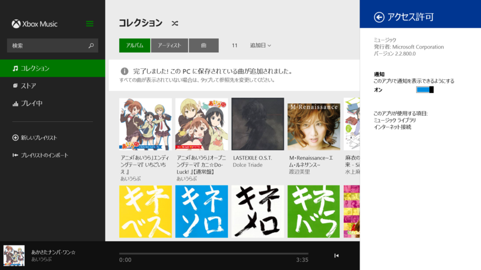

 

<h3>ミュージック 2.2.800.0</h3>

 

<blockquote>

アップデート内容:

<ul>
<li>オフラインのときは、PC 上にない曲やアルバムの表示が変わり 、再生できる曲とできない曲が簡単に見わけられるようになりました その他の修正 お住まいの国や地域で利用できる機能は、Xbox Music の機能リストをご確認ください。 <a href="http://support.xbox.com/apps/windows-8/xbox-on-windows-features">http://support.xbox.com/apps/windows-8/xbox-on-windows-features</a></li>
</ul>
</blockquote>

2.2.767.0 より。オンライン利用している SkyDrive、じゃない、OneDrive のミュージックだと表示が変わるのかもしれない（めんどくさくて未確認）。

<ul>
<li><a href="http://apps.microsoft.com/windows/ja-jp/app/music/16db93bf-8748-449a-96ba-e9ed3a5f872d">Windows &#x30B9;&#x30C8;&#x30A2; &#x306E; Windows &#x7528; &#x30DF;&#x30E5;&#x30FC;&#x30B8;&#x30C3;&#x30AF; &#x30A2;&#x30D7;&#x30EA;</a></li>
</ul>

<h3>Flipboard 2.0.9.0</h3>

2.0.8.0 より。相変わらず変更点の記述なし。

<ul>
<li><a href="http://apps.microsoft.com/windows/ja-jp/app/flipboard/e62e393a-acc9-40d9-a34a-13a41f2eeef0">Windows &#x30B9;&#x30C8;&#x30A2; &#x306E; Windows &#x7528; Flipboard &#x30A2;&#x30D7;&#x30EA;</a></li>
</ul>

