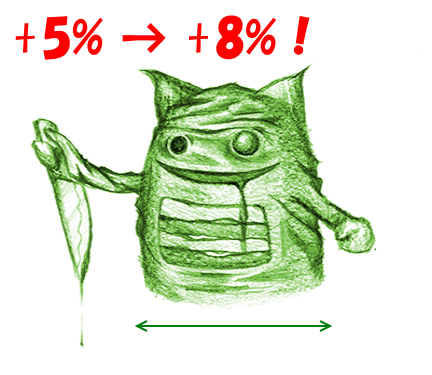

私 @daruyanagi は、2014年4月1日より施行される消費税増税にともない、以下の通りの対応を行うことになりました。

<ul>
<li>これまで日本人成年男性の平均 +5% の肥満度を維持してまいりましたが、これを +8% へ緩和いたします。</li>
<li>加齢臭に関しましても、消費税分 8％ を本体へ転嫁させていただきます。</li>
<li>身長に関しましては、これ以上のイケメン化を防止するため、現状維持とさせていただきます。</li>
</ul>
大変恐縮ではありますが、今後ともご愛顧のほどよろしくお願い申し上げます。

この記事は4月1日に公開されました。

