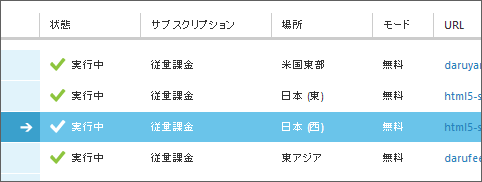

<blockquote cite="http://www.microsoft.com/ja-jp/news/Press/2013/May13/130523_azure.aspx">

日本マイクロソフト株式会社（本社：東京都港区、代表執行役 社長：樋口 泰行）は、パブリッククラウドサービス「Microsoft Windows Azure」をユーザーに提供する、新たな主要リージョンを日本に展開することを発表します。この「日本リージョン」には、日本国内の2か所（首都圏と関西圏）のサブリージョンが含まれ、Windows Azure のサービスを国内のデータセンターから提供することを可能にします。

<cite><a href="http://www.microsoft.com/ja-jp/news/Press/2013/May13/130523_azure.aspx">&#x300C;Microsoft Windows Azure&#x300D;&#x306E;&#x56FD;&#x5185;&#x30D3;&#x30B8;&#x30CD;&#x30B9;&#x5F37;&#x5316;&#x306B;&#x5411;&#x3051;&#x3066; &#x65E5;&#x672C;&#x30EA;&#x30FC;&#x30B8;&#x30E7;&#x30F3;&#x306E;&#x958B;&#x8A2D;&#x8A08;&#x753B;&#x3092;&#x516C;&#x958B;</a></cite>
</blockquote>

遅ればせながら、<s>Windows</s> Microsoft Azure の日本リージョン開設おめでとうございます。これで Azure の普及が日本でも進めばいいですね。

この日本リージョンですが、WebMatrix からでも利用できるみたいです。<s>Windows</s> Microsoft Azure にサイトを作成する際に現れるドロップダウンリストで<b>“空白”</b>を選びましょう。

この“空白”、二つありますが、手元で試してみたところ<b>上が“日本 (西)”</b>、<b>下が“日本 (東)”</b>みたいですね？　違ったらごめんなさい。

