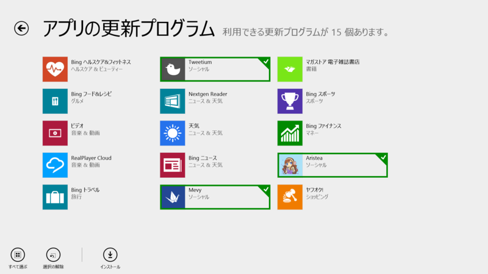
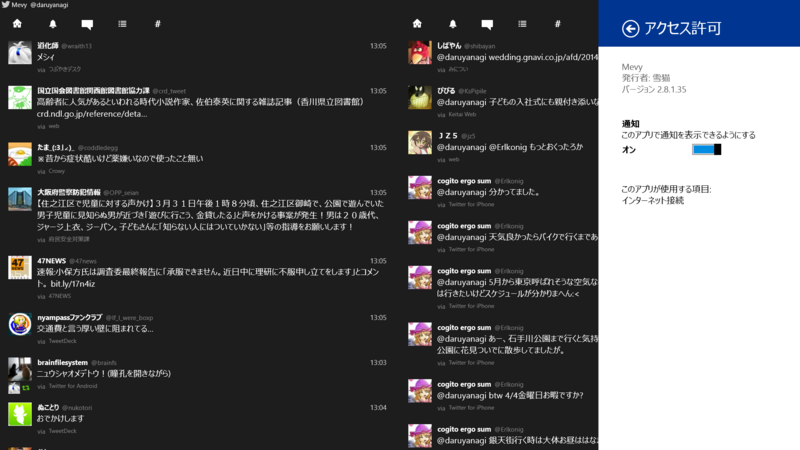
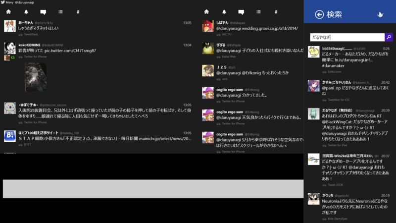
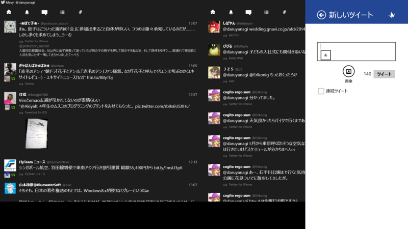
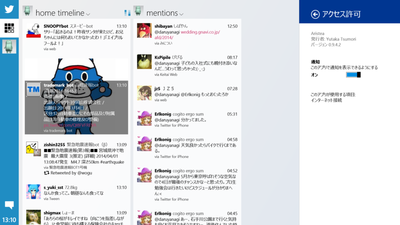
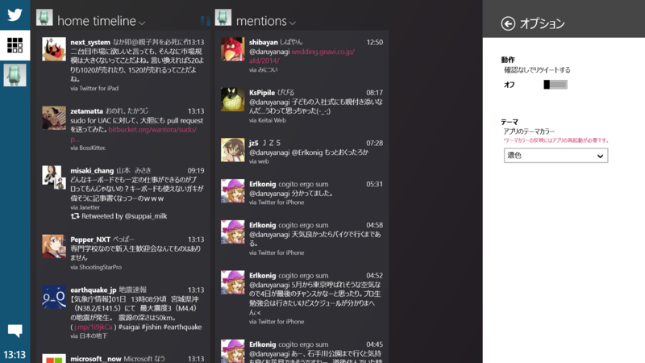
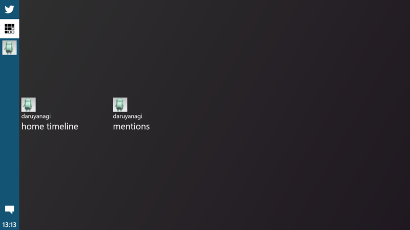

とりあえず Twitter クライアントからアップデートしてみるか。

<h3>Tweetium 2.4.0.186</h3>

 

<blockquote>

v2.4

<ul>
<li>Push notifications for Pro users!</li>
<li>Increased multiple account limit to 7 accounts for Pro users.</li>
<li>Improved URL recognition to match Twitter's implementation, so tweet character counts should always be correct now.</li>
<li>Changing accounts now properly saves the last read state of the current view before switching</li>
<li>Improved DM conversation interactions in vertical mode</li>
</ul>
For full details of this and past releases, visit the support link.

</blockquote>

Pro アカウントは<s>半月</s>半年で 400 円。

<ul>
<li><a href="http://apps.microsoft.com/windows/ja-jp/app/tweetium/4071d364-44bf-47ce-9eb7-d527e6f182a2">Windows &#x30B9;&#x30C8;&#x30A2; &#x306E; Windows &#x7528; Tweetium &#x30A2;&#x30D7;&#x30EA;</a></li>
</ul>

<h3>Mevy 2.8.1.35</h3>

 

<blockquote>

[2014/03/31] v2.8.1.35

<ul>
<li>共有画面で広告OFFが反映されていなかった問題を修正</li>
<li>ローカライズ漏れ修正</li>
<li>新UIでの広告位置調整</li>
<li>検索結果のツイートをクリックした際にポップアップが出ていた問題の修正</li>
</ul>
[2014/03/28] v2.8.0.34

<ul>
<li>検索機能追加（閲覧のみ）</li>
<li>プロフィール画面にフォローボタン追加</li>
<li>クリップボードから画像の貼り付け</li>
<li>共有画面でもCntrl+Enterが可能に</li>
<li>設定に質問フォーム設置</li>
<li>列数の切り替え幅調整</li>
<li>通知カラムのアイコン変更</li>
<li>詳細画面の画像表示調整</li>
<li>特定の文字列を含んでいた場合にツイートできない問題の修正</li>
<li>新UI（β）を試すオプション追加</li>
<li>新ツイート欄に連続ツイート機能追加</li>
</ul>
</blockquote>

旧 UI（安定版）と検索画面。

新 UI（β）。新しいほうが好きかな！

<ul>
<li><a href="http://apps.microsoft.com/windows/ja-jp/app/mevy/31760b9c-38fb-4d95-a471-d2ee8d920ee5">Windows &#x30B9;&#x30C8;&#x30A2; &#x306E; Windows &#x7528; Mevy &#x30A2;&#x30D7;&#x30EA;</a></li>
</ul>

<h3>Aristea 0.9.4.2</h3>

 

<blockquote>

v0.9.4

<ul>
<li>黒系カラーテーマを追加しました</li>
<li>クイック操作ボタンを追加しました</li>
<li>画像プレビューの不具合を修正しました</li>
<li>セマンティックズームの不具合を修正しました</li>
<li>細かいUIの修正をしました</li>
<li>細かい不具合を修正しました</li>
</ul>
</blockquote>

テーマの変更は要再起動。ダークテーマカッコいいな！

セマンティックズームあったのはしらなかった。あんまり使いこなしてないからあれなんだけど、カラムの追加ってどうするんじゃい？

<ul>
<li><a href="http://apps.microsoft.com/windows/ja-jp/app/aristea/88e09e92-fdc4-4510-96d9-649f20ad8ecf">Windows &#x30B9;&#x30C8;&#x30A2; &#x306E; Windows &#x7528; Aristea &#x30A2;&#x30D7;&#x30EA;</a></li>
</ul>

