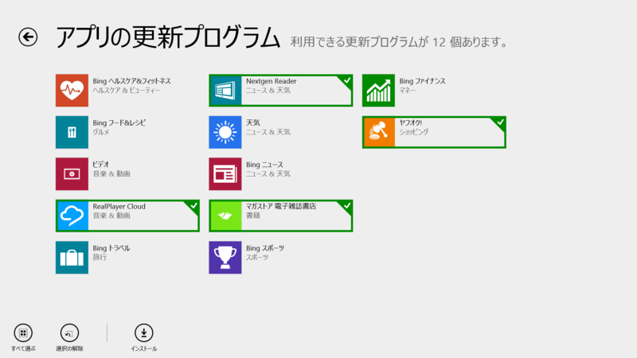
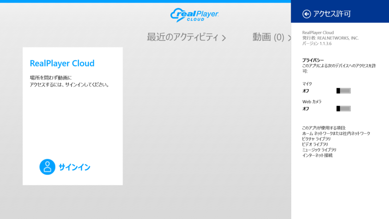
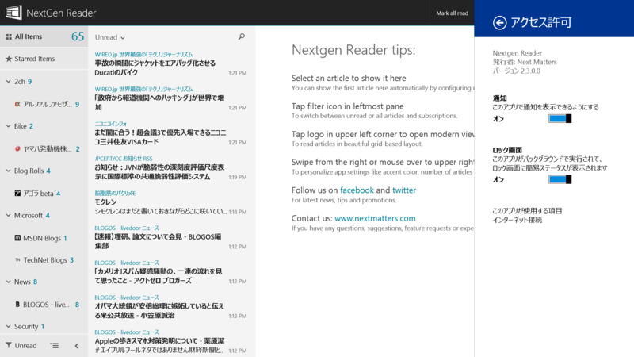
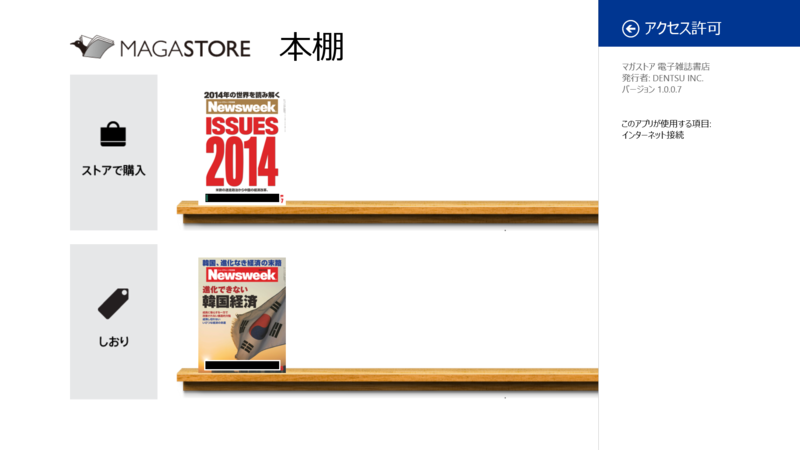
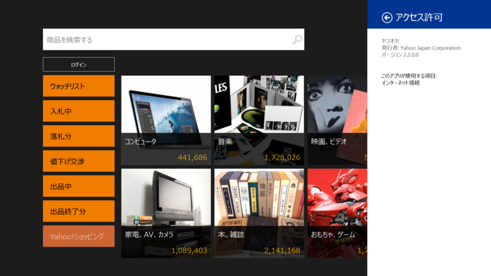

お次はビルトインアプリ以外。

<h3>RealPlayer Cloud 1.1.3.6</h3>

更新点なし。もう VLC for Windows 8 でいいかな。

<ul>
<li><a href="http://apps.microsoft.com/windows/ja-jp/app/realplayer-cloud/0dfaf7d4-40ae-4b3c-ba0c-b8b03c0a9408">Windows &#x30B9;&#x30C8;&#x30A2; &#x306E; Windows &#x7528; RealPlayer Cloud &#x30A2;&#x30D7;&#x30EA;</a></li>
</ul>

<h3>Nextgen Reader 2.3.0.0</h3>

 

<blockquote>

Support: If you have any questions, comments, feature requests, or experience a crash or bug, please contact us at <a href="http://nextmatters.com/.">http://nextmatters.com/.</a>

What's new in v2.3

<ul>
<li>New: Smart search (requires @feedlypro account for complete search results).</li>
<li>New: Quickly show/hide read items and feeds.</li>
<li>New: Easily collapse or expand all folders.</li>
<li>New: Right click on a feed/article in the list for context menus.</li>
<li>New: Option to launch browser in full screen.</li>
<li>New: Keyboard shortcuts - Y: show/hide read items, Z: focus reading pane, etc.</li>
<li>Moved: Manage section to settings charm.</li>
<li>Improved: Better handling for login/sync errors during first time setup.</li>
<li>Several bug fixes and many other enhancements.</li>
</ul>
</blockquote>

<s>「Share full article」がクソ便利。「New: Option to override dates and times format according to your region.」は要再起動。<a href="https://bufferapp.com/">Buffer - A better way to share on social media</a> っていうサービスは寡聞にして知らなかった。あとで試してみよう。</s>（v2.1 の変更点だった）

<ul>
<li><a href="http://apps.microsoft.com/windows/ja-jp/app/nextgen-reader/30648d7a-f0b5-4719-8ca9-7ed6ce3b4b9b">Windows &#x30B9;&#x30C8;&#x30A2; &#x306E; Windows &#x7528; Nextgen Reader &#x30A2;&#x30D7;&#x30EA;</a></li>
</ul>

<h3>マガストア 電子雑誌書店 1.0.0.7</h3>

 

<blockquote>

<ul>
<li>コンテンツのダウンロード速度を改善しました。</li>
</ul>
</blockquote>

<ul>
<li><a href="http://apps.microsoft.com/windows/ja-jp/app/6ceff58b-e9a0-4d48-a395-c332fa49ebbc">Windows &#x30B9;&#x30C8;&#x30A2; &#x306E; Windows &#x7528; &#x30DE;&#x30AC;&#x30B9;&#x30C8;&#x30A2; &#x96FB;&#x5B50;&#x96D1;&#x8A8C;&#x66F8;&#x5E97; &#x30A2;&#x30D7;&#x30EA;</a></li>
</ul>

<h3>ヤフオク! 2.2.0.0</h3>

 

<blockquote>

<ul>
<li>消費税率の変更に対応しました。</li>
<li>複数個出品されている商品への入札時不具合を改修しました。</li>
</ul>
</blockquote>

<ul>
<li><a href="http://apps.microsoft.com/windows/ja-jp/app/551e089b-6192-4cec-94e9-266489ff8c74">Windows &#x30B9;&#x30C8;&#x30A2; &#x306E; Windows &#x7528; &#x30E4;&#x30D5;&#x30AA;&#x30AF;! &#x30A2;&#x30D7;&#x30EA;</a></li>
</ul>

