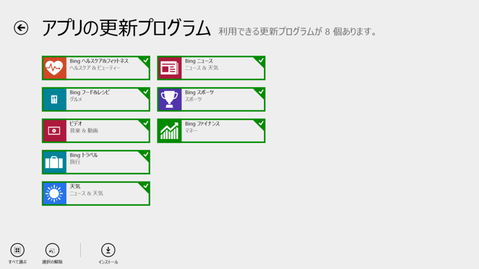
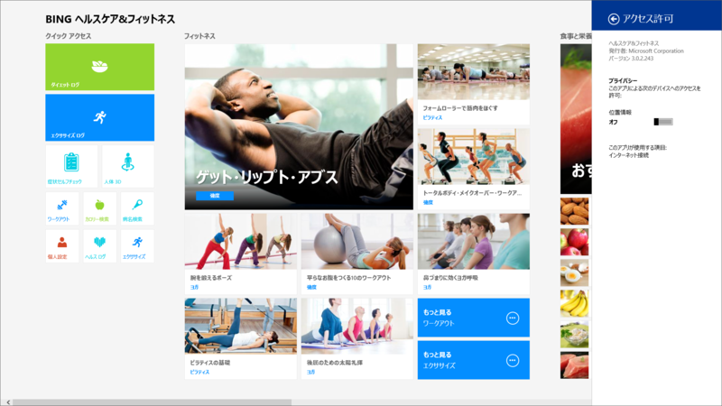
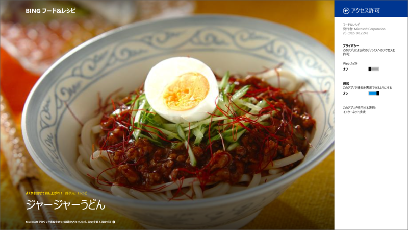
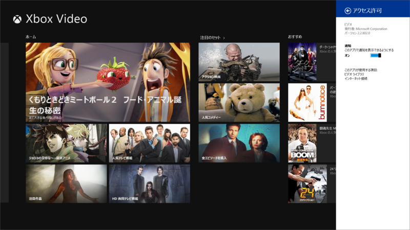
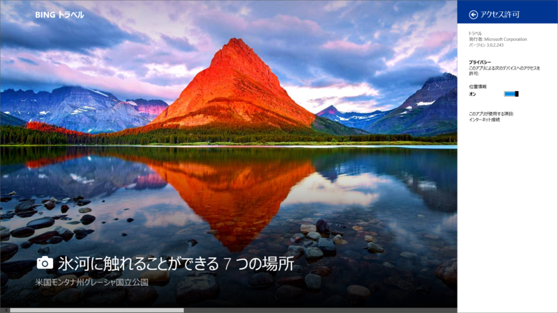
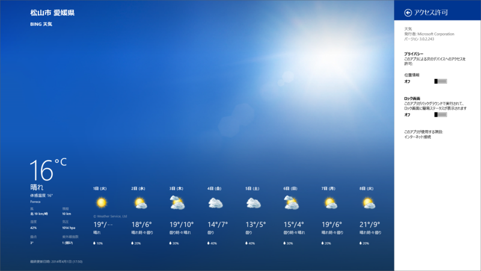
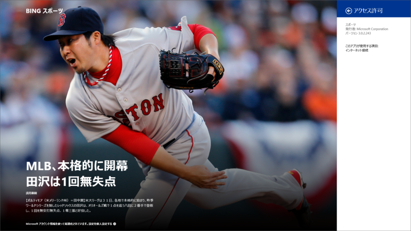
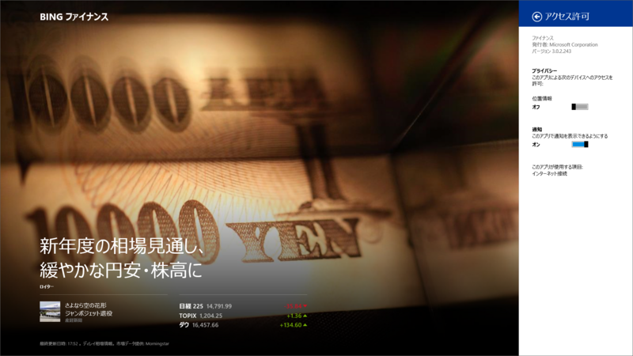

ビルトインアプリの一斉アップデート。

<h3>Bing ヘルスケア&フィットネス 3.0.2.243</h3>

 

<ul>
<li><a href="http://apps.microsoft.com/windows/ja-jp/app/bing-health-fitness/54c27690-1f6b-40b0-b561-72dc76e67d02">Windows &#x30B9;&#x30C8;&#x30A2; &#x306E; Windows &#x7528; Bing &#x30D8;&#x30EB;&#x30B9;&#x30B1;&#x30A2;&amp;&#x30D5;&#x30A3;&#x30C3;&#x30C8;&#x30CD;&#x30B9; &#x30A2;&#x30D7;&#x30EA;</a></li>
</ul>

<h3>Bing フード&レシピ 3.0.2.243</h3>

 

<ul>
<li><a href="http://apps.microsoft.com/windows/ja-jp/app/bing-food-drink/fa01a69f-eb9f-4f1c-a83c-5344200dc045">Windows &#x30B9;&#x30C8;&#x30A2; &#x306E; Windows &#x7528; Bing &#x30D5;&#x30FC;&#x30C9;&amp;&#x30EC;&#x30B7;&#x30D4; &#x30A2;&#x30D7;&#x30EA;</a></li>
</ul>

<h3>ビデオ 2.2.802.0</h3>

 

<blockquote>

アップデート内容: 

<ul>
<li>ダウンロード時の画質: HD で購入した映画やテレビ番組をダウンロードするときに、HD または SD のいずれかを選択できます</li>
<li>注目のセット: 映画やテレビ番組の名作が並んだイチオシのリスト</li>
<li>その他の修正</li>
</ul>
Xbox の映画ストアが利用可能な国や地域のみ。 お住まいの国や地域で利用できる機能は、Xbox Video の機能リストをご確認ください。 <a href="http://support.xbox.com/apps/windows-8/xbox-on-windows-features">http://support.xbox.com/apps/windows-8/xbox-on-windows-features</a>

</blockquote>

<ul>
<li><a href="http://apps.microsoft.com/windows/ja-jp/app/video/64b22df1-5a9c-4c88-aa1f-42cefaf8b281">Windows &#x30B9;&#x30C8;&#x30A2; &#x306E; Windows &#x7528; &#x30D3;&#x30C7;&#x30AA; &#x30A2;&#x30D7;&#x30EA;</a></li>
</ul>

<h3>Bing トラベル 3.0.2.243</h3>

 

<ul>
<li><a href="http://apps.microsoft.com/windows/ja-jp/app/bing-travel/9e2610f3-bad2-41cd-b793-a712b055089f">Windows &#x30B9;&#x30C8;&#x30A2; &#x306E; Windows &#x7528; Bing &#x30C8;&#x30E9;&#x30D9;&#x30EB; &#x30A2;&#x30D7;&#x30EA;</a></li>
</ul>

<h3>天気 3.0.2.243</h3>

 

<ul>
<li><a href="http://apps.microsoft.com/windows/ja-jp/app/weather/421ba874-f903-4965-9b82-d60f3ba3cae0">Windows &#x30B9;&#x30C8;&#x30A2; &#x306E; Windows &#x7528; &#x5929;&#x6C17; &#x30A2;&#x30D7;&#x30EA;</a></li>
</ul>

<h3>Bing ニュース 3.0.2.243</h3>

 

<ul>
<li><a href="http://apps.microsoft.com/windows/ja-jp/app/bing-news/eaaf2ce3-d5a3-4a59-ae31-276fbc44a7cd">Windows &#x30B9;&#x30C8;&#x30A2; &#x306E; Windows &#x7528; Bing &#x30CB;&#x30E5;&#x30FC;&#x30B9; &#x30A2;&#x30D7;&#x30EA;</a></li>
</ul>

<h3>Bing スポーツ 3.0.2.243</h3>

 

<ul>
<li><a href="http://apps.microsoft.com/windows/ja-jp/app/bing-sports/d9a4d6fd-a65b-41a6-95ff-270b882ea5f1">Windows &#x30B9;&#x30C8;&#x30A2; &#x306E; Windows &#x7528; Bing &#x30B9;&#x30DD;&#x30FC;&#x30C4; &#x30A2;&#x30D7;&#x30EA;</a></li>
</ul>

<h3>Bing ファイナンス</h3>

 

<ul>
<li><a href="http://apps.microsoft.com/windows/ja-jp/app/bing-finance/ffc158e5-74d6-4878-8ace-8f0df45083c1">Windows &#x30B9;&#x30C8;&#x30A2; &#x306E; Windows &#x7528; Bing &#x30D5;&#x30A1;&#x30A4;&#x30CA;&#x30F3;&#x30B9; &#x30A2;&#x30D7;&#x30EA;</a></li>
</ul>

