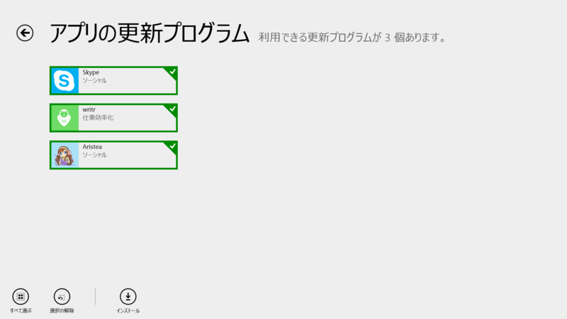
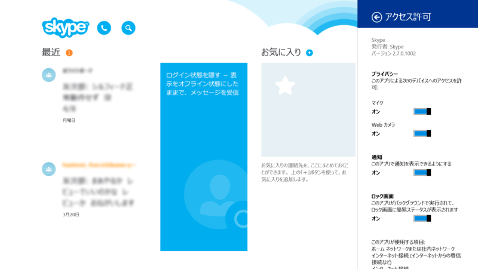
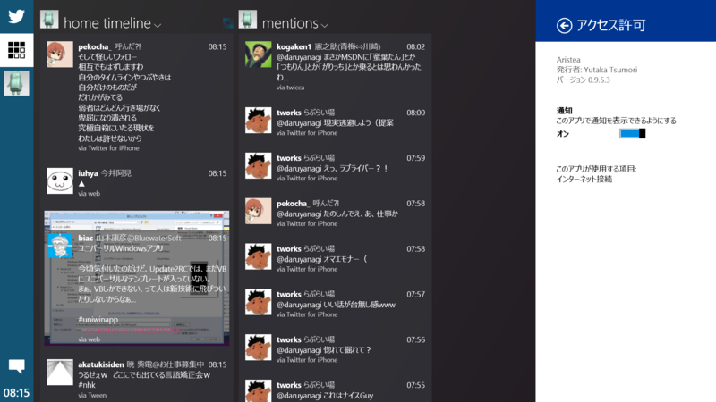
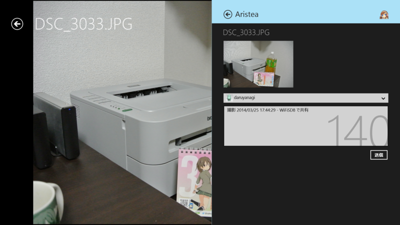

<a href="http://apps.microsoft.com/windows/ja-jp/app/writr-beta/6b3bef0b-95ea-41ff-afad-2b5ac551c432">writr</a> は日本語化されたら割と受けそうなアプリだと思う。

<h3>Skype 2.7.0.1002（Skype for Modern Windows）</h3>

 

<blockquote>

新機能： 

<ul>
<li>別の場所で通話に応答した場合、Skypeの呼び出しは停止されます。</li>
</ul>
</blockquote>

これは 2.6 の記述と変わらず。

<ul>
<li><a href="http://apps.microsoft.com/windows/ja-jp/app/skype/5e19cc61-8994-4797-bdc7-c21263f6282b">Windows &#x30B9;&#x30C8;&#x30A2; &#x306E; Windows &#x7528; Skype &#x30A2;&#x30D7;&#x30EA;</a></li>
</ul>
<blockquote cite="http://blogs.skype.com/2014/04/02/introducing-the-new-skype-for-windows-phone-8-1-and-improved-skype-for-windows-8-1/">

<h5>And new on Windows 8.1…</h5>

As part of Build, we also announced improvements to make your Windows 8.1 experience more accessible and familiar. Skype for Windows Modern is built for touch devices, but we know that many users use 2-in-1 devices and often work in the desktop mode, switching between modern and desktop apps. We wanted to make that easier. So now your built-in Skype app can be pinned to the taskbar and accessible either on your start screen or on the desktop. The Windows 8.1 update is free to Windows 8 and Windows RT users, and the latest version of Skype will come with it. To pin Skype to the taskbar, hold down or right click on the Skype tile and select Pin to Taskbar.

We will continue to deliver the best experience possible by providing regular updates to Skype over time. We received valuable feedback since the launch of both Skype for Windows Phone 8 and Skype for Windows 8.1 and we will continue to listen as we launch future versions.

<cite><a href="http://blogs.skype.com/2014/04/02/introducing-the-new-skype-for-windows-phone-8-1-and-improved-skype-for-windows-8-1/">Introducing New Skype for Windows Phone 8.1 &amp; Improved Skype for Windows 8.1 &ndash; - Skype Blogs</a></cite>
</blockquote>

Windows 8.1 Update 1 対応みたいだね。

<h3>Aristea 0.9.5.3</h3>

 

<blockquote>

v0.9.5

<ul>
<li>アプリ起動時にタイムラインを読み込むようになりました</li>
<li>画像をアップロードできない問題を修正しました</li>
<li>細かい使いやすさを向上しました</li>
<li>アプリの動作速度を向上しました</li>
<li>タッチ操作での使いやすさを改善しました</li>
<li>その他細かい不具合を修正しました</li>
</ul>
</blockquote>

<ul>
<li><a href="http://apps.microsoft.com/windows/ja-jp/app/aristea/88e09e92-fdc4-4510-96d9-649f20ad8ecf">Windows &#x30B9;&#x30C8;&#x30A2; &#x306E; Windows &#x7528; Aristea &#x30A2;&#x30D7;&#x30EA;</a></li>
</ul>

試しに WiFiSD8 で共有してみた。

<blockquote class="twitter-tweet" lang="ja">
撮影 2014/03/25 17:44:29 - WiFiSD8 で共有 <a href="http://t.co/xK2I5kUhMv">pic.twitter.com/xK2I5kUhMv</a>
&mdash; だるやなぎ（無料槍） (@daruyanagi) <a href="https://twitter.com/daruyanagi/statuses/453315567617712128">2014, 4月 7</a></blockquote>

イケたっぽい。

<blockquote cite="http://ddlgjp.blogspot.jp/2014/03/wifisd8.html">

<h5>簡単な技術的背景</h5>

共有には幾つかのタイプがありますが、WiFiSD8では以下三種類のデータをOSを介して共有受け側アプリに送信します。

<ul>
<li>写真のBitmap画像 (1024pxにリサイズ済み）</li>
<li>写真のJPEGファイル（1024pxにリサイズ済み）</li>
<li>写真の解説テキスト</li>
</ul>
共有受け側アプリは、上三つのデータに対応していればOSに「自分そのデータ扱えます！」と宣言し、その結果共有メニューにアプリが表示される、という仕組みです。

しかし、残念ながら…2014年3月現在、Bitmap画像・ファイルの共有受信が実際には動作しないアプリも幾つかあります。 
こういった「非対応」アプリは、OSには「対応してます」と答えるので共有メニューには表示されるのですが、実際やってみると延々待機、エラーが出る等で動作しません。

<cite><a href="http://ddlgjp.blogspot.jp/2014/03/wifisd8.html">DDLG: WiFiSD8 &#x304B;&#x3089;&#x306E;&#x5199;&#x771F;&#x306E;&#x5171;&#x6709;&#x306B;&#x3064;&#x3044;&#x3066;</a></cite>
</blockquote>

