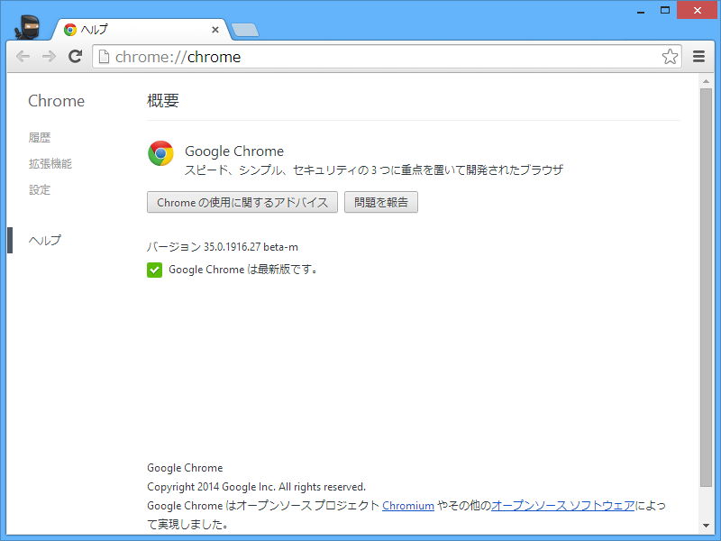
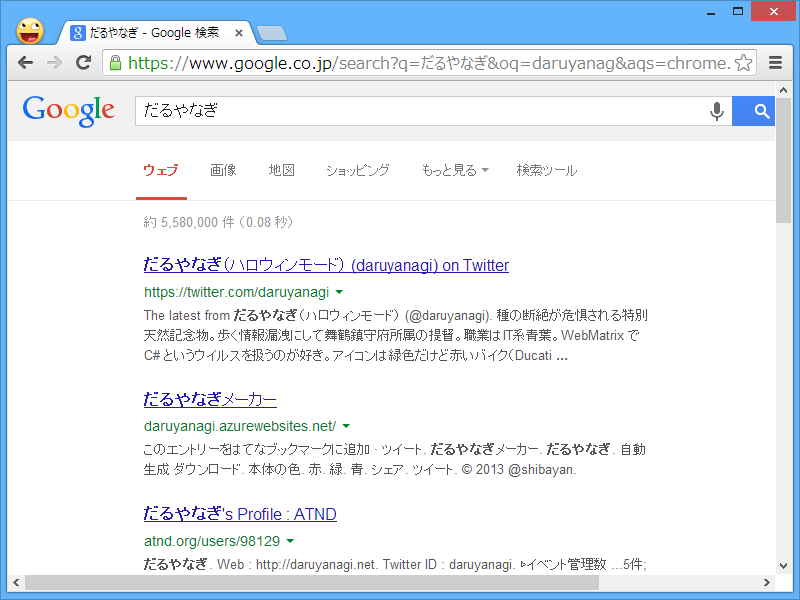
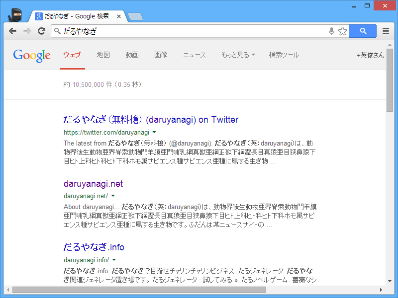

 

<blockquote cite="http://www.forest.impress.co.jp/docs/news/20140411_643976.html">

米Google Inc.は10日（現地時間）、Webブラウザー「Google Chrome」の最新ベータ版v35.0.1916.27を公開した。Windows XP/Vista/7/8に対応するフリーソフトで、編集部にてWindows 8.1での動作も確認した。現在、同社のWebサイトからダウンロード可能。Mac OS X/Linux版の最新ベータ版も用意されている。

<cite><a href="http://www.forest.impress.co.jp/docs/news/20140411_643976.html">&#x300C;Google Chrome 35&#x300D;&#x304C;&#x30D9;&#x30FC;&#x30BF;&#x7248;&#x306B; - &#x7A93;&#x306E;&#x675C;</a></cite>
</blockquote>

細かいところだけど、オムニバーで検索したときの外観がまたちょっと変わってた。

<h3>Google Chrome 31 Beta（Google Chrome 34 Stable も同じ挙動）</h3>

Google Chrome 31 でオムニバーから Web 検索すると、「普通の」Google 検索の結果ページが現れる。

<h3>Google Chrome 32 Beta</h3>

 

<ul>
<li>Google 検索画面にキーワード入力欄がない</li>
<li>オムニバーの左端アイコンが検索マークに</li>
</ul>

<h3>Google Chrome 35 Beta</h3>

 

<ul>
<li>Google 検索画面にキーワード入力欄がない</li>
<li>オムニバーの右端に検索インジケーターが</li>
</ul>
実は Google Chrome 33～34 Beta の時どうだったかあまり覚えていないのだけど。

<ul>
<li><a href="https://blog.daruyanagi.jp/entry/2013/11/15/065043">Google Chrome 32 &#x3068; Web &#x691C;&#x7D22; - &#x3060;&#x308B;&#x308D;&#x3050;</a></li>
</ul>

