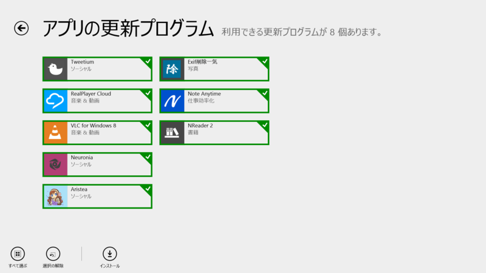
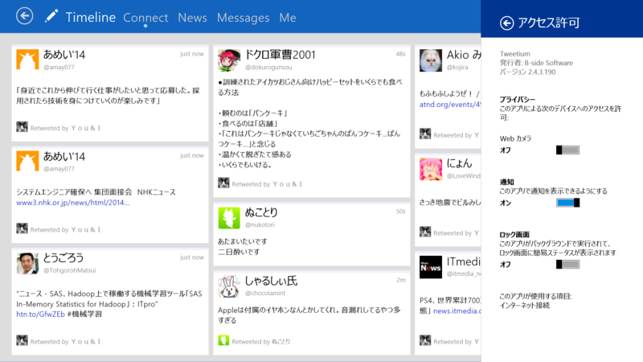
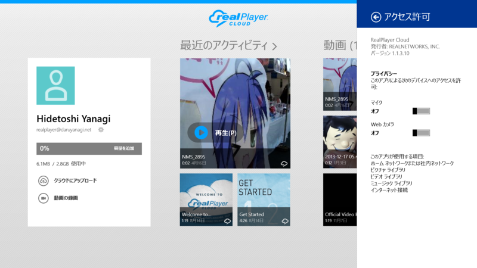
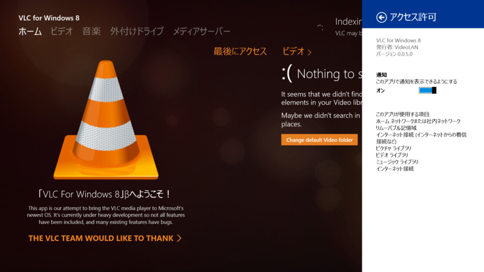
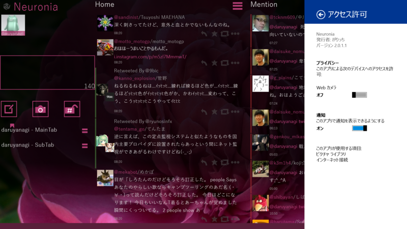
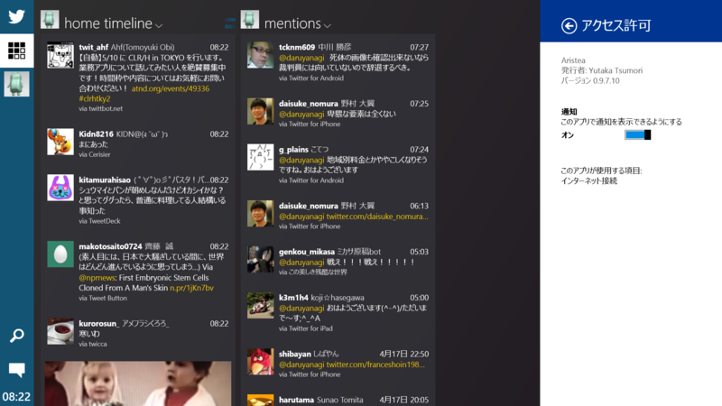
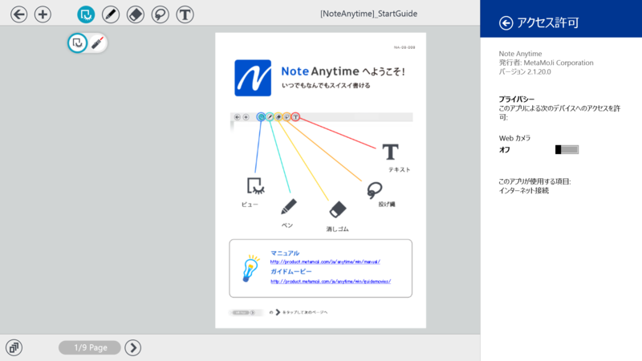
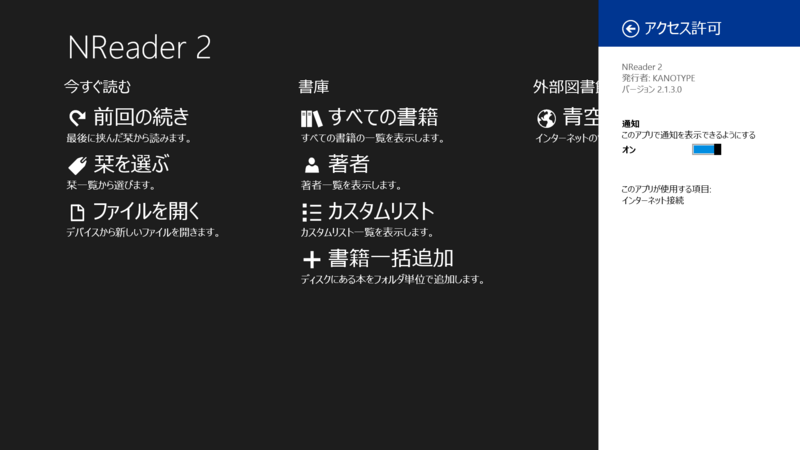

 

<h3>Tweetium 2.4.3.190</h3>

 

<blockquote cite="http://apps.microsoft.com/windows/ja-jp/app/tweetium/4071d364-44bf-47ce-9eb7-d527e6f182a2">

v2.4.3

<ul>
<li>Additional improvements to launch-from-toast behaviors</li>
<li>Fixed a couple of rare crashing bugs</li>
<li>Fixed a username autocomplete issue for multi-line tweets</li>
</ul>
<cite><a href="http://apps.microsoft.com/windows/ja-jp/app/tweetium/4071d364-44bf-47ce-9eb7-d527e6f182a2">Windows &#x30B9;&#x30C8;&#x30A2; &#x306E; Windows &#x7528; Tweetium &#x30A2;&#x30D7;&#x30EA;</a></cite>
</blockquote>

<h3>RealPlayer Cloud 1.1.310</h3>

 

<blockquote cite="http://apps.microsoft.com/windows/ja-jp/app/realplayer-cloud/0dfaf7d4-40ae-4b3c-ba0c-b8b03c0a9408">

Changes in 1.1.3.10 > 
NEW : 

<ul>
<li>Sharing allow up to 20 minutes per video.</li>
</ul>
FIXED :

<ul>
<li>Japanese web video playback</li>
</ul>
Send us your feedback at help.win8@real.com

<cite><a href="http://apps.microsoft.com/windows/ja-jp/app/realplayer-cloud/0dfaf7d4-40ae-4b3c-ba0c-b8b03c0a9408">Windows &#x30B9;&#x30C8;&#x30A2; &#x306E; Windows &#x7528; RealPlayer Cloud &#x30A2;&#x30D7;&#x30EA;</a></cite>
</blockquote>

ユーザーインターフェイスも変わった気がする。なんかイマイチ信用できない点を除けば、割りといいアプリなのかもしれない。

<ul>
<li><a href="http://www.forest.impress.co.jp/docs/news/20140416_644547.html">RealNetworks&#x3001;&#x52D5;&#x753B;&#x5C02;&#x9580;&#x30AF;&#x30E9;&#x30A6;&#x30C9;&#x30B9;&#x30C8;&#x30EC;&#x30FC;&#x30B8;&#x3068;&#x9023;&#x643A;&#x3067;&#x304D;&#x308B;&#x300C;RealPlayer Cloud&#x300D;&#x3092;&#x516C;&#x958B; - &#x7A93;&#x306E;&#x675C;</a></li>
</ul>

<h3>VLC for Windows 8 0.0.5.0</h3>

 

<ul>
<li><a href="http://apps.microsoft.com/windows/ja-jp/app/vlc-for-windows-8/c527ff2d-b5d0-45b6-bfc3-92fb7357ef72">Windows &#x30B9;&#x30C8;&#x30A2; &#x306E; Windows &#x7528; VLC for Windows 8 &#x30A2;&#x30D7;&#x30EA;</a></li>
</ul>

<h3>Neuronia 2.0.1.1</h3>

 

<blockquote cite="http://apps.microsoft.com/windows/ja-jp/app/neuronia/2c9802e8-9488-4db4-843f-bad93877c5e6">

～Ver2.0.1.1更新内容～ 
ボタンデザインを変更しました

～Ver2.0.1.0更新内容～ 
・起動バグを修正しました 
・ツイートに対するコマンドボタンのデザインを変えました 
・タブ切り替えのキーボードショートカットを追加しました 
・テーマカラーを追加しました

<cite><a href="http://apps.microsoft.com/windows/ja-jp/app/neuronia/2c9802e8-9488-4db4-843f-bad93877c5e6">Windows &#x30B9;&#x30C8;&#x30A2; &#x306E; Windows &#x7528; Neuronia &#x30A2;&#x30D7;&#x30EA;</a></cite>
</blockquote>

<h3>Aristea 0.9.7.10</h3>

 

<blockquote>

v0.9.7

<ul>
<li>ダイレクトメッセージ、リストに対応しました</li>
<li>アプリ内での通知に対応しました</li>
<li>検索ストリームに対応しました</li>
<li>下書きに対応しました</li>
<li>使いやすさを向上しました</li>
<li>動作速度を向上しました</li>
<li>その他細かい不具合を修正しました</li>
</ul>
</blockquote>

<h3>Note Anytime 2.1.20.0</h3>

 

<blockquote cite="http://apps.microsoft.com/windows/ja-jp/app/note-anytime/b143522d-3500-4858-9be5-2dec4dcb693e">

[2.1.20] 
・いくつかの問題を修正

[2.1.2] 
・Windows 8.1対応（Windows 8.0には導入できません） 
・可変長サイズのスナップに対応 
・PDF読み込みの解像度が向上 
・蛍光ペンの不透明度設定が可能に 
・ナビゲーションバーでノートタイトルの変更が可能に 
・ディテールウインドウの改行幅が、罫線比に加えてフレーム比で設定可能に 
・書式バーから［文字背景色］が設定可能に 
・テキストユニット内のカーソル位置の文字サイズを、書式バー上に表示 
・その他、多数を改善

<cite><a href="http://apps.microsoft.com/windows/ja-jp/app/note-anytime/b143522d-3500-4858-9be5-2dec4dcb693e">Windows &#x30B9;&#x30C8;&#x30A2; &#x306E; Windows &#x7528; Note Anytime &#x30A2;&#x30D7;&#x30EA;</a></cite>
</blockquote>

<h3>NReader 2 2.1.3.0</h3>

 

<blockquote cite="http://apps.microsoft.com/windows/ja-jp/app/nreader-2/b2927053-43a8-42ca-ad6a-02aaa6c6ecec">

v2.1.3.0 
修正: 書庫の保存場所を変更したとき、再起動まで反映されない問題を修正。 
修正: その他のバグを修正。

<cite><a href="http://apps.microsoft.com/windows/ja-jp/app/nreader-2/b2927053-43a8-42ca-ad6a-02aaa6c6ecec">Windows &#x30B9;&#x30C8;&#x30A2; &#x306E; Windows &#x7528; NReader 2 &#x30A2;&#x30D7;&#x30EA;</a></cite>
</blockquote>

たぶん今のところ最強の青空アプリ（無償）かもしれない。

