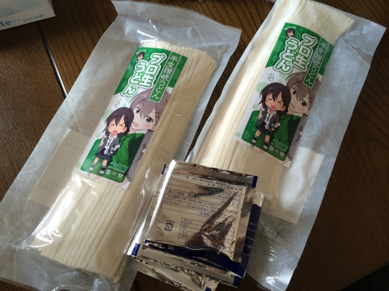
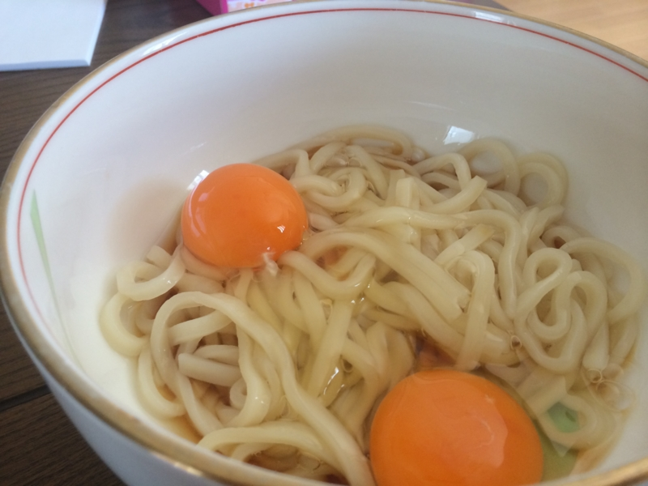

<a href="http://akiba-pc.watch.impress.co.jp/docs/wakiba/find/20140303_637728.html">&#x751F;&#x516B;&#x3064;&#x6A4B;&#x304C;&#x30A2;&#x30AD;&#x30D0;&#x540D;&#x7269;&#x306B;&#x306A;&#x308A;&#x3064;&#x3064;&#x3042;&#x308B;</a>というプロ生ちゃんブランドだが、新しい動きがあったようだ。

<ul>
<li><a href="http://pronama.azurewebsites.net/2014/04/01/pronama-udon/">&#x30D7;&#x30ED;&#x751F;&#x3046;&#x3069;&#x3093;&#xFF08;&#x534A;&#x751F;&#x8B83;&#x5C90;&#x3046;&#x3069;&#x3093;&#xFF09;&#x306F;&#x3058;&#x3081;&#x307E;&#x3057;&#x305F; | &#x30D7;&#x30ED;&#x30B0;&#x30E9;&#x30DF;&#x30F3;&#x30B0;&#x751F;&#x653E;&#x9001;</a></li>
</ul>
これ、4月1日の記事だったので最初はウソかと思ったのだけど、本当のことだった。さっそく頼んでみた。<b>プロ“生”</b>うどんとは洒落ておる。

シンプルに湯がいて付属のダシをいれただけ。調理を担当した親父が勝手に卵を二個もいれたのだけど、多分ひとつでいい。あと、ネギはほしいな！　ネギはほしいな！（大事なことなので二回

お味は……なかなかのコシ。ツルツルとした食感も、食欲をそそる。キワモノかと思ってたけど、案外フツーにおいしかった。ただ、ダシはちょっと味が濃いかもしれない。お気に入りのダシがあればそっちでどうぞ。

