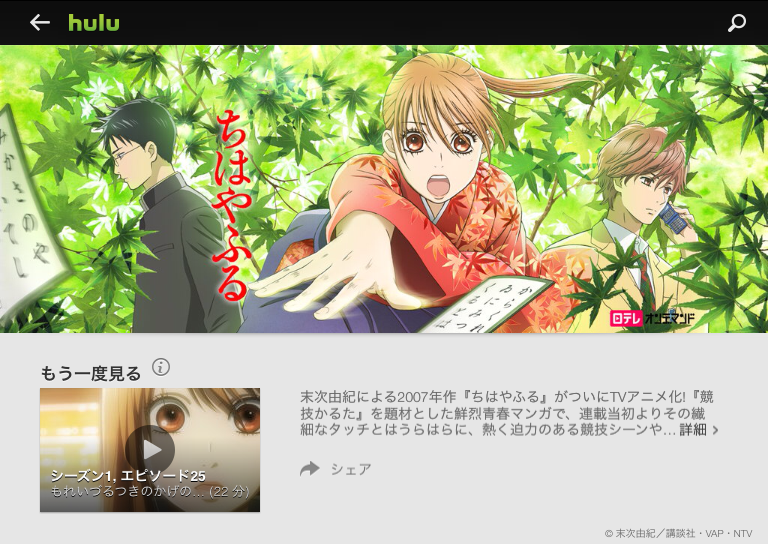
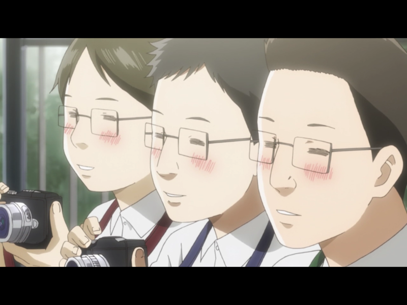

連休0日目。仕事が早く終わったので、午後は親父といよてつ高島屋まで行って、そのあとはずっと“艦これ”そっちのけで『ちはやふる』を2クール分、ぶっ続けで観ていた。24時間ぐらい？

<ul>
<li><a href="http://www.hulu.jp/chihayafuru">&#x3061;&#x306F;&#x3084;&#x3075;&#x308B; &#x3092;&#x8996;&#x8074;</a></li>
<li><a href="http://www.hulu.jp/chihayafuru-2">&#x3061;&#x306F;&#x3084;&#x3075;&#x308B;2 &#x3092;&#x8996;&#x8074;</a></li>
</ul>
<blockquote cite="http://internet.watch.impress.co.jp/docs/news/20140401_642227.html">

　HJホールディングスは4月1日、日本テレビ放送網株式会社（日本テレビ）のドラマやアニメ番組70作品以上をHuluにて配信開始すると発表した。

　日本テレビは2月28日、Hulu, LLCとHuluの日本市場向け事業を承継することで合意。日本テレビは今春事業の譲渡を受け、定額制動画配信事業に参入すると発表している。

<cite><a href="http://internet.watch.impress.co.jp/docs/news/20140401_642227.html">Hulu&#x3001;&#x300C;&#x5BB6;&#x653F;&#x5A66;&#x306E;&#x30DF;&#x30BF;&#x300D;&#x300C;&#x3061;&#x306F;&#x3084;&#x3075;&#x308B;&#x300D;&#x306A;&#x3069;&#x65E5;&#x672C;&#x30C6;&#x30EC;&#x30D3;&#x306E;&#x30C9;&#x30E9;&#x30DE;&#x30FB;&#x30A2;&#x30CB;&#x30E1;&#x3092;&#x914D;&#x4FE1; -INTERNET Watch</a></cite>
</blockquote>

日テレが Hulu の日本事業を買った（？）おかげで、観れるようになったんだな。ちょっとうれしい。でも、正直、何テレがどんな番組やってるとか言うのはまったく興味はない。どこのコンテンツでも Hulu ――じゃなくてもいい、どこか――だけで観れるようになってほしいものだ。今度はバンダイチャンネルあたりを買収してくれないだろうか。ターンエーガンダムをぜんぶ観るのに。

<ruby><rb>閑話休題</rb><rp>（</rp><rt>それはさておき</rt><rp>）</rp></ruby>。

アニメを一日ぶっ続けでぜんぶ観たのはいつぶりだろう？　序盤は数話みてはちょっと本をペラペラめくったりしていたのだけど、競技かるたの試合が本格化するあたりになると目が離せなくなった。百人一首ってこんなに面白かったのなぁ。

そういえば、確か中学校の頃だったかな？　冬休みの課題が小倉百人一首の暗記で、確かかるた大会もやっていたように思う。自慢じゃないけど、僕は長期休みの課題をちゃんとやったことが一度もなくて、百人一首も最初の10個（あきのたの から あまつかぜ ぐらいまで！）を覚えていたに過ぎなかった。でも、

――このたびは ぬさもとりあえず 手向山 紅葉の錦 神のまにまに

という菅原道真公の歌はコミカルで気に入っていて、「これだけはとってやろう！」と気合を入れていたのを思い出す。ちなみにこの歌は「この」の二字決まり。「の」まで読んだところで取れるんだな。当時はそんなことぜんぜん考えてなかった。

あとは、生まれ故郷・住之江にちなんだ

――住の江の　岸による波　よるさへや　夢の通ひぢ　人目避くらむ

なんかもちょっと好きで、狙ってた（この歌はちょっと読んでて照れくさい感じだね！）。

残念ながら、自分の好きな歌はアニメでそれほどフォーカスが当たってなかったように思うけれど、どの歌も「あぁ、聞いたことはある」と懐かしい気持ちがした。読手さんはプロの方だろうか？　割りと雰囲気があっていいね。

恥ずかしながら、当時の自分は「暗記」というものをスゴく馬鹿にして、避けていた。そういう分野では弟に勝てないってのもあったし（割りとプライドが高かったんだ！）、記憶に頼らず、頭で考えて正解にたどりつくほうが断然偉いと思っていた。そういう点で、競技かるた――おぼえて、とって、すぐわすれる――は当時の自分とは対極にあったようにも思う。でも、あの時、誰かが自分の頭をかち割ってくれていれば。もう少し自分の世界が広がっていたかなぁ、と思わないでもない。そういう訓練を避けていたせいか、自分はどうも物覚えが悪い。

アニメの内容で言えば、とくに部長君の心理描写がスゴいな……原作は少女漫画なのかな？　そんな感じがする。あと、肉まん君には妙に親近感を感じた。肝心なところで負けちゃったりするけど（なんかそこんとこ！　自分に似てる気が！）、肉まん君こそがあの部の背骨やと思うで。

ちなみに、お気に入りの女性キャラは断然メグムちゃんだな。

自分が作中に登場するなら、この三人衆に加わっていたと思う。

