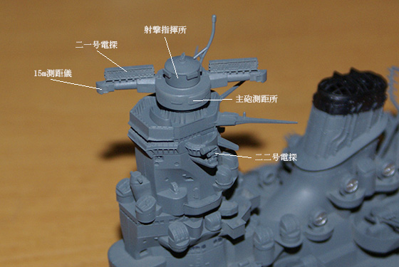
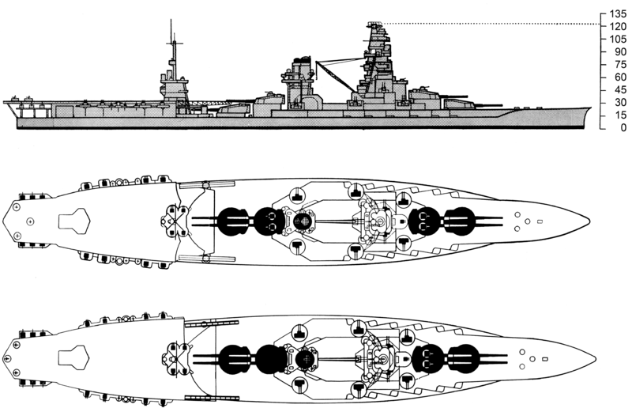

<a href="http://www.amazon.co.jp/exec/obidos/ASIN/4769821034/bestylesnet-22/">造艦テクノロジーの戦い―科学技術の頂点に立った連合艦隊軍艦物語 (光人社NF文庫)</a>
<ul><li>作者: 吉田俊雄</li><li>出版社/メーカー: 光人社</li><li>発売日: 2009/01/01</li><li>メディア: 文庫</li><li><a href="http://d.hatena.ne.jp/asin/4769821034/bestylesnet-22" target="_blank">この商品を含むブログ (1件) を見る</a></li></ul>

造艦の話ももちろんあったのだけど、艦の運命を書くことに妙にチカラのはいった、アツい本だった。でも、今回はそういうのは排除、排除で読み進める。

<h4>プロローグ</h4>

<blockquote>

（三式弾は）短く切った鋼の管に焼夷弾訳や発光薬を填め、それを無数に束ねて弾体に填めたもので、十二・七センチ砲弾以上の大空砲弾として使われ、敵機の変態を一網打尽にすることを狙った。

</blockquote>

へぇ、12.7cm でもイケたんだ。

日本海軍の光学兵器は割りと優れていたらしい。優れていたからこそ、電探（レーダー）の開発で後れをとったのかも。とくに夜戦では、米軍のレーダーよりも日本軍の夜間双眼鏡が効果的であったことも少なくなかったという。

（<a href="http://blogs.yahoo.co.jp/smoug777/53666001.html">&#x30CF;&#x30BB;&#x30AC;&#x30EF; 1/450 &#x6226;&#x8266;&#x5927;&#x548C;(3) ( &#x304A;&#x3082;&#x3061;&#x3083; ) - &#x893B;&#x5C45;&#xFF1A; &#x8266;&#x8239;&#x30E9;&#x30B8;&#x30B3;&#x30F3;&#x88FD;&#x4F5C;&#x5BA4; - Yahoo!&#x30D6;&#x30ED;&#x30B0;</a>）

15メートル測距儀のお値段は40万円。今にして5億を超える。「40km 離れた水平線からわずかばかり見えてきた敵艦のマストの先端をすばやくとらえ、波やうねりによる船体の動揺、高速航行や射撃による船体の振動を克服しながら、最高の制度で距離を測ることができた。」

艦攻・水偵・陸攻に積んだ磁気探知機も優秀。「一度、磁探で探知されると、天候に異常さえ起らなければ、その潜水艦はもう逃げられなくなる」。当時の潜水艦は潜航時に数ノットしか出せなかった（スピードを出すとすぐ電池が空になる。一方、数ノットならば36時間程度動けたらしい）。そういえば「航空支援があれば潜水艦相手は楽」と <a href="https://blog.daruyanagi.jp/entry/2014/04/29/204829">&#x300E;&#x8266;&#x9577;&#x305F;&#x3061;&#x306E;&#x592A;&#x5E73;&#x6D0B;&#x6226;&#x4E89;&#x2015;34&#x4EBA;&#x306E;&#x8266;&#x9577;&#x304C;&#x8A9E;&#x3063;&#x305F;&#x52C7;&#x8005;&#x306E;&#x6761;&#x4EF6;&#x300F; - &#x3060;&#x308B;&#x308D;&#x3050;</a> でも誰かが言ってた気がする。

日本艦艇の損害。

<table>
<tr>
<td></td>
<td>開戦時</td>
<td>戦時建造</td>
<td>終戦時残存</td>
<td>終戦時残存（大中小破・着底込）</td>
<td>擬装未完了</td>
</tr>
<tr>
<td>戦艦</td>
<td>10</td>
<td>2</td>
<td>0</td>
<td>4</td>
<td>0</td>
</tr>
<tr>
<td>巡洋艦</td>
<td>38</td>
<td>6</td>
<td>2</td>
<td>9</td>
<td>0</td>
</tr>
<tr>
<td>空母</td>
<td>10</td>
<td>15</td>
<td>0</td>
<td>6</td>
<td>4</td>
</tr>
<tr>
<td>駆逐艦</td>
<td>112</td>
<td>63</td>
<td>30</td>
<td>11</td>
<td>3</td>
</tr>
<tr>
<td>潜水艦</td>
<td>65</td>
<td>126</td>
<td>55</td>
<td>4</td>
<td>21</td>
</tr>
<tr>
<td>そのたの軍艦（たぶん砲艦や海防艦）</td>
<td>390</td>
<td> </td>
<td> </td>
<td> </td>
<td> </td>
</tr>
</table>
空母と潜水艦の準備が立ち遅れていたのが手に取るようにわかる。しかも、せっかく作っても積む飛行機がなかったり、潜水艦に荷物積んで輸送をやらせたりと、なにもかもがちぐはぐだった。

<h4>戦艦「大和」、巡洋戦艦「比叡」「霧島」</h4>

まぁ、有名だしいや。

<h4>航空戦艦「伊勢」「日向」</h4>

（<a href="http://ja.wikipedia.org/wiki/%E4%BC%8A%E5%8B%A2_(%E6%88%A6%E8%89%A6)">&#x4F0A;&#x52E2; (&#x6226;&#x8266;) - Wikipedia</a>）

「頑強な“両棲動物”」　後部甲板には彗星（発艦だけ）を積むつもりだったらしいが、実際には物資輸送の倉庫として役に立った。

素人ながら、三番・四番砲塔が使いにくそうだななぁ、もう要らないんじゃね？　って思っちゃう。航空戦艦への改装にかかった工数は40万。対潜用の護衛艦艇なら数隻分であるという。噴進砲も含めて対空兵装はだいぶ役に立ったみたいだけど……。

<h4>正規空母「瑞鶴」</h4>

（<a href="http://ja.wikipedia.org/wiki/%E7%91%9E%E9%B6%B4_(%E7%A9%BA%E6%AF%8D)">&#x745E;&#x9DB4; (&#x7A7A;&#x6BCD;) - Wikipedia</a>）

幸運な妹の方。

「瑞鶴」には主タービンと巡航タービンの2種類を備えていたが、巡航タービンのみで26ノットを出せた（全速で34ノット。お姉さんは逃走中に40ノット以上出したという伝説がある）。これは無風状態でも艦載機が飛ばせる速度。瑞鶴の使いやすさというのがわかる――一方で、加賀さんの使いにくさもよーくわかる。

搭載機は零戦18（補用2）、九九艦爆27（補用5）、九七艦攻27（補用5）。計、常用72機、補用12機。「瑞鶴」の補用機はバラバラにしてしまうのではなく、急げばすぐに組み立てて飛ばせたという。

<h4>正規空母「飛龍」以降</h4>

割愛。物語として読んでもいろいろ面白かった。

