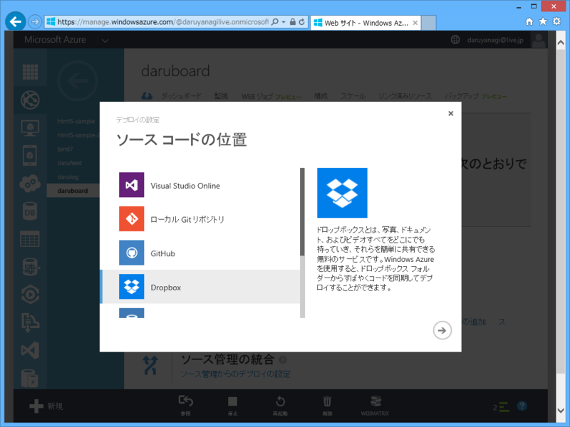
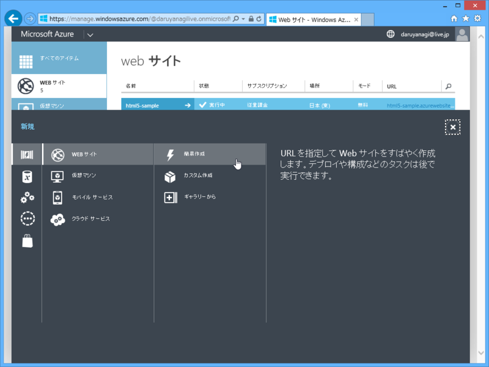
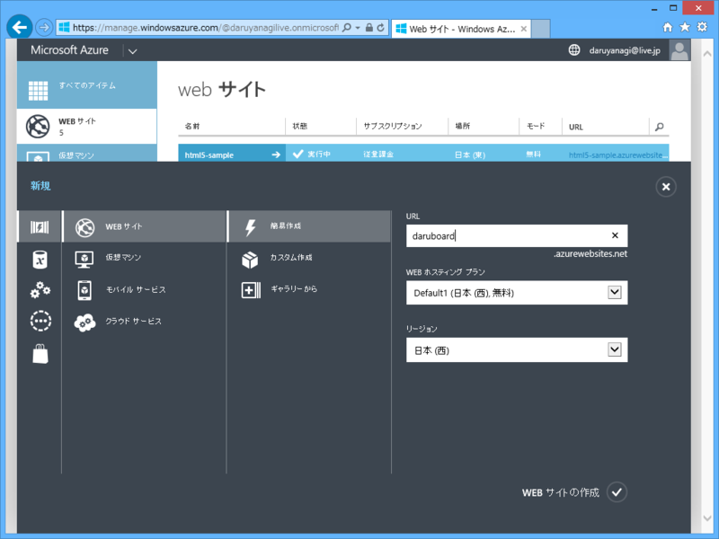
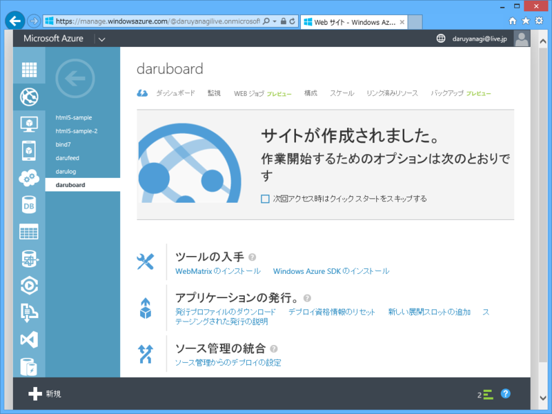
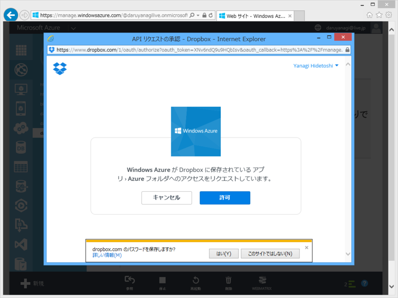
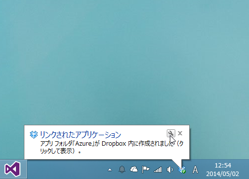
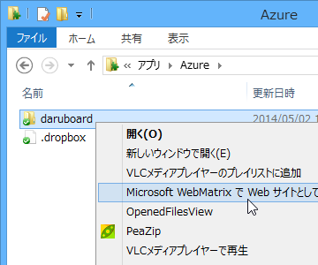
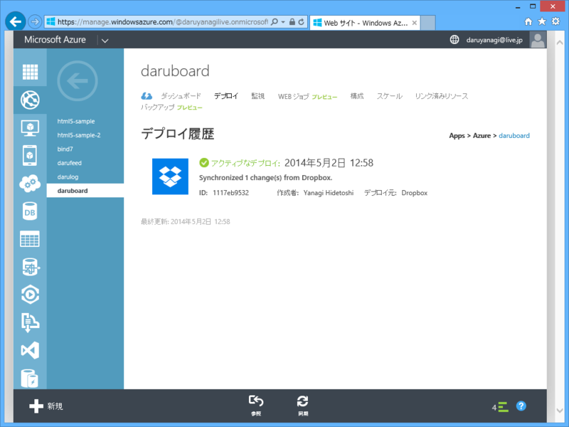
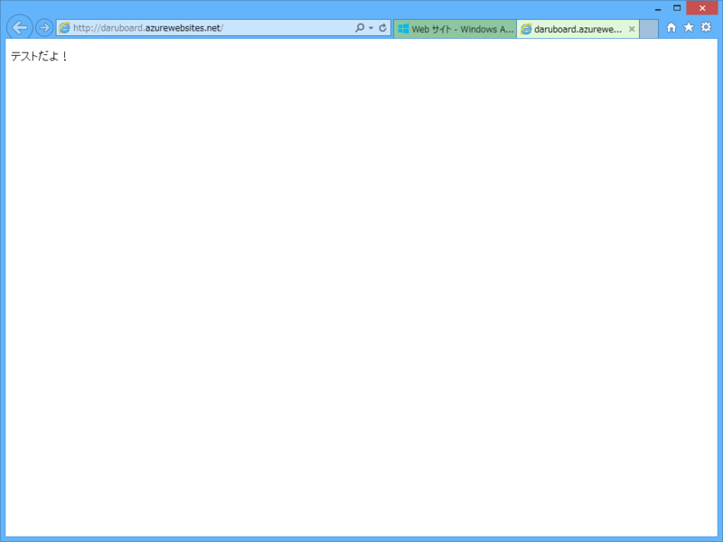

<del>Windows</del> Microsoft Azure Web サイト（MAWS）では、Dropbox のフォルダーとコードを同期して、サイトをデプロイすることができます。

<ul>
<li>複数の環境でソースコードを同期しておきたい</li>
<li>Git とかよくわかんねーけど、Dropbox なら毎日使ってるぜ</li>
</ul>
といったユーザーにお勧めかも。

<h3>サイトの作成</h3>

まず MAWS で新規サイトを作成してみました。［Web サイト］-［簡易作成］を選択し、

URL（サブドメイン）を決めるだけ（ほかはよくわからんのでそのままにした）。

できあがり。簡単すぎて鼻血が出そうでした。

<h3>Dropbox との連携</h3>

さっきの画面の下の方にある［ソース管理の統合］-［ソース管理からのデプロイの設定］を選択すると、どこに保存されているコードをサイトへデプロイするかが選べます。もちろん、今回は Dropbox を選択。

指示されるがままに Dropbox との連携処理を行うと……

なんかフォルダが作成されます。

確認してみると DROPBPBOX_ROOT\アプリ\Azure にサイトのフォルダがありますね（カタカナ！？）。これを WebMatrix でサイトとして開きます。で、なんでもいいので適当にファイルを置いてみてください。今回は“テストだよ！”と表示するだけの Default.cshtml をルートにおいています。

んで、サイトの管理画面（ブラウザー）に戻り、下の方にある［同期］ボタンを押してデプローイ！

無事サイトも動き出しました。

たぶん、デプロイってコマンドでもできるよね。静的ページ（動的なのでもいいけど）を Dropbox で管理して、コマンドでデプロイするようにすればいい感じかもしれない。

