
<a href="https://blog.daruyanagi.jp/entry/2014/05/10/200224">GW: &#x3076;&#x3089;&#x308A;&#x3068;&#x5B87;&#x548C;&#x5CF6;&#x884C;&#x3063;&#x3066;&#x304D;&#x305F;&#x3063;&#x305F;&#x3002; - &#x3060;&#x308B;&#x308D;&#x3050;</a> のはいいが、何もすることがない俺氏。駅前にあった地図と睨めっこしながら何するか悩んでたんだけど……ここには宇和島城というものがあるらしい。

――というわけで登ってみた。

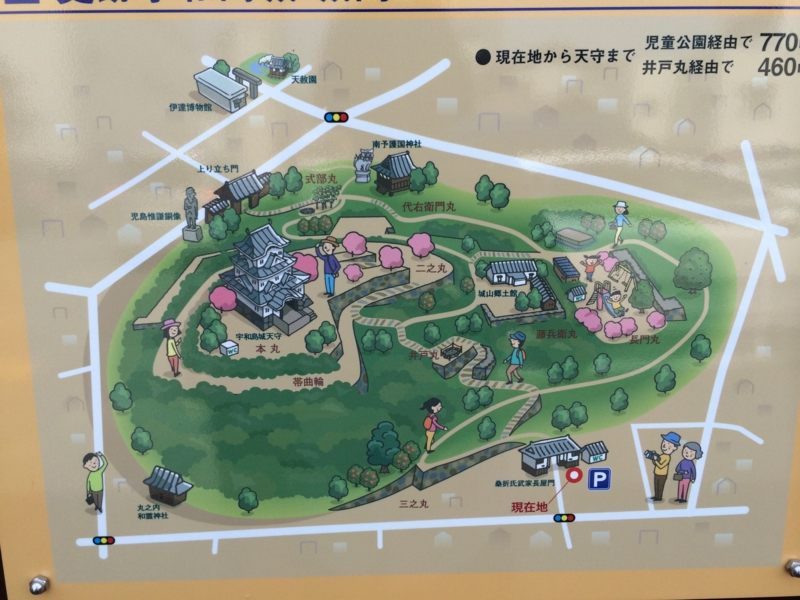
 

宇和島城があった場所には、もともと板島丸串城という中世山城があったのだけど、これを築城の名手と呼ばれた藤堂高虎が慶長年間（1596～）に近代的な海城として築きなおしたらしい。

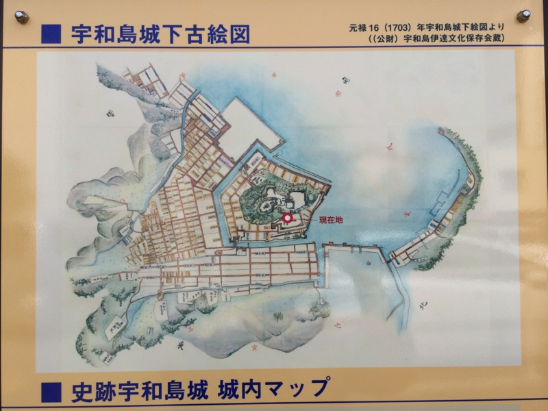

特徴的なのは、「空角の経始（あきかくのなわ）」と呼ばれる五角形の縄張り。

<blockquote cite="http://ja.wikipedia.org/wiki/%E5%AE%87%E5%92%8C%E5%B3%B6%E5%9F%8E">

高虎の発想は、城を攻める側は当然方形の縄張を予想して攻めてくる。しかし実際は五角形だから、一辺が空角になる。つまり、城を攻める側にとって、完全に死角になってしまい、攻撃は手薄になる。いわば、この一辺の空角は、敵の攻撃を避けられるとともに、敵を攻撃する出撃口ともなり得る。そればかりではない。この秘かな空角は、物資搬入口ともなり、城から落ちのびる場合の抜け道ともなる。これは守城の作戦上、効果は絶大なものといえるだろう。当時の築城術でこのようなからくりを用いた城は他にはなかった。

<cite><a href="http://ja.wikipedia.org/wiki/%E5%AE%87%E5%92%8C%E5%B3%B6%E5%9F%8E">&#x5B87;&#x548C;&#x5CF6;&#x57CE; - Wikipedia</a></cite>
</blockquote>

"現に幕府の隠密が江戸に送った密書には「四方の間、合わせて十四町」と、誤って記された"とのことで、高虎にまんまとしてやられた格好だ。

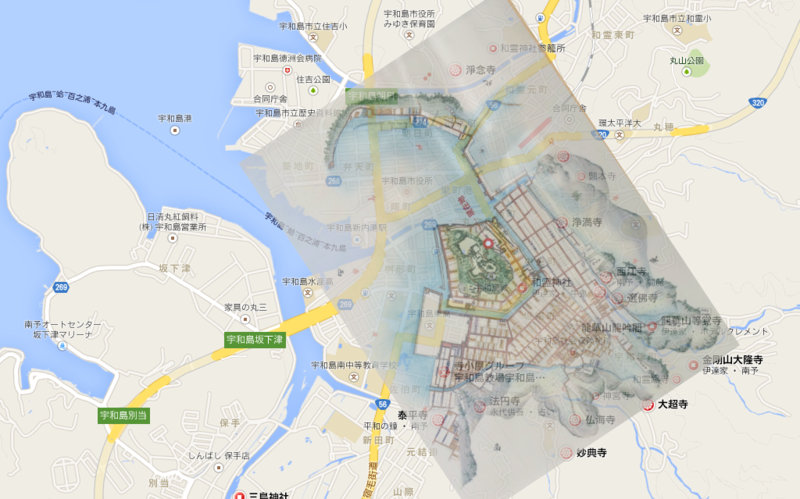

幸い、古地図にある大平寺・法恩寺が現存している。現在の大通りがかつての堀（のあたり）だったと仮定し、寺を目印にして Google Map へ古地図を重ねてみた。当時の海岸線がイメージできるかも。

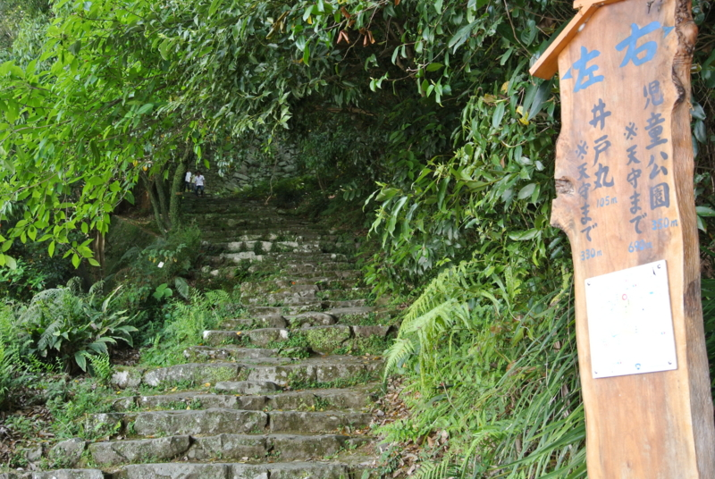

天守閣までは330m。苔むした石段が、雑草に侵されそうになりながら、山を貫いている。

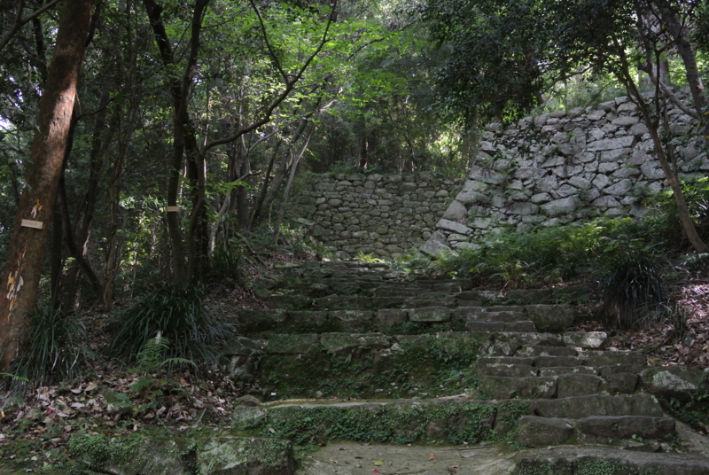

ここらへんでもう息が上がってきた。死にたい。こんな城を攻めろと言われたら、反逆できる自信ある。

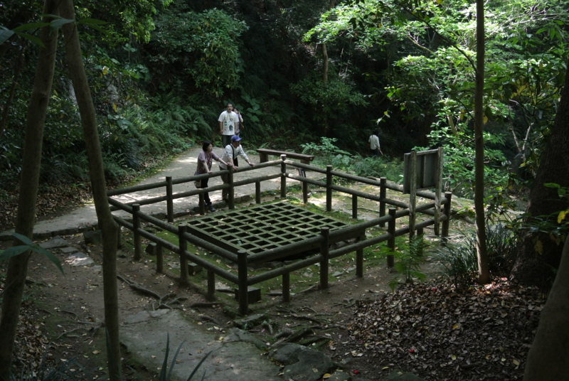

途中にある「井戸丸」。籠城の際は、この井戸が兵の喉を潤したのだろう。

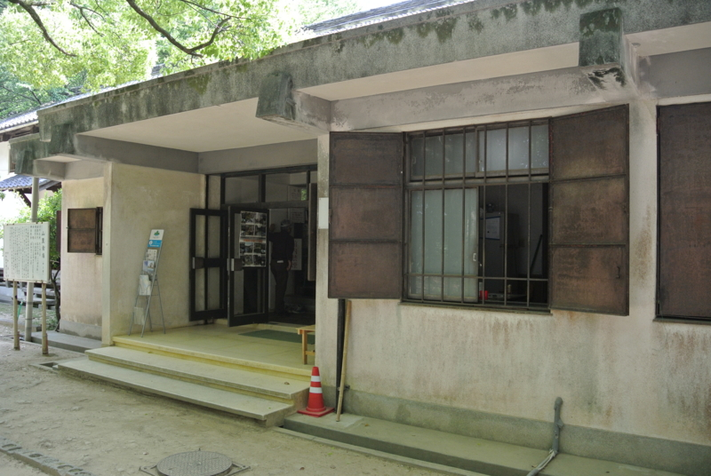

途中にあった資料館で休憩。

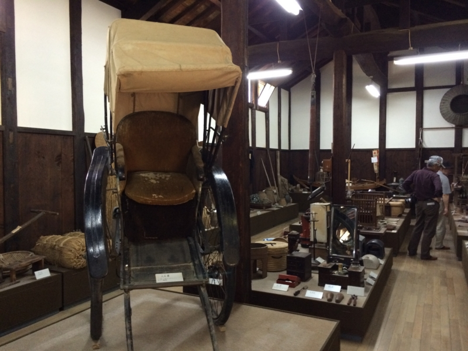

陳列物は江戸から戦前にかけてのものなのだろうか。こういう資料館って、藩主の持ち物なんかをガラス張りで陳列するものだと思っていたけれど、ここは庶民の暮らしの道具がメインになっていて、割と“実践的”な品ぞろえだと思った。

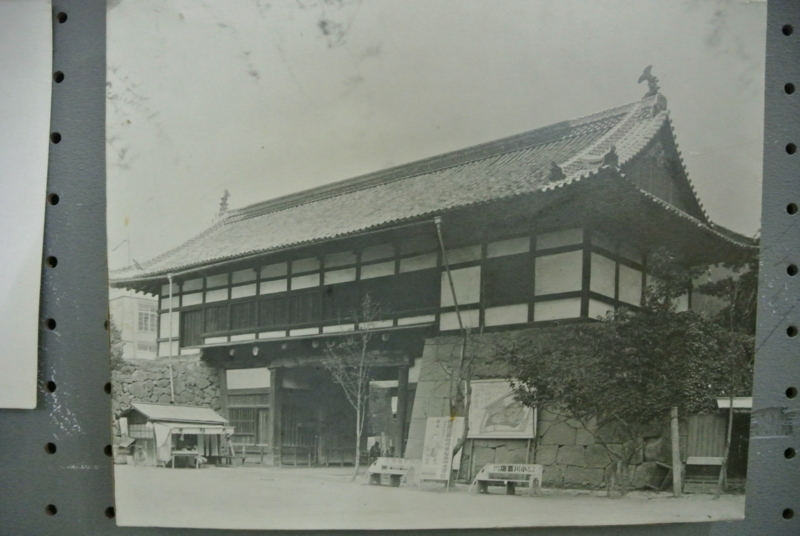

貴重な写真も展示されている。これは戦災で焼失した追手門（国宝）の在りし日の姿。天守閣とこれしか残ってなかったのに、惜しいこと。

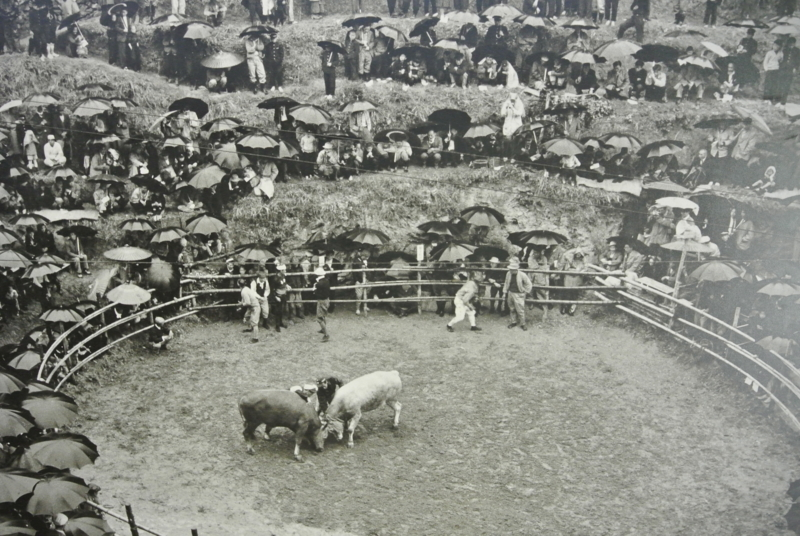

あと、宇和島は闘牛の町なのだそうだ。7月ごろに行われるのだそうで、是非みてみたいもの。ただ、混雑するのは面倒だな……。きっと、観光客でごった返すのだろう。

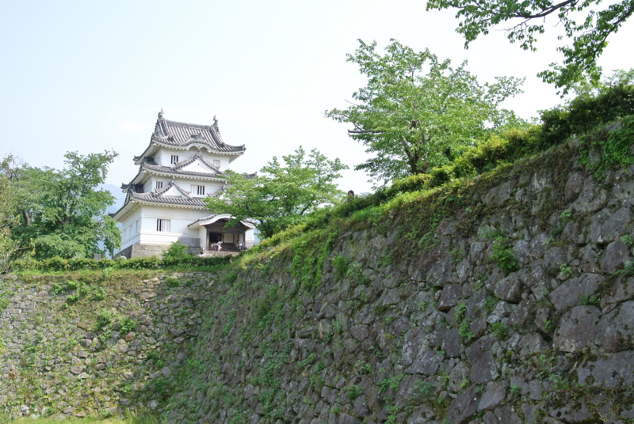

資料館も飽きたので、山登りを継続。やっとこさ、天守閣が見えてきた。

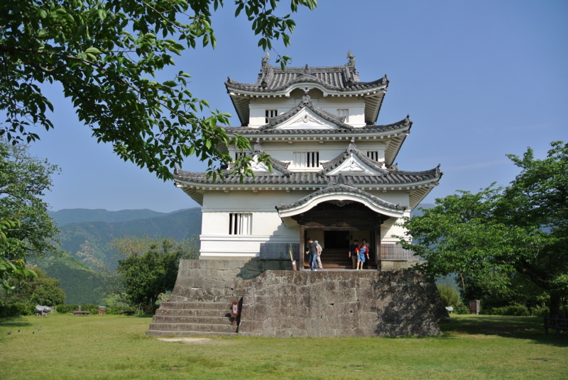

広い本丸広場に小さな天守閣――それでも三層ある立派なものだ――がポツンと建っている。正直、ちょっとショボいなと思ったけれど、往年ならば城壁などに守られて、かなり壮観な眺めだったろう。<a href="http://ja.wikipedia.org/wiki/%E7%8F%BE%E5%AD%98%E5%A4%A9%E5%AE%88">&#x73FE;&#x5B58;12&#x5929;&#x5B88;</a>のうちの一つ。

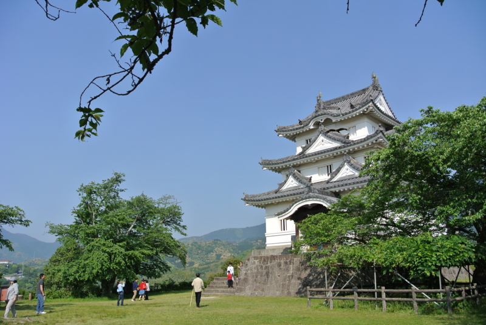

ちょっと斜めから撮ると、わりかしかっこよく見える。

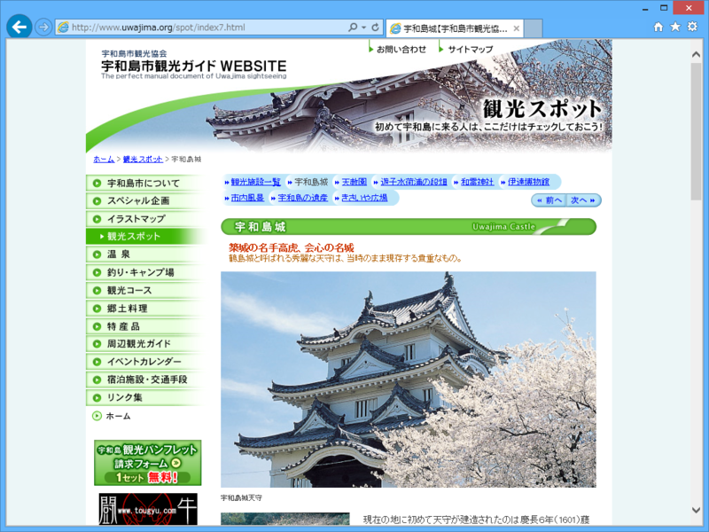

<a href="http://www.uwajima.org/spot/index7.html">&#x5B87;&#x548C;&#x5CF6;&#x57CE;&#x3010;&#x5B87;&#x548C;&#x5CF6;&#x5E02;&#x89B3;&#x5149;&#x7269;&#x7523;&#x5354;&#x4F1A;&#x3011;</a> も斜めから撮って、下部分をカットしているので、これが斜め45度の「クリステル角度」ならぬ「宇和島城角度」なのだろう。

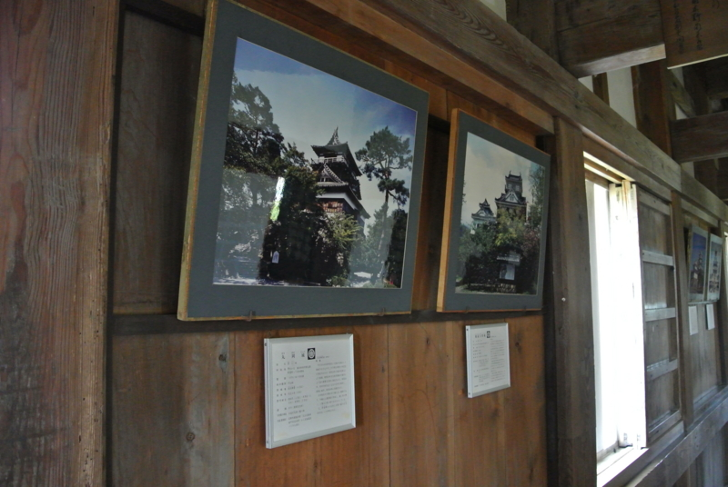

天守閣の中には、なぜか全国各地の城の写真が展示されている。「こいつらと仲間なんだぜ！」みたいな背伸びを感じて、ちょっと微笑ましく思う。宇和島城、十分カッコいいよ。全国の城の中でもかなり上位にいるよ。

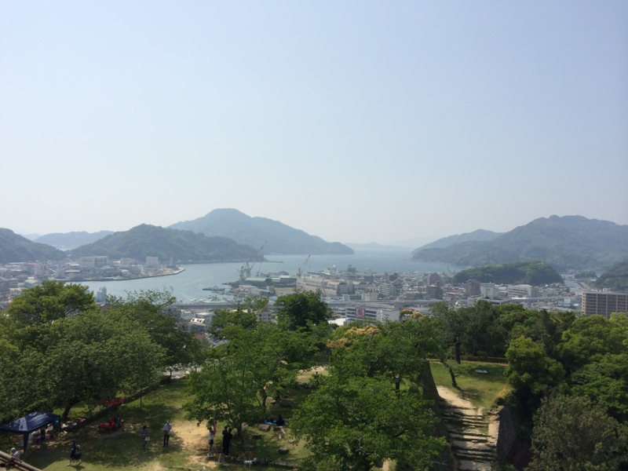

天守閣からは、宇和島の町が一望できる。山に守られたこの港、現在の大型艦船だと少し手狭なのかもしれないが、中世・近世だったらかなり使い勝手の良い港だったのではないだろうか。

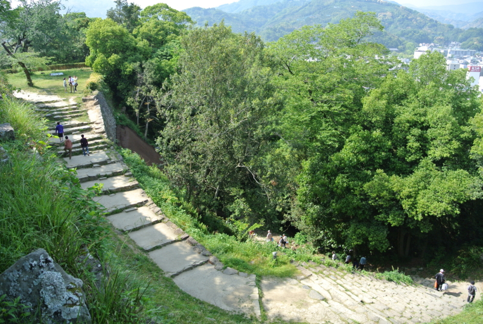

上ってきた道を見下ろしてみた。もう登りたくない……。

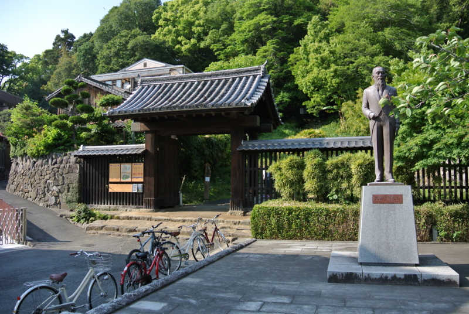

最後にお城の周りを徒歩でぐるっと一周。<a href="http://ja.wikipedia.org/wiki/%E5%85%90%E5%B3%B6%E6%83%9F%E8%AC%99">&#x5150;&#x5CF6;&#x60DF;&#x8B19; - Wikipedia</a> の銅像が立っていた。資料館には穂積兄弟（<a href="http://ja.wikipedia.org/wiki/%E7%A9%82%E7%A9%8D%E9%99%B3%E9%87%8D">&#x7A42;&#x7A4D;&#x9673;&#x91CD; - Wikipedia</a>、<a href="http://ja.wikipedia.org/wiki/%E7%A9%82%E7%A9%8D%E5%85%AB%E6%9D%9F">&#x7A42;&#x7A4D;&#x516B;&#x675F; - Wikipedia</a>）の生家が移設されていたし、宇和島は法学に縁の深い土地なのかも。

――気が向いたら続く。

