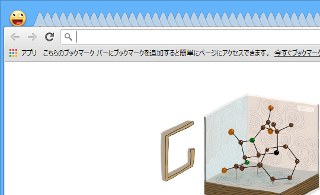
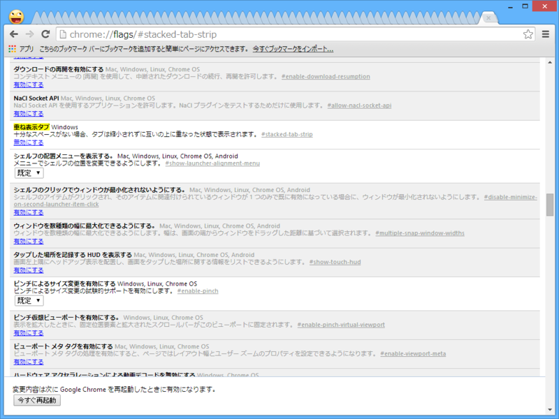
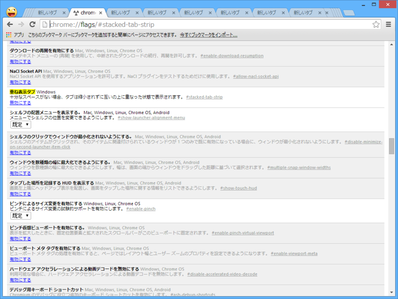
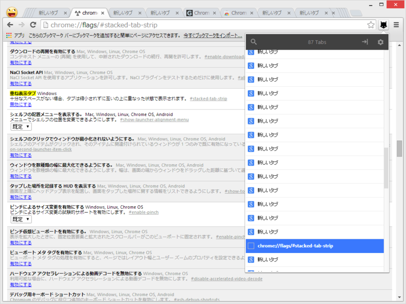

これな。タブを開きまくって、ノコギリの刃みたいになってしもうておる。もはやページタイトルを確認することすらあたわぬ。どのタブに何が表示されているのかさっぱりわからん。

<h3>「重ね表示タブ」機能を有効化する</h3>

ここからは自己責任で。まず chrome://flags/#stacked-tab-strip を開く。すると“重ね表示タブ Windows”というフラグがあるはずなので、これを有効化して「Google Chrome」を再起動する。

<blockquote>

重ね表示タブ Windows 
十分なスペースがない場合、タブは縮小されずに互いの上に重なった状態で表示されます。 #stacked-tab-strip

</blockquote>

アクティブなタブとその隣、数タブには最低限の幅が確保され、表示しきれないタブは両端にスタックされる。これで少しは見やすくなった気がする。

けれど、スタックされたタブへアクセスるのはめんどくさくなった。

<h3>拡張機能をいれてみる</h3>

試しに <a href="https://chrome.google.com/webstore/detail/tabman-tabs-manager/hgmnkflcjcohihpdcniifjbafcdelhlm/related">Chrome Web Store - Tabman Tabs Manager</a> をいれてみた。少しはマシになるかな。

こうしたタブ一覧系の拡張機能は割とたくさんあると思うので、好みのヤツをいれればいいと思う。個人的には

<ul>
<li><a href="http://www.forest.impress.co.jp/docs/review/20100727_383511.html">&#x7A93;&#x306E;&#x675C; - &#x3010;REVIEW&#x3011;&#x95B2;&#x89A7;&#x4E2D;&#x306E;&#x30BF;&#x30D6;&#x3092;&#x30D3;&#x30B8;&#x30E5;&#x30A2;&#x30EB;&#x306B;&#x5207;&#x308A;&#x66FF;&#x3048;&#x3067;&#x304D;&#x308B;Google Chrome&#x7528;&#x62E1;&#x5F35;&#x6A5F;&#x80FD;&#x300C;Tabs Plus&#x300D;</a></li>
</ul>
なんかが割りといいなと思った。ほかにもいいものがあったら教えてくりゃれ。

