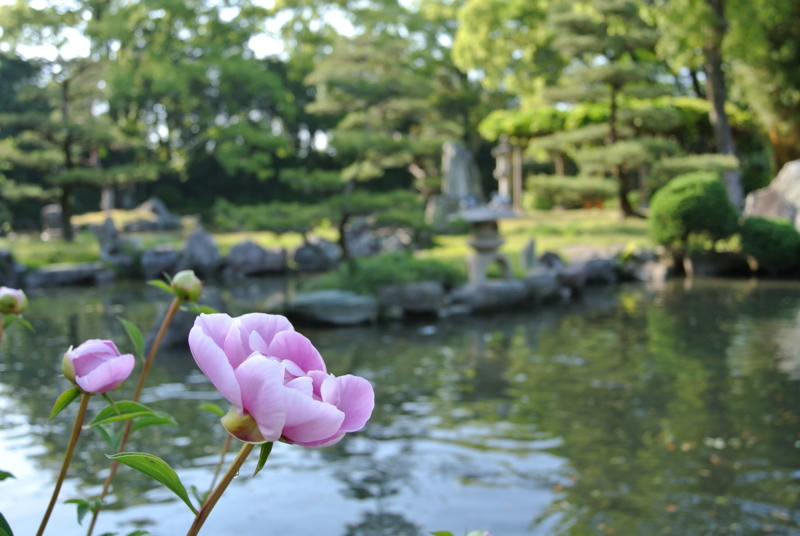
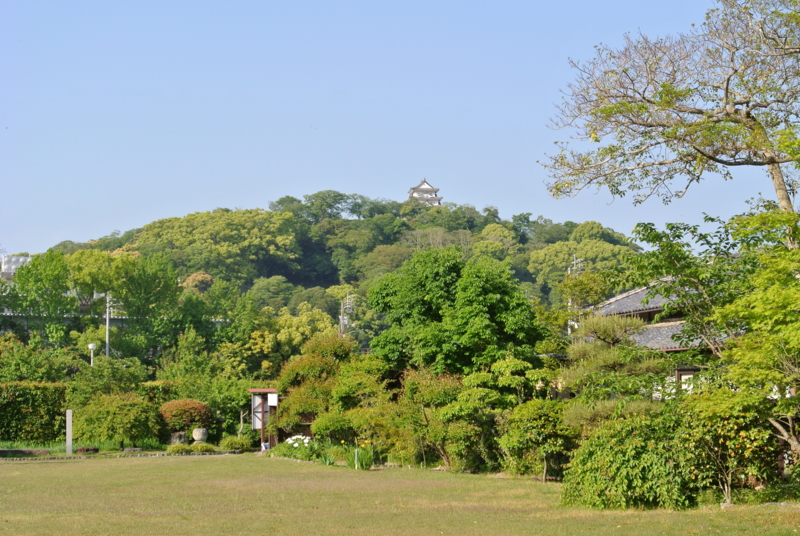
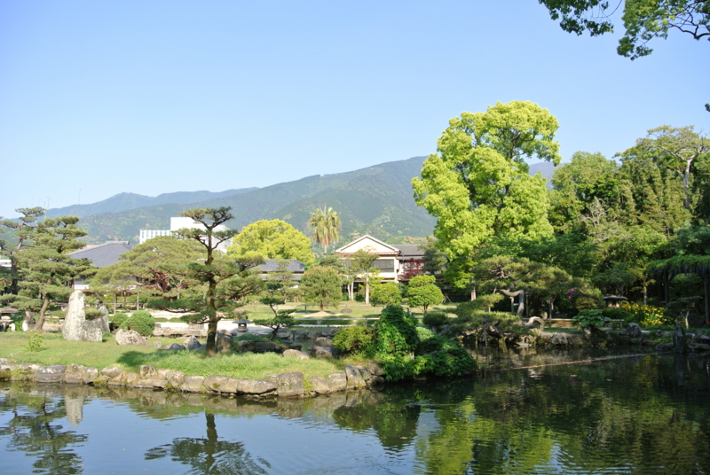
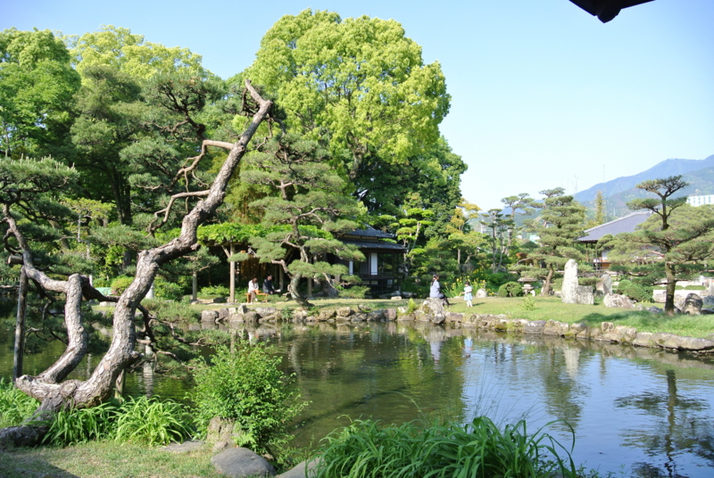
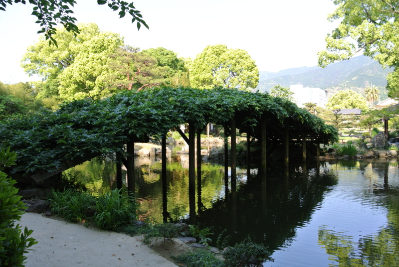
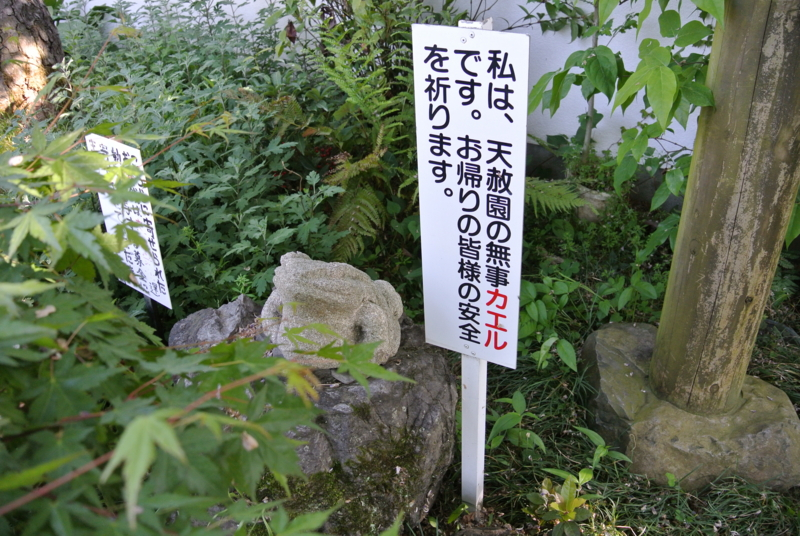
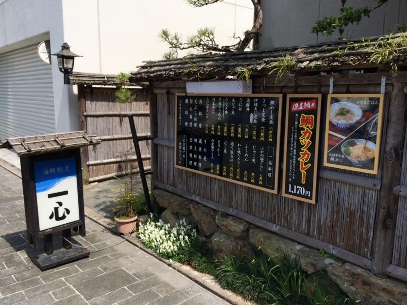
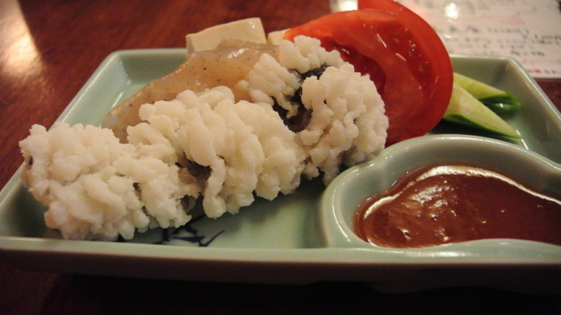
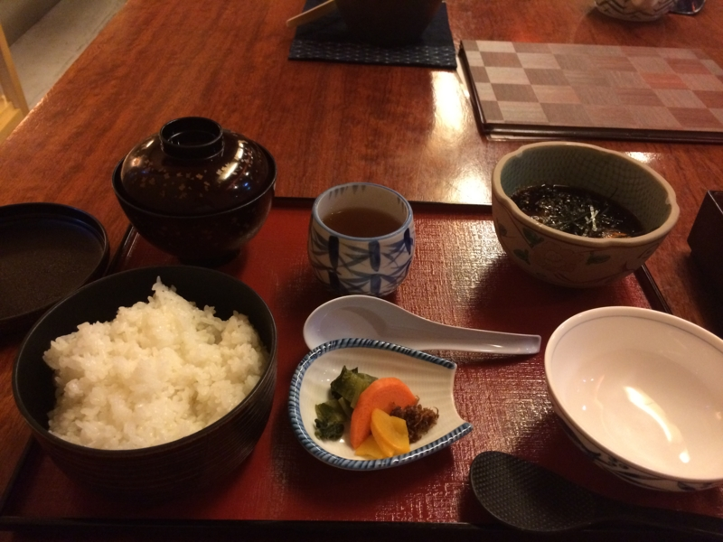
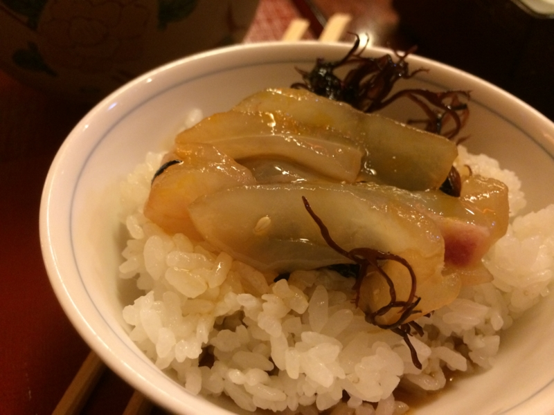

<a href="https://blog.daruyanagi.jp/entry/2014/05/11/211639">GW: &#x5B87;&#x548C;&#x5CF6;&#x57CE;&#x306B;&#x767B;&#x3063;&#x305F;&#x3063;&#x305F;&#x3002; - &#x3060;&#x308B;&#x308D;&#x3050;</a> のあとは天赦園に行った。

<blockquote cite="http://ja.wikipedia.org/wiki/%E5%A4%A9%E8%B5%A6%E5%9C%92">

天赦園（てんしゃえん）は、愛媛県宇和島市にある日本庭園。国の名勝に指定されている。元は宇和島藩2代藩主の伊達宗利が海を埋め立てて造成した浜御殿の一部であったが、幕末に7代藩主の伊達宗紀が慶応3年（1868年）に築庭した。鬼ヶ城連峰を借景とした池泉回遊式の庭園で、大名庭園でもある。

<cite><a href="http://ja.wikipedia.org/wiki/%E5%A4%A9%E8%B5%A6%E5%9C%92">&#x5929;&#x8D66;&#x5712; - Wikipedia</a></cite>
</blockquote>

名前の由来は、宗紀が詠んだ句（元は先祖である伊達政宗が詠んだもの、宇和島藩は仙台伊達家の分家に当たるんだね！）。

<blockquote>

馬上少年過 
世平白髪多 
残躯天所赦　 
不楽是如何

（馬上に少年過ぎ 世は平にして白髪多し 
残躯は天の赦す所 楽しまずして是を如何せん）

</blockquote>

「若い頃頑張ったし、のんびりして何が悪い！　存分にハネ伸ばしたるもんね！」みたいな意味ですな。「馬上少年過」というフレーズに耳覚えがあると思ったら、あれだ、司馬遼太郎の小説にあった。

<a href="http://www.amazon.co.jp/exec/obidos/ASIN/4101152241/bestylesnet-22/">馬上少年過ぐ (新潮文庫)</a>
<ul><li>作者: 司馬遼太郎</li><li>出版社/メーカー: 新潮社</li><li>発売日: 1978/11/29</li><li>メディア: 文庫</li><li> クリック: 3回</li><li><a href="http://d.hatena.ne.jp/asin/4101152241/bestylesnet-22" target="_blank">この商品を含むブログ (18件) を見る</a></li></ul>

もう一度読んでみようかな。たぶん読んだのは中学生か高校生のころだ。あと、宇和島伊達家といえば、

<a href="http://www.amazon.co.jp/exec/obidos/ASIN/4167663104/bestylesnet-22/">新装版 酔って候 (文春文庫)</a>
<ul><li>作者: 司馬遼太郎</li><li>出版社/メーカー: 文藝春秋</li><li>発売日: 2003/10/11</li><li>メディア: 文庫</li><li>購入: 2人 クリック: 10回</li><li><a href="http://d.hatena.ne.jp/asin/4167663104/bestylesnet-22" target="_blank">この商品を含むブログ (51件) を見る</a></li></ul>

に収録されている『伊達の黒船』も思い出される。手先の器用な職人が、伊達の殿様に「黒船作ってや」って無茶振りされる話だった気がする。

さて、天赦園。

さっき登った宇和島城が見える。

“鬼ヶ城連峰”を借景にしているとのことだったけど、俺にはどこが鬼ヶ城連峰なのかよくわかんなかった（爆死

この山のことなのかなぁ……。

ずっとまえにいった兼六園ほどの驚きはなかったけど、いろんな草木が植わっていてなかなか楽しいところだった。しばし四阿でのんびりしたった。

天赦園のランドマーク的なモノっぽいけど、これなんだろう（

入り口には謎の蛙さんがいて、旅の無事を祈ってくれました。

ようやく日も傾いてきたので、宇和島城に登るときにチェックしておいたご飯屋さんへ向かう。

宇和島城三の丸跡地にある「海鮮割烹 一心」さん。確か夕方は5時から。ゆったりした、調理場が一望できるコの字型のカウンターに通されました。

ビールを飲みつつ、つきだしのハモとお刺身をつまみながら、鯛めしを待つことしばし。

きました。

ぜんぜん知らなかったのだけど、宇和島の鯛めしというのはちょっと変わっている――ふつう、鯛めしって炊き込みご飯というか、火の通った鯛がのっかってるって感じかなと思うのだけど、ここのはご飯と別に、卵を落とした出汁のなかに鯛の切り身が入っている。これをかき混ぜて、ご飯にぶっかけて食べるのだ。

これがクソうまい。“卵かけごはん”を超ウルトラスーパー豪華にしてハイパーオメガ美味しくした感じだ。これが毎日食べられる身分になりたい。

味皇さまモードのスイッチが入った僕は、生ビールを4杯もいただき、5千円札一枚を置いてきたのでした（2,000円もあれば割りと楽しめそうなお店です）。大将の気も効いていて、なかなかいいお店だと思いました。

