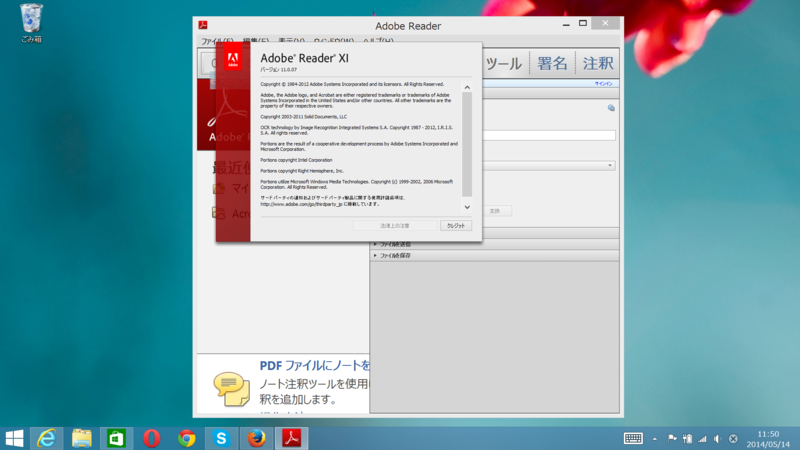
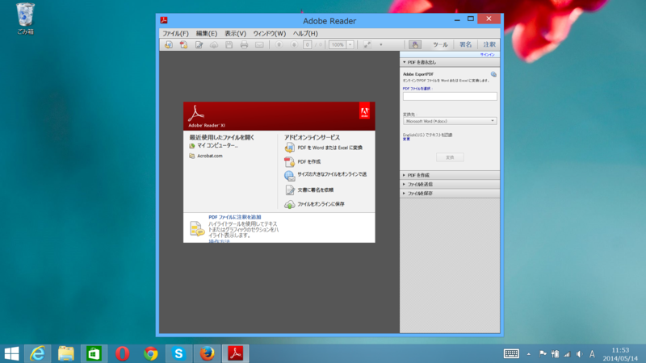
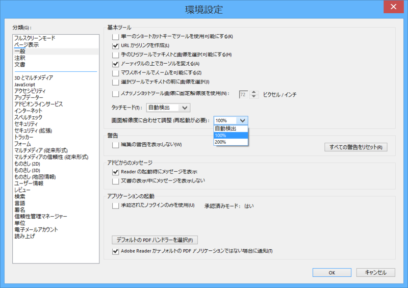
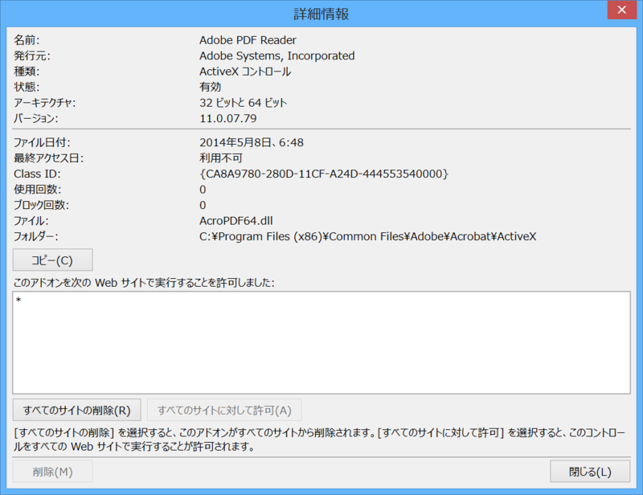

Surface 1 Pro（DPI 150％）に入れてみたら、えらいことになった。

DPI 設定を 100% に戻してみた（要再サインイン）。

デフォルトは「自動」（DPI 設定が 150% 以上ならば 200% でスケーリング）で、あとは「100％」と「200％」が選べるのだけど……使いづらいな。

11.0.07 の Adobe PDF Reader アドオン（Surface 1 Pro）。“32 ビットと 64 ビット”になってる気がする。デスクトップ PC はまだ 11.0.06 にしているのだけど（というか、アップデートがうまくいかなかった）、こちらは“32 ビット”になっている。

