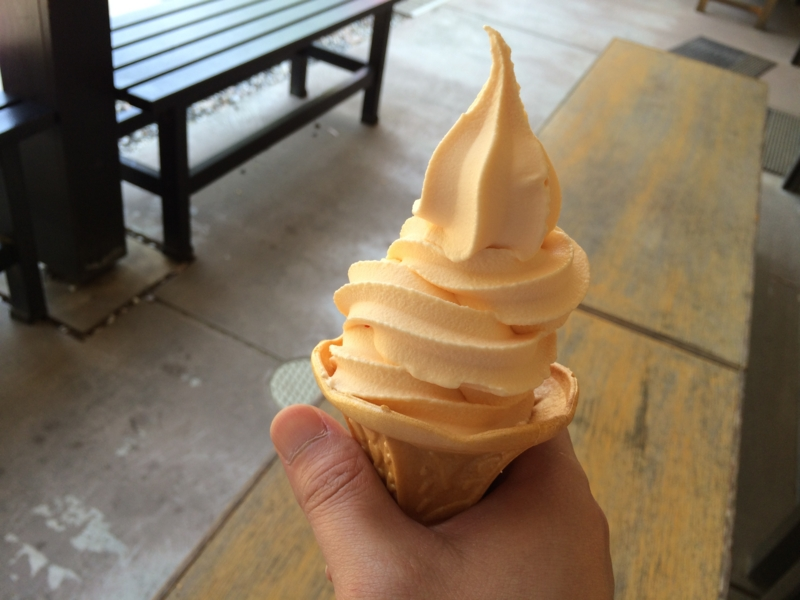
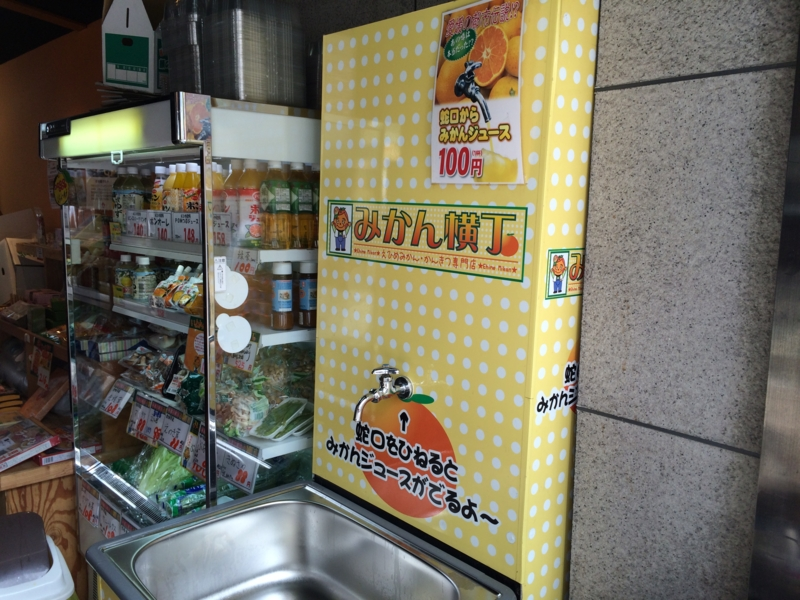
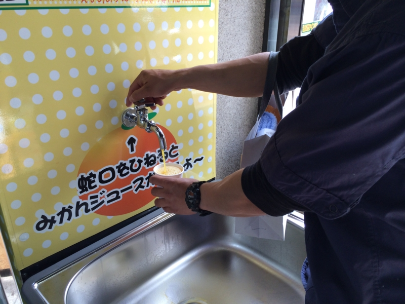
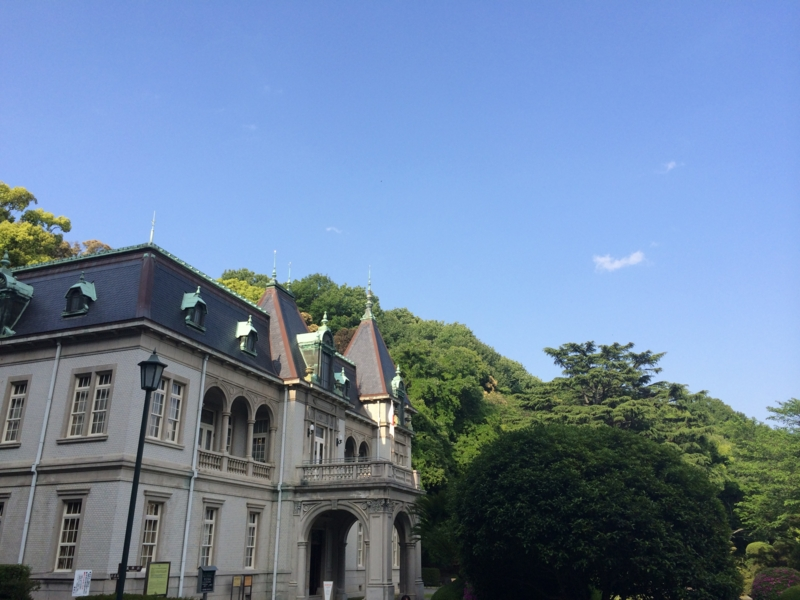
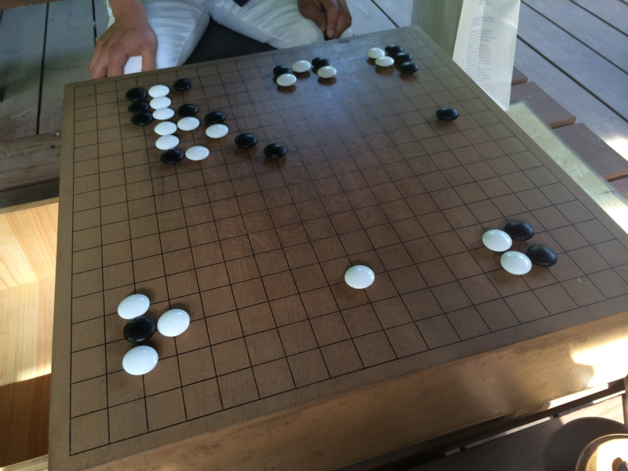
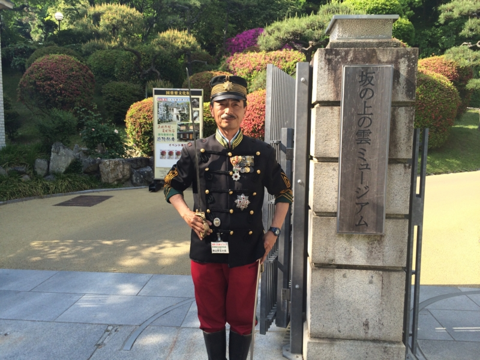
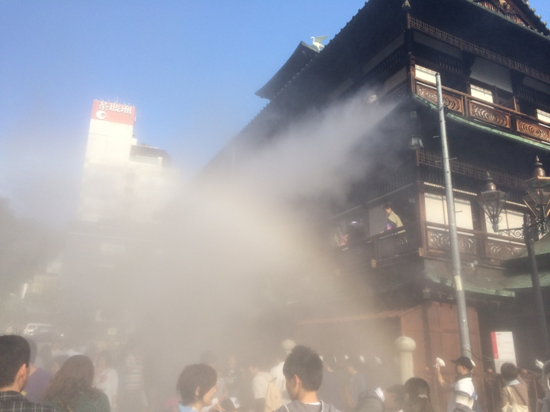
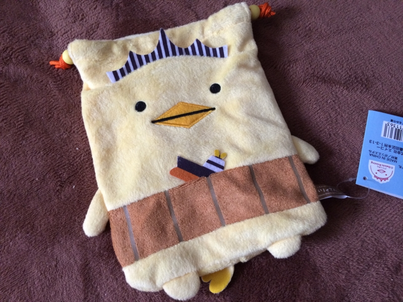
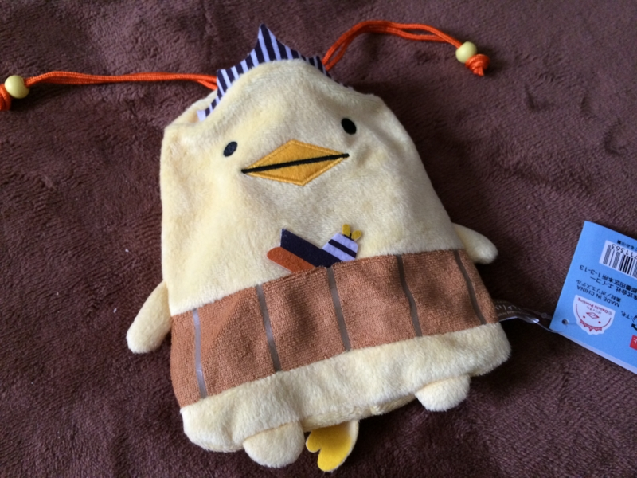

弟2号が彼女を連れて松山へ遊びに来たので、案内したった。兄は彼女いないのに（震え声

まずは定番、松山城。いい加減天守閣に登るのは飽きたので、本丸広場まで案内して、あとはお二人の時間に。自分はベンチで昼寝していた。とても空が高く、木陰に吹き込んでくる風も心地よい。30分ぐらい爆睡した。

みかんソフトクリームも食べた。初めてだったのだけど、味の方は……まぁ、一生に一度食べるのだったらアリというレベル。毎日食いたいとは思わなかった。

ちょっとビックリなのだけど、ロープウェイ通りのみかんばっかり置いてあるお土産屋さんに、ミカンジュースの蛇口ができていた。

紙コップ1杯100円。俺んちの蛇口からもミカンジュース出ないだろうか。

あと、ついでにまだ行ったことのなかった「萬翠荘」にもお邪魔した（<a href="http://www.bansuisou.org/">&#x56FD;&#x306E;&#x91CD;&#x8981;&#x6587;&#x5316;&#x8CA1; &#x842C;&#x7FE0;&#x8358;&#xFF08;&#x3070;&#x3093;&#x3059;&#x3044;&#x305D;&#x3046;&#xFF09;&#x516C;&#x5F0F;&#x30DB;&#x30FC;&#x30E0;&#x30DA;&#x30FC;&#x30B8;</a>）。なんの建物か知らんかったんだけど、「1922年（大正11年）に、旧松山藩主の子孫久松定謨（ひさまつ さだこと）伯爵が別邸として建てた、フランス・ルネッサンス風の洋館」（<a href="http://ja.wikipedia.org/wiki/%E8%90%AC%E7%BF%A0%E8%8D%98">&#x842C;&#x7FE0;&#x8358; - Wikipedia</a>）なのだそうだ。

池のそばの四阿には囲碁盤が置いてあって、自由に遊べる。定石も知らないが、戯れに弟2号と打ってみた（俺氏：白番）。最初はなんか攻められてるなーといった感じだったけど、落ち着いて受けて逆転勝ち。囲碁はよくわかんない（というか、地を数えるのが面倒な感じ）けど、ちょっと勉強してみてもいいかもしれない。

あと、秋山好古のコスプレをしたおっさんがいて、写真を撮らせてもらった（要、若干の寄付）。骨董品のリボルバー銃なんかも触らせてもらったり。

最後は道後温泉へ。浸かる気満々だったけど、めちゃくちゃ混んでいて、入れなかった。でも、ちょうど“霧の彫刻”というイベントをやっていたみたい。辺りが霧に覆われ、ちょっと歩き疲れたところ、思いがけず涼が得られた。

<h3>おまけ</h3>

今回の戦利品。

