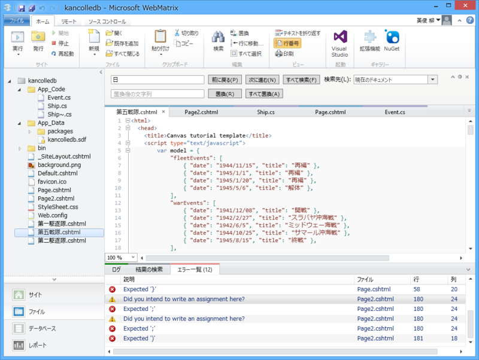
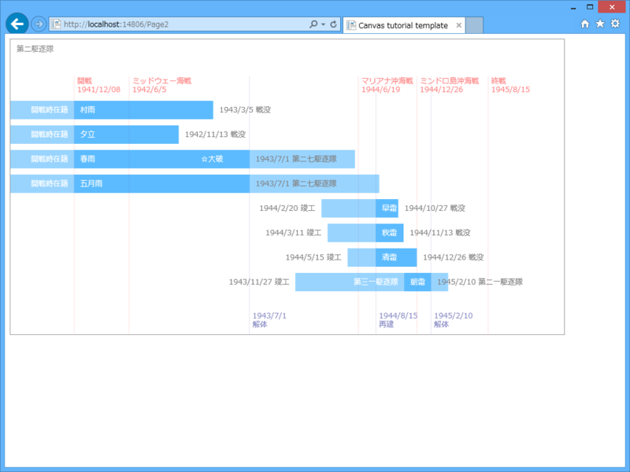
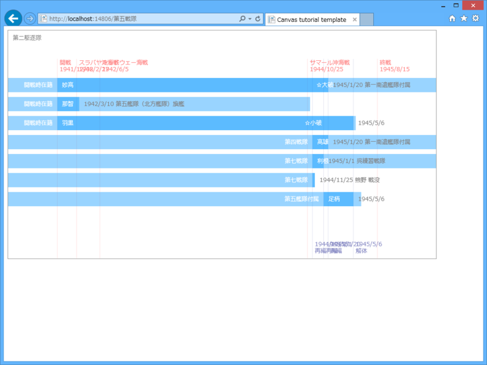

（別に技術的な内容ではない。ただの日記だ。成果をまとめてるといつまでたってもブログが書けないし、それは自分の役割でもない気がする。ただ、近頃はこんなことをして遊んでるというだけの話だ。最近は時間がとれないので、こういう形が増えそうな気がする）

太平洋戦争期の艦隊編成を年表みたいに表示できたらいいなと思って（<a href="http://www.jyai.net/military/data-08/kuchikutai_00.htm">&#x3053;&#x3093;&#x306A;&#x304B;&#x3093;&#x3058;</a>）、いろいろ頑張ってみた。

最初は div を position: absolute で配置していく感じにしたのだけど、データが複雑になるにつれて破綻していくように思えたので、Canvas に図を書くことにした。Canvas に書いちゃうとテキストにリンクが貼れないのがちょっとアレだけど、それはそれで仕方ない。

とりあえず線を引くとこから始めて、半日後にはこんな感じに成長した。HTML5 Canvas は割りと低レベルな API っぽくて、線を一本引くだけでもダルい。みんなどうやっているんだろう。なんかラッパーを書くのかな？　ライブラリを使うのかな？

まぁ、それはともかく。

最初はグラフとデータが一体化していたのだけど（1941年12月8日は x px に、1945年8月15日は y px にマッピングしてそれを線で結ぶ、とかとか）、JavaScript に慣れるにしたがって少しずつ分けていった。そのデータも、最初は

<pre class="code lang-javascript" data-lang="javascript" data-unlink>var events = [];
events.push(new Event(&quot;1941/12/08&quot;, &quot;開戦時編成&quot;));
events.push(new Event(&quot;1943/7/1&quot;, &quot;解体&quot;));
events.push(new Event(&quot;1944/8/15&quot;, &quot;再建&quot;));
events.push(new Event(&quot;1945/2/10&quot;, &quot;解体&quot;));
events.push(new Event(&quot;1945/8/15&quot;, &quot;終戦&quot;));
</pre>
みたいな糞ダサいコードで用意していたのだけど（とりあえず動いてくれ！！）、最後には

<pre class="code lang-javascript" data-lang="javascript" data-unlink>var model = {
&quot;fleetEvents&quot;: [
{ &quot;date&quot;: &quot;1944/11/15&quot;, &quot;title&quot;: &quot;再編&quot; },
{ &quot;date&quot;: &quot;1945/1/1&quot;, &quot;title&quot;: &quot;再編&quot; },
{ &quot;date&quot;: &quot;1945/1/20&quot;, &quot;title&quot;: &quot;再編&quot; },
{ &quot;date&quot;: &quot;1945/5/6&quot;, &quot;title&quot;: &quot;解体&quot; },
],
&quot;warEvents&quot;: [
{ &quot;date&quot;: &quot;1941/12/08&quot;, &quot;title&quot;: &quot;開戦&quot; },
{ &quot;date&quot;: &quot;1942/2/27&quot;, &quot;title&quot;: &quot;スラバヤ沖海戦&quot; },
{ &quot;date&quot;: &quot;1942/6/5&quot;, &quot;title&quot;: &quot;ミッドウェー海戦&quot; },
{ &quot;date&quot;: &quot;1944/10/25&quot;, &quot;title&quot;: &quot;サマール沖海戦&quot; },
{ &quot;date&quot;: &quot;1945/8/15&quot;, &quot;title&quot;: &quot;終戦&quot; },
],
&quot;ships&quot;: [
{
&quot;name&quot;: &quot;妙高&quot;,
&quot;comm&quot;: &quot;1929/7/31&quot;,
&quot;lost&quot;: &quot;1946/7/8&quot;,
&quot;join&quot;: &quot;1941/12/08&quot;,
&quot;left&quot;: &quot;1945/1/20&quot;,
&quot;beforeJoin&quot;: &quot;開戦時在籍&quot;,
&quot;afterLeft&quot;: &quot;第一南遣艦隊付属&quot;,
&quot;damaged&quot;: [
{ &quot;date&quot;: &quot;1944/12/13&quot;, &quot;title&quot;: &quot;大破&quot; }
]
},
</pre>
みたいな JSON データを読み込む感じにできた。これで、こんな JSON を返すサーバーを作れば動的にグラフが書けるハズ（今度はどうやってサーバーを書けばいいかわからん。Dapper で少し考えてみたけど、自分は結合とかよくわかってないから SQL だけでサクッと書けない。まぁ、C# で書けばいいのか）。

最初のスクリーンショットは第二駆逐艦のデータを使ったけど、次は同じプレゼンテーションコードに第五戦隊のデータをぶち込んでみた。テキストが被りまくってるのを除けば、だいたいうまくできてる（ってことは、ちゃんとデータとビューが分離できたってことなのかな？）。あとは measureText() でちゃんとテキストの大きさを図って、ずらして描画していけばいいはず。

ちょっと JavaScript が楽しくなってきた。いまだに文法あんまり覚えてなくて、細かいところでハマって時間を浪費しているけれど、これから先 C# しかわかんないのもどうかと思うので頑張る。

