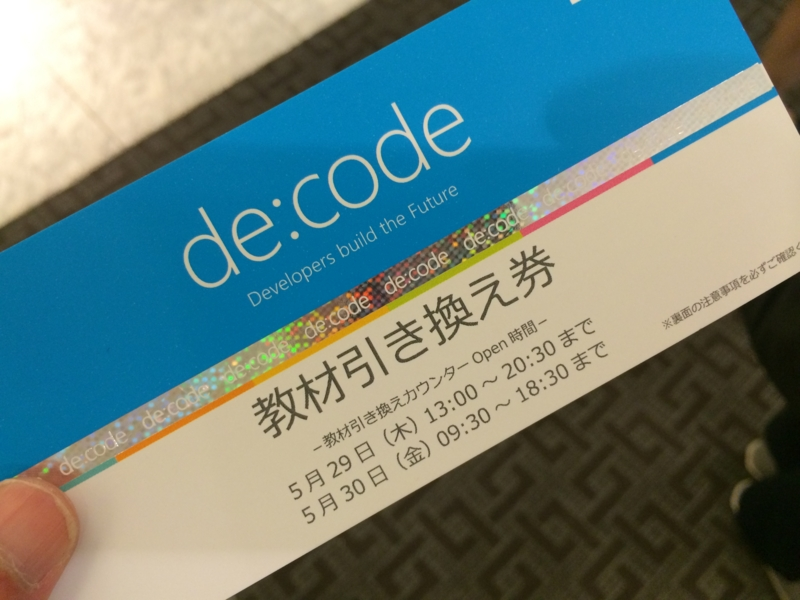

<a href="http://www.microsoft.com/ja-jp/events/developer/">de:code &#xFF5C; &#x65E5;&#x672C;&#x30DE;&#x30A4;&#x30AF;&#x30ED;&#x30BD;&#x30D5;&#x30C8;&#x306E;&#x958B;&#x767A;&#x8005;/&#x30A2;&#x30FC;&#x30AD;&#x30C6;&#x30AF;&#x30C8;&#x5411;&#x3051;&#x30A4;&#x30D9;&#x30F3;&#x30C8; - Microsoft Events &amp; Seminars</a> へ参加してきた。自腹で。10万円ちょいだっけ？　はまぁ、ともかくいいのだけど、その間無収入になるし、交通費かかるしで、思った以上に負担だった……。少しでも穴埋めしようと仕事頑張った結果、参加した時にはすでにちょっと消耗していたし。こういうとき、会社員は楽でいいよなぁ。有給休暇がうらやましいぜ。

――それはともかく。

個人的には、

<blockquote>

Azure Web Sites Deep Dive! Kudu から Management API まで  
～ Azure Web Sites 応用編 ～詳細を見る 
何気なく利用している Azure Web Sites の裏側で活躍している Kudu や Management API などのバックエンド サービスに光を当ててご紹介します。 
レベル：400 (専門) 
5 月 29 日 (木) 17:40 - 18:30 
Room C 
芝村 達郎 
ソーシャルグリッド株式会社

</blockquote>

のセッションと、

（日頃 Twitter でいろいろつぶやいてるが、こいつどうやってそういうの調べてんだろうと思ってたのだけど、ははーんそういうことだったのかーっていう感じ。実際に真似して試さないまでも、そういう部分を知らずに触るのと知って触るのとでは全然違うだろう）

<blockquote>

Windows Runtime 徹底解説 - Deep Dive - 
Windows Runtime は、Windows 8 以降の OS だけでなく Windows Phone 8 以降や Xbox One のアプリ環境も提供しています。そして、実行環境だけでなく、アプリ開発に役立つライブラリという側面もあります。本セッションでは、Windows Runtime の奥底に流れる動作や技術詳細に踏み込んだ解説をします。 
レベル：400 (専門) 
5 月 30 日 (金) 15:50 - 16:40 
Room F 
荒井 省三 
日本マイクロソフト株式会社 
デベロッパー & プラットフォーム統括本部 
エバンジェリスト

</blockquote>

がダントツに面白かった。

（「COM は死んだ？　死なねーよ！」でグッと引き込まれてしまった。Windows Runtime は COM ベースだというのがよくわかるデモがグッド。個人的には IME 周りの話もツッコんでやってほしかったけど、限られた時間では無理かな）

PowerShell DSC の話も面白かったし、ユニバーサルアプリが割も簡単そうでやってみようかなって気になった（実際にやってみたら、いろいろ暗黒面に直面するだろうｗ）。「ちょっと意味が分かんないところがある」ぐらい難易度のセッションが増えてくれると、寝不足でつらいカラダでも舟を漕がずに済んでうれしい。

あと、TypeScript は頑張ってみたいなと思う。最近少しだけ JavaScript を齧ってるけれど、ちょっとこれめんどくさすぎる。言語仕様的には変数のスコープが罠だなと思うぐらいだけど、いっちいち function () {} とか書くのタルいし、それだけのために TypeScript 使ってもいいかなって思ってる。JavaScript のスーパーセットなのだから、好きな仕様だけ使って、あとは生の JavaScript を書けばいいんだよね！？

（関係ない話。仙台プロ生で飲みながら話した時に思ったのだけど、スクリプト使いのひとは IDE なんてめんどくさいと思っているのに対し、静的型付け言語派は IDE の助けもなしにプログラミングするのがめんどくさいと思っているんだなと、今さらながら実感できてちょっと面白かった。）

<h3>教材ガチャ</h3>

<blockquote class="twitter-tweet" lang="ja">
当てた。Windows Phone 勢が S レアだって騒いでる <a href="http://t.co/elbYjZVevv">pic.twitter.com/elbYjZVevv</a>
&mdash; ご注文はだるやなぎですか？ (@daruyanagi) <a href="https://twitter.com/daruyanagi/statuses/471864891872014339">2014, 5月 29</a></blockquote>

あとでわかったけど、ハズレだった ／(＾o＾)＼ おい、WP 軍団、あとでツラを貸せや ＼(＾o＾)／

でも、日本語のフォントなんかが全部入ってる ＆ SIM ロックとかめんどくさいところがないらしいので、めんどくさがりの自分にはこれでいいような気もする。もう若くないし、ROM 焼いたりなんて聞くだけでめんどくさい。ハードはソフトが動けばよろしく、それで十分だ。できれば、美しく、頑丈であってほしいけれど。

<blockquote class="twitter-tweet" lang="ja">
誰も開けないので開ける <a href="http://t.co/RdDrWoK5vA">pic.twitter.com/RdDrWoK5vA</a>
&mdash; ご注文はだるやなぎですか？ (@daruyanagi) <a href="https://twitter.com/daruyanagi/statuses/471867961884413952">2014, 5月 29</a></blockquote>

もう一つのタブレットについては、あまり言うことはない。どうせこういう端末を作るなら、ペン入力ぐらいつけるべきだ。デザインにも機能にもチャレンジングな姿勢が全く感じられず、なにが「Leading Innovation」だゴルァ！　としか言いようがない。

ただ、@you_and_i さんが「HDMI 出力がついているのはうれしい」と言っていた。あんまり自分はそこを評価していなかったから、ちょっとなるほどなって思ったり。企業向けにはそこそこ受けたりするんだろうか。

――ともあれ、こういうお土産デバイスもうれしいんだけど、できたらこれなしで安いプランがあったらうれしいなって思ったかも。ただでさえ Surface Pro 3 がほしくてお金ためなきゃいけない時期なのでｗ

<blockquote class="twitter-tweet" lang="ja">
de:code みたいなイベント、成功してくれないと困る気がする。ますます日本がスルーされるんじゃないかって感じ。ぶっちゃけ開発者でもない俺なんて行かなくてもいいんだけど、漢気みせんとな。まぁ、勉強したいってのももちろんあるし
&mdash; ご注文はだるやなぎですか？ (@daruyanagi) <a href="https://twitter.com/daruyanagi/statuses/471482609638207488">2014, 5月 28</a></blockquote>

もしかしたらプレスとして入ったり、紹介があったりとかでタダで入れるチャンスはあったのかもしれないけれど、今回は最初からお金を払って参加しようと決めていた。というのも、こういうイベントが成功して、「毎年」（←ここ重要）続いていくことは日本の IT 界にとって割と重要かなと思ったので、ちょっと貢献したかったから。そうじゃないと、なんでも日本の頭を通り越して決まって行ってしまうかなぁ、と。最初だし、海外の情報の焼き直しが多いのは仕方がないと思うけれど、徐々にステップアップしていって、海外からも参加者が来るぐらいになってほしいよね（日本語でやってるうちはあかんのかもしれんけどｗ）。

来年も参加したいけど、お金あるかな……orz　貧乏は嫌だぉ……

