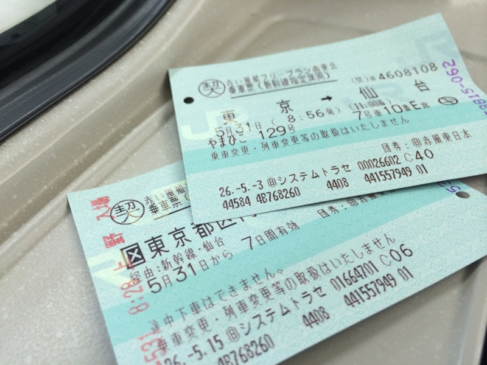

今週末は強行軍で、さすがにちょっとしんどかった。

<ul>
<li>5/28 昼：松山 → 東京。夜：前の会社の人と会食、小岩の飲み屋に顔を出す</li>
<li>5/29 昼：<a href="https://blog.daruyanagi.jp/entry/2014/06/05/010551">de:code</a> 1日目。夜：パーティーサボって旧友と飲み会</li>
<li>5/30 昼：de:code 2日目。夜：秋葉原で謎の飲み会</li>
<li>5/31 昼：東京 → 仙台。プロ生＠仙台参加。夜：懇親会（2次会まで参加）</li>
<li>6/01 昼：仙台 → 東京。夜：割と遅めに帰宅。</li>
<li>6/02 昼：東京 → 松山。夜まで壊れた PC の復旧</li>
</ul>
後半はちょっとおなかの調子も悪くて、トラブルにも遭った。

<h3>その壱：新幹線に乗り遅れかけた</h3>

1日の仙台 → 東京での話。

新幹線の出発前、少し時間があったので仙台駅のトイレに籠って大をしていたのだけど、なんか頭がぼーっとしてしまって。同行の @jz5 から「先に電車乗ってるわ」とメールがあって我に返り、慌ててトイレを出てホームへひた走ったのだが……

――途中でエスカレーターで手に持ってた切符をひっかけて落としてしまった ／(＾o＾)＼

スーッとエスカレーターの手すりを滑り落ちていく切符。まるでスローモーションの映像のようで、美しい。

そのあと慌てて下りのエスカレーター駆け下りて切符を探したのだけど、結局見つからなかった。仕方ないので、そのまま新幹線に乗る。格安の切符なので、今さらほかの列車に振り替えることもできないので仕方がない。

幸い、落としたのは乗車券のみで、特急券は残っていた。それを見せながら車掌さんに事情説明。改札の駅員さんにも事情を説明したところ、なんとか今回は乗車券を買いなおさずに済んだ。ありがたや……ありがたや……。車掌さんが最初メンドクサそうな対応だったので、内心割りと逆切れしていたのだけどｗ

<h3>その弐：飛行機に乗り遅れかけた</h3>

2日の東京 → 松山での話。

その日はいつも使っている総武快速が止まっていたらしく（？）、初めて京成を使うことにした。よくわからんけど、Google Map さんによると、市川真間駅を出て、京成八幡で特急に乗り換えたら、十分余裕をもって成田空港に10:00には着くらしい。フライトは11:00なので十分間に合う。

――が、なんか頭がぼーっとしてしまって、京成八幡で降りるのを忘れていた／(＾o＾)＼

しょうがないから船橋まで行って成田空港行の快速へ乗り換えを図る。それでもまだ時間には余裕があったので、ちょっとおなかの調子が良くなかった僕は、京成船橋のトイレに籠ることにした。そこで念入りに時刻表を調べたところ、なにやら「シティライナー」という日に数本しか走っていない電車に乗れるらしい。これはラッキーではないかと思ったので、快速をパスしてそっちに乗ってみた。5分ぐらい余裕をもってウンコもできるしな。

――しかし。なんと「成田空港」行きじゃなくて、「成田」行きだった。

終点に着いて列車を下ろされると、そこは田舎くさい改札だった。空港……どこ……。スーツケースをゴロゴロ言わせながら、途方に暮れる俺氏。幸い、タクシーがいたのでそれを捕まえて、第二ターミナルまで急ぐ。

「どれぐらいかかりますか (*´ω｀*)」 
「17、8分でしょうか」 
「（今は10:02……、うおおお、やべええ！）そうですか (*´ω｀*)」 
「お急ぎですか？」 
「まぁね (*´ω｀*)」

タクシーにスピード違反をさせるわけにもいかないし、あえて冷静を装う俺氏だったが、内心は焦りまくりだった。ジェットスターだから、飛行機まではリムジンでの移動になる。ANA だったら余裕のタイミングでも、ジェットスターでは命取りになるやもしれぬ。

「着きましたー。2,***円になります」 
「（耳に入ってない）3,000円！　お釣り要らないんで急いでトランク開けてください！」 
「ぇ、あ、はい、ありがとうございます」 
「急いで……急いで……(ノД`)・゜・。」

10:30ごろ、黄色いスーツケースを高速でゴロゴロさせ、第二ターミナル2Fを全速力で走り回るおっさんがいたら、それは私です。なんとか間に合ってよかったけど、もうこんな目は二度と会いたくない……orz

<h3>教訓</h3>

切符落としたり、タクシーに3,000円払ったりしてたら、格安チケットの意味ないな！

