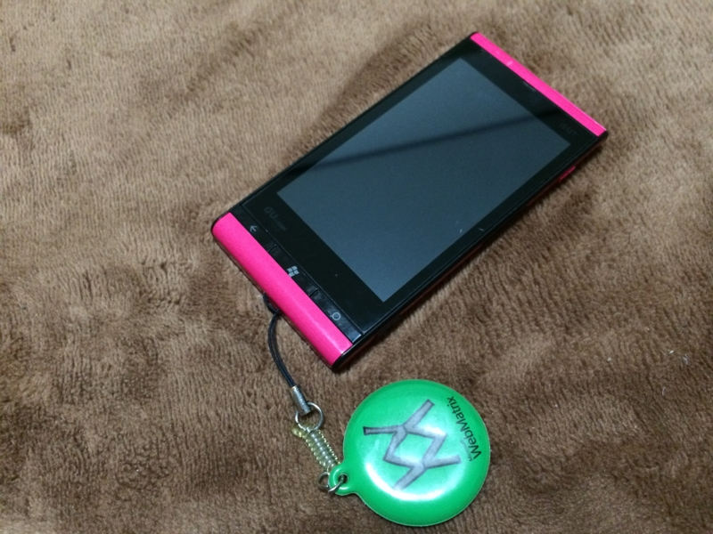
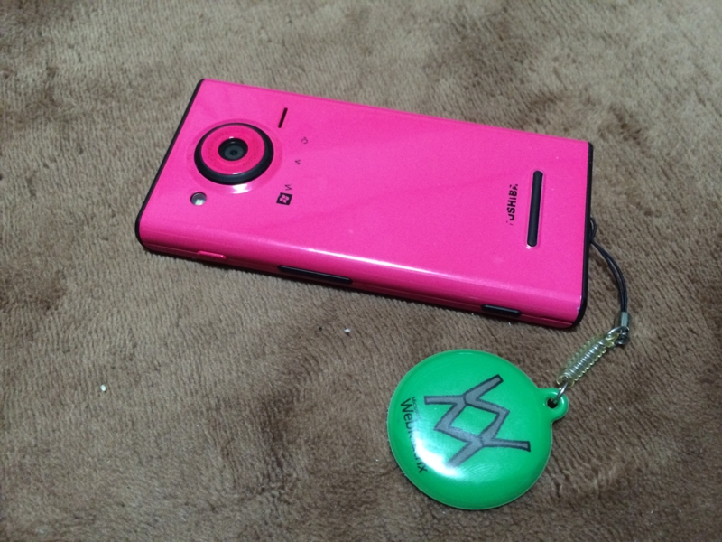

（ストラップは @WebMatrixman の画面拭き。割と気に入っている）

de:code に参加する前日、IS12T を解約した。一年ぐらい前までは、そのうち au から Windows Phone 端末が出るかなと淡く期待していたのだけど、もはやそういうこともなさそうなので。Windows Phone 端末のために義理で毎月お布施してやったのに、解約手数料はキッチリとられるらしい。まぁ、そういう契約なので仕方がない。

この IS12T は、正直言ってビミョーな端末だった。とくに初期のファームウェアは不安定で、音楽を聴いていると勝手に再起動したりした。手に入れたばっかりでウキウキしているときにこういう不具合をやられると、どうしても印象は悪くなる。ただ、デザインは悪くなかったと思う（背面のカメラを強調しているところは嫌い）。僕はマゼンダを選んだのだけど、こういうハデな色は Windows Phone にピッタリだったと思う（Surface の Type/Touch Cover もこういうハデな色のほうが断然いい！）。

もう裏の Windows Phone ロゴもハゲちゃって（TOSHIBA ロゴはどうでもいい）、そろそろ引退かなって感じ。お疲れ様。

東京へ来たついでに、アキバで中古の Windows Phone を買って帰るつもりだったけれど、S レア端末を de:code でいただいたので、これからはそっちを開発用に活用させていただこうかと思う。

<ul>
<li><a href="https://blog.daruyanagi.jp/category/IS12T">IS12T</a> （初期の記事はブログ移転の際に失われたようだ）</li>
</ul>