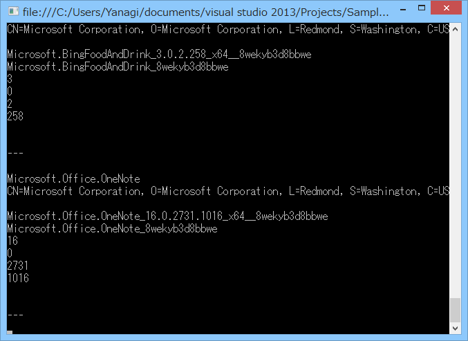
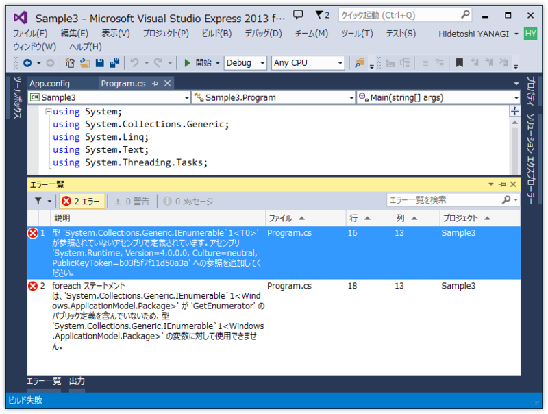
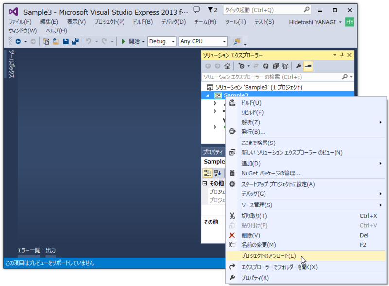
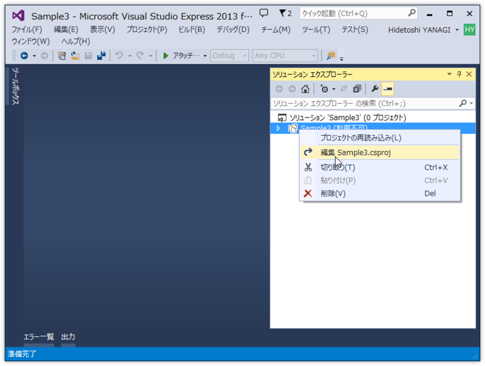
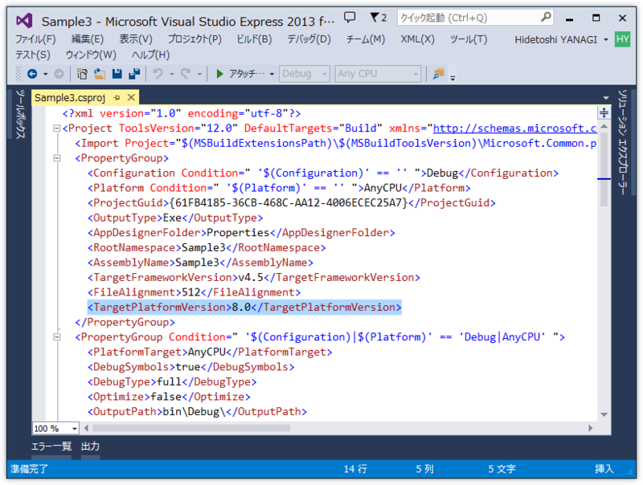
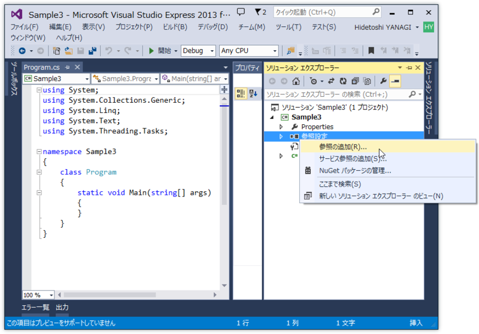
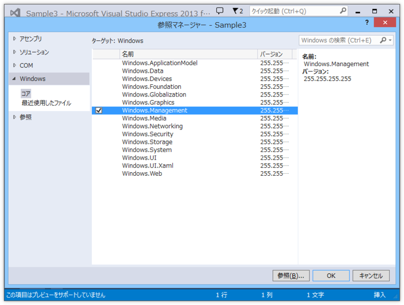
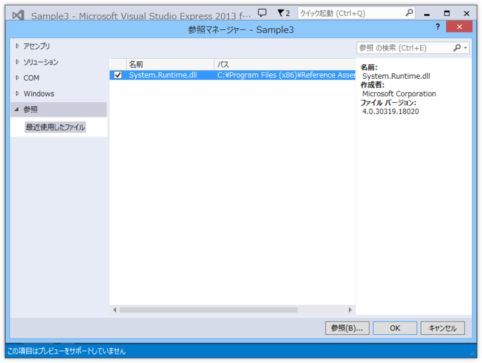

 

<h3>方針</h3>

<a href="http://msdn.microsoft.com/ja-jp/library/windows/apps/br240968.aspx">PackageManager.FindPackagesForUser(String) Method (Windows)</a> を使えばよい――が、この API は Windows Store Apps では使うことができない。今回は Windows Desktop Apps （コンソール）からこの API を呼んでみる。

<h3>準備</h3>

適当にコードを書いて実行すると、

<blockquote>

アセンブリ 'System.Runtime, Version=4.0.0.0, Culture=neutral, PublicKeyToken=b03f5f7f11d50a3a' への参照を追加してください。

</blockquote>

というエラーが出る。とりあえず System.Runtime を参照に追加しろということらしいがどうすればよいのだろう……と思ったら、<a href="http://www.atmarkit.co.jp/ait/articles/1304/26/news058_2.html">&#x7279;&#x96C6;&#xFF1A;&#x30C7;&#x30B9;&#x30AF;&#x30C8;&#x30C3;&#x30D7;&#x3067;&#x3082;WinRT&#x6D3B;&#x7528;&#xFF1A;&#x958B;&#x767A;&#x8005;&#x304C;&#x77E5;&#x3063;&#x3066;&#x304A;&#x304F;&#x3079;&#x304D;&#x3001;&#x30E9;&#x30A4;&#x30D6;&#x30E9;&#x30EA;&#x3068;&#x3057;&#x3066;&#x306E;Windows&#x30E9;&#x30F3;&#x30BF;&#x30A4;&#x30E0; (2/5) - &#xFF20;IT</a> に解決策があった。

まとめると、

プロジェクトを一度アンロードして……

 *.csproj ファイルを編集し……

TargetPlatformVersion を 8.0 にする。

<pre class="code lang-xml" data-lang="xml" data-unlink>&lt;?xml version=&quot;1.0&quot; encoding=&quot;utf-8&quot;?&gt;
&lt;Project ToolsVersion=&quot;12.0&quot; DefaultTargets=&quot;Build&quot; xmlns=&quot;http://schemas.microsoft.com/developer/msbuild/2003&quot;&gt;
&lt;Import Project=&quot;$(MSBuildExtensionsPath)\$(MSBuildToolsVersion)\Microsoft.Common.props&quot; Condition=&quot;Exists('$(MSBuildExtensionsPath)\$(MSBuildToolsVersion)\Microsoft.Common.props')&quot; /&gt;
&lt;PropertyGroup&gt;
:
:
&lt;TargetPlatformVersion&gt;8.0&lt;/TargetPlatformVersion&gt; // &lt;-- この行を追加
</pre>

で、もう一度プロジェクトを読み込んで［参照の追加］をすると、

［Windows］という欄ができている。今回は、パッケージ関連の API を利用するので Windows.Management と Windows.ApplicationModel を参照に追加。さらに、最初のビルドエラーで要求されていた System.Runtime も参照に追加しておく。

“%ProgramFiles(x86)%\Reference Assemblies\Microsoft\Framework\.NETFramework\v4.5\Facades\System.Runtime.dll”ファイルを指定して参照に加える。これで準備は完了。

<h3>コード</h3>
<pre class="code lang-cs" data-lang="cs" data-unlink>using System;
using System.Collections.Generic;
using System.Linq;
using System.Text;
using System.Threading.Tasks;

namespace Sample3
{
using Windows.Management.Deployment;

class Program
{
static void Main(string[] args)
{
var manager = new PackageManager();
var packages = manager.FindPackagesForUser(string.Empty);

foreach (var package in packages)
{
Console.WriteLine(package.DisplayName);
Console.WriteLine(package.Id.Name);
Console.WriteLine(package.Id.Publisher);
Console.WriteLine(package.Id.FullName);
Console.WriteLine(package.Id.FamilyName);
Console.WriteLine(package.Id.Version.Major);
Console.WriteLine(package.Id.Version.Minor);
Console.WriteLine(package.Id.Version.Build);
Console.WriteLine(package.Id.Version.Revision);
Console.WriteLine(package.Description);
Console.WriteLine(package.PublisherDisplayName);
Console.WriteLine(&quot;---&quot;);
}

Console.ReadKey();
}
}
}
</pre>
適当にこんな感じにして実行。

package.DisplayName や package.Description などが表示されないが、この情報はそもそも提供されていないらしい。がっかりだ。

ただ、 <a href="https://github.com/luisrigoni/metro-apps-list">luisrigoni/metro-apps-list &middot; GitHub</a> で示されているように、Win32 API で PRI を読むなどすれば取得できないこともないらしい。だいぶ面倒だな……。

<ul>
<li><a href="http://msdn.microsoft.com/ja-jp/library/windows/apps/jj552947.aspx">&#x30EA;&#x30BD;&#x30FC;&#x30B9;&#x7BA1;&#x7406;&#x30B7;&#x30B9;&#x30C6;&#x30E0; (Windows)</a></li>
</ul>

