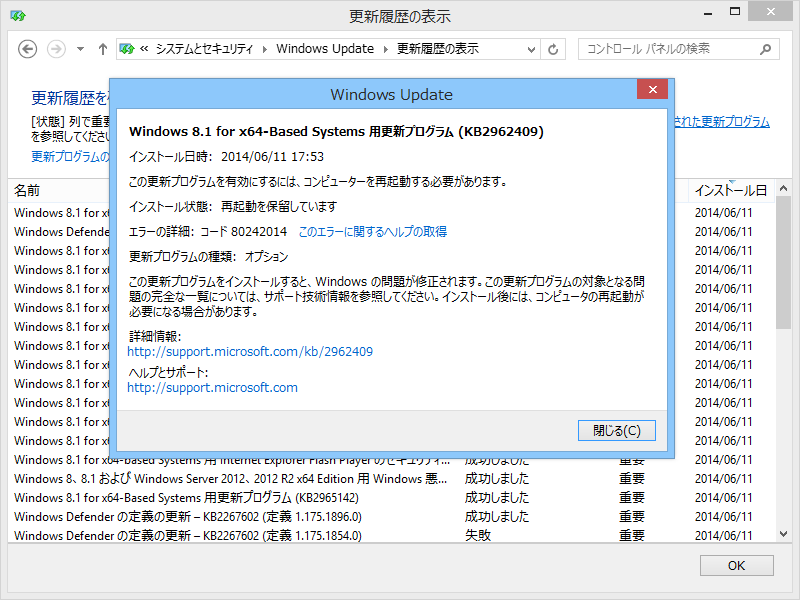
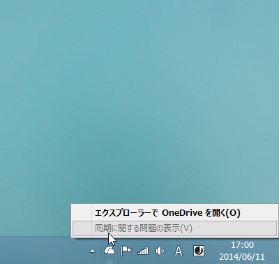
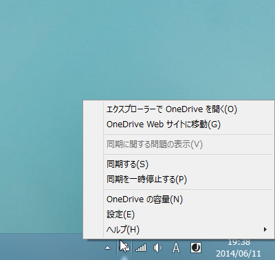
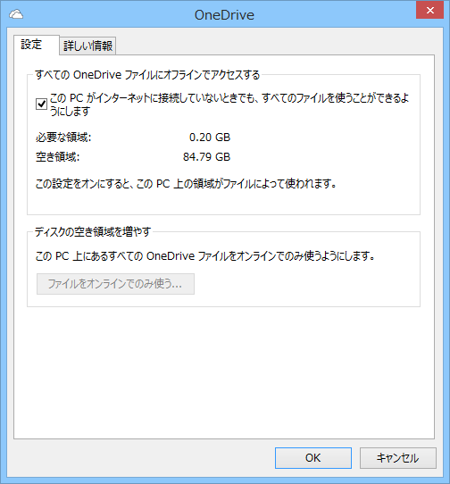
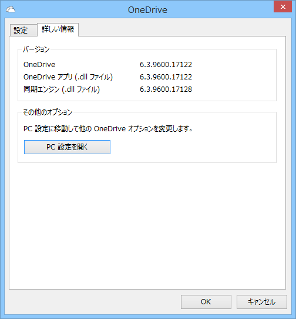
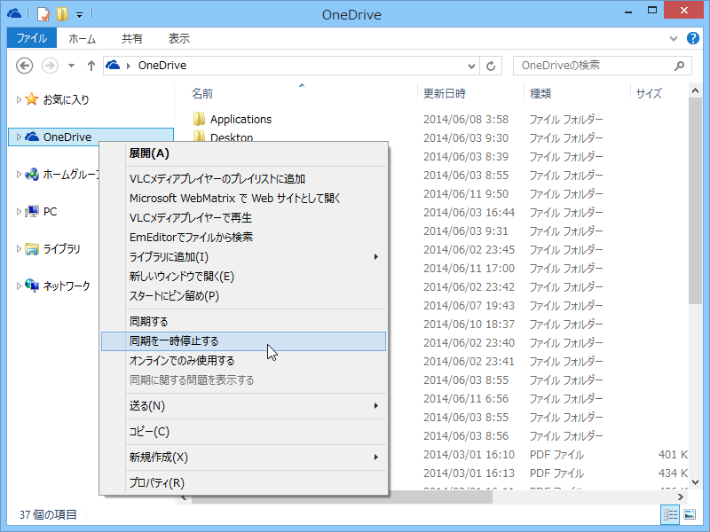
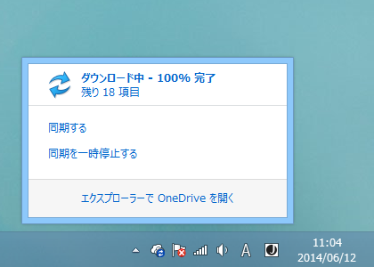

<blockquote class="twitter-tweet" lang="ja">
6/10付で公開されているWindows 8.1のupdate rollupにOneDriveのUpdateが含まれてて、それを当てたらタスクトレイのアイコンから同期のオン、オフが可能になった。MicrosoftさんGJ！&#10;&#10;<a href="http://t.co/DmFOrtvs0s">http://t.co/DmFOrtvs0s</a>
&mdash; Kazuki Kasahara (@KazukiKasahara) <a href="https://twitter.com/KazukiKasahara/statuses/476615523782754304">2014, 6月 11</a></blockquote>

使用前。

使用後。

　

設定ダイアログは新設になるのかな？　見た覚えがない気がする。［OneDrive の容量］は PC 設定の“OneDrive”画面に飛ばされるだけ。

一応、これまでも OneDrive フォルダーのコンテキストメニューから同期の一時停止はできたっぽいのだけど、タスクトレイからできるほうが便利だよね。わざわざエクスプローラーを起動せずに済むし。

なお、更新プログラムの適用には再起動が必要。“重要”ではなく“オプション”として提供されている。

<h4>追記</h4>

タスクトレイアイコンをクリックするとパネルが出てくる。以前は“OneDrive”フォルダーが開く仕組みだった。

