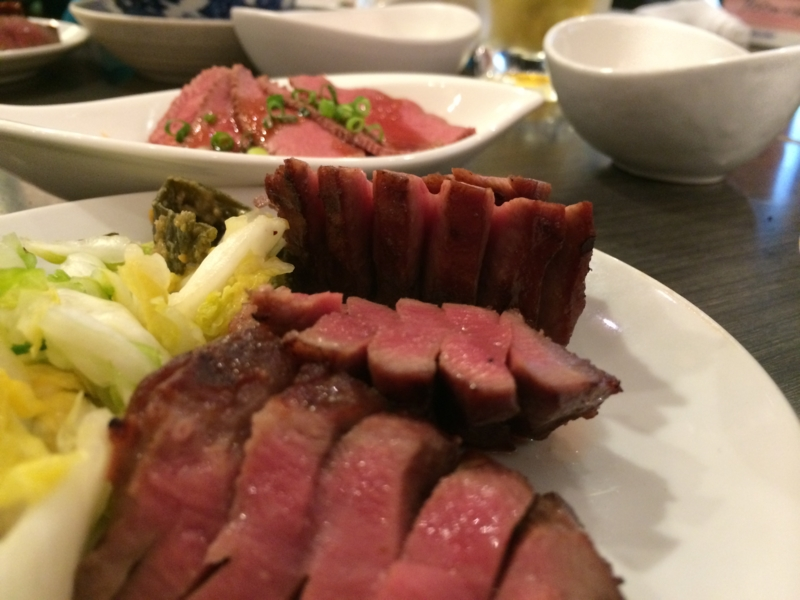

<a href="https://blog.daruyanagi.jp/entry/2014/06/09/052150">&#x30D7;&#x30ED;&#x30B0;&#x30E9;&#x30DF;&#x30F3;&#x30B0;&#x751F;&#x653E;&#x9001;&#x52C9;&#x5F37;&#x4F1A; &#x7B2C;28&#x56DE;&#xFF20;&#x6771;&#x5317;&#x5927;&#x5B66; &#x306B;&#x53C2;&#x52A0;&#x3057;&#x3066;&#x304D;&#x305F;&#x3063;&#x305F;&#x3002; #pronama - &#x3060;&#x308B;&#x308D;&#x3050;</a> の次の日は、@jz5 と塩釜へ行った。

<blockquote class="twitter-tweet" data-lang="ja">
貸切だぜひゃっはーーー！ <a href="http://t.co/8Z3qrEJNCr">pic.twitter.com/8Z3qrEJNCr</a>
&mdash; だるやなぎ に天使が舞い降りた！ (@daruyanagi) <a href="https://twitter.com/daruyanagi/status/472922117705453568?ref_src=twsrc%5Etfw">2014年6月1日</a></blockquote>

仙台・白石・塩釜あたりは震災の一か月前に行って以来。

<blockquote class="twitter-tweet" data-lang="ja">
（＾ω＾） <a href="http://t.co/3ZmNbJQ2kA">pic.twitter.com/3ZmNbJQ2kA</a>
&mdash; だるやなぎ に天使が舞い降りた！ (@daruyanagi) <a href="https://twitter.com/daruyanagi/status/472925839793725440?ref_src=twsrc%5Etfw">2014年6月1日</a></blockquote>

とりあえず港でマグロ・ウニ・イクラの三色丼とやらを食す。多分これで1500円ぐらいだったかな、忘れた。@jz5 は無職なのにわしより豪華なのを食べてた。

とりあえず船に乗って松島まで行く。風がめちゃくちゃ気持ちよくて、爆睡できた。

松島に到着。前回は行かなかった瑞巌寺というお寺を訪問。伊達家の菩提寺で国宝なのだそうだ。

震災のときはなかまで津波が押し寄せたらしい。見た感じ松島は震災前と変わんないけど、地元の方は苦労されたのだろうと思う。

なんやようわからんけど、仏像がたくさん建ってた。見覚えのあるお寺の札が建っていたのだけど、寄進でもしてもらったんだろうか。ちょろっと調べたら <a href="http://ja.wikipedia.org/wiki/%E8%A5%BF%E5%9B%BD%E4%B8%89%E5%8D%81%E4%B8%89%E6%89%80">&#x897F;&#x56FD;&#x4E09;&#x5341;&#x4E09;&#x6240; - Wikipedia</a> というのと関連があるそうだけど、瑞巌寺だけでプチ西国三十三所巡りができまっせ、という趣向なのかしら。まぁ、いろいろ見られてお得感はあった。

拝観料が SUICA で決済できるのはほかも見習うべきだと思う。伝統と技術革新のさわやかなマリアージュやでぇ。

ここにはだるまくじというのがあるっぽくて（自分は気づかずに普通に100円のおみくじ引いてた）、くじを引いた後の（？）だるまが絵馬掛けの上にいっぱい並んでた。あと、<i>「モテて、男子からけんか売られませんように」</i>という絵馬がすごい気にいって写真に撮ってしまったのだけど、ここに乗せるのは遠慮しておく。

伊達政宗・忠宗父子の位牌。デカい。無駄にデカい。うちの爺ちゃんの位牌の100倍ぐらいはありそう。

ずんだソフトは一度食べたら十分だと思う。マズくはないが、毎日食べたい味ではない。

夕方は仙台に戻って、@bonprosoft おすすめのお店で牛タンを食べた。

シチューはおすすめのメニューのものとは少し違うらしいのだけど（あいにく切らしてたらしい）、それでも十分美味しかった。ごちそうさま。

<blockquote class="twitter-tweet" data-lang="ja">
I&#39;m at 牛たん炭焼 利久 市役所前店 w/ <a href="https://twitter.com/jz5?ref_src=twsrc%5Etfw">@jz5</a> <a href="http://t.co/0Pw0GpNZ4M">http://t.co/0Pw0GpNZ4M</a>
&mdash; だるやなぎ に天使が舞い降りた！ (@daruyanagi) <a href="https://twitter.com/daruyanagi/status/473022747531284480?ref_src=twsrc%5Etfw">2014年6月1日</a></blockquote>

@bonprosoft はできる子だと思った。

