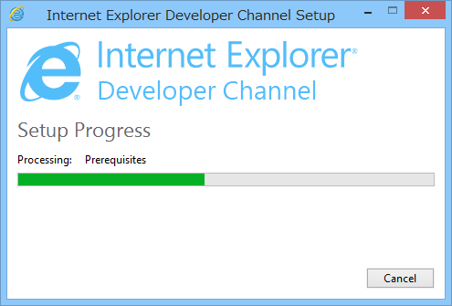
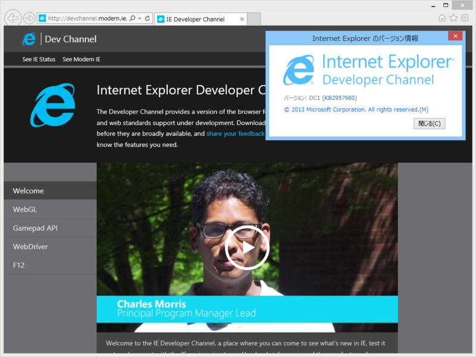
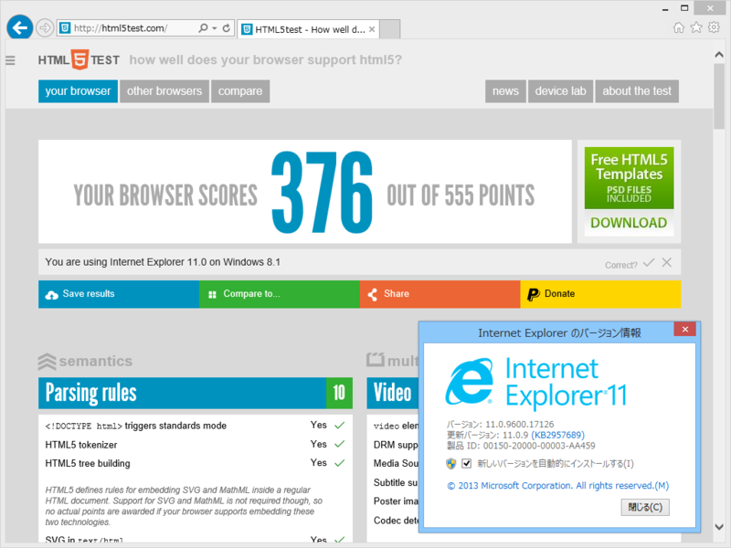
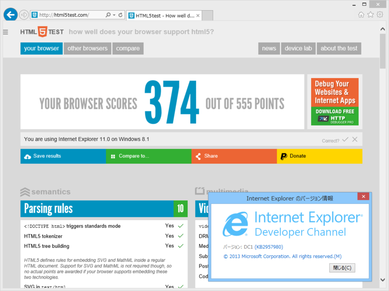
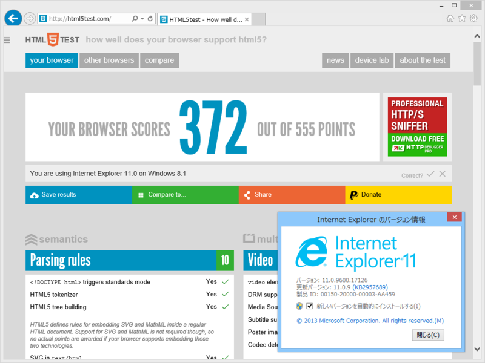
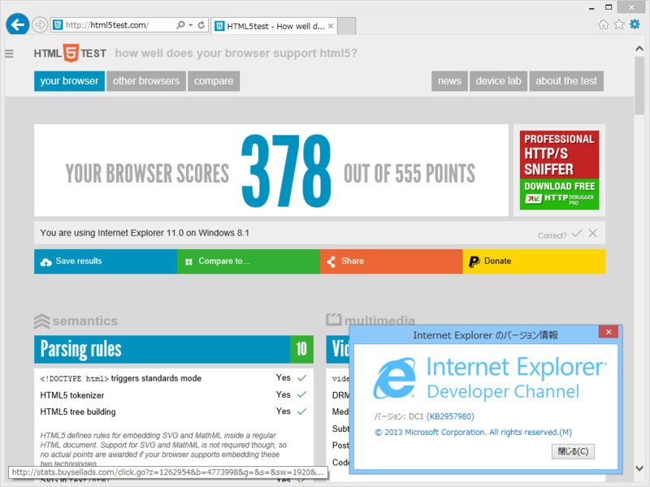
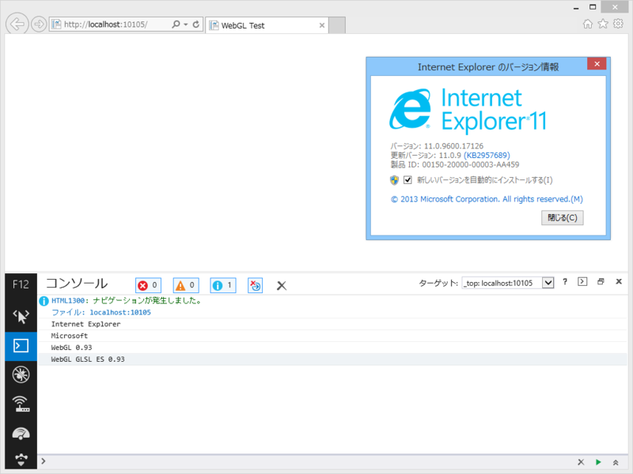
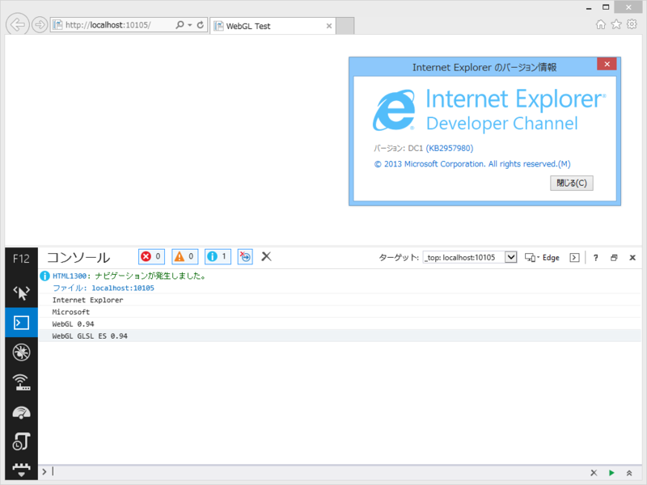

 

<blockquote cite="http://devchannel.modern.ie/">

Internet Explorer Developer Channel provides a sneak peek at Internet Explorer as it's being developed. It can run alongside and independently of IE11, and has all of the browser features that you love in IE11, as well as the latest platform features we’re working on. This version supports new platform features like WebDriver API, GamePad API, F12 Developer Tools improvements, and WebGL improvements

<cite><a href="http://devchannel.modern.ie/">IE Developer Channel</a></cite>
</blockquote>

“It can run alongside and independently of IE11”とのことなのでそのままぶち込む。対応は Windows 7 SP 1 と Windows 8.1。

とりあえず <a href="http://html5test.com/">HTML5test - How well does your browser support HTML5?</a> を走らせる。

通常版から2ポイント下がって「ふぁっ！？」ってなった。リロードしても同じ。そのうち DP がフリーズしたので、タスクマネージャーで殺してもう一回起動してみたら――

なぜか6ポイントあがった（通常版は4ポイント下がった）。この結果（通常版 372、DP1 378）が多分正しい。そのほかにも割といろいろよくわかんない動作するので、利用の際は注意されたい。なんか重いし。

あと“WebGL improvements”って何かなーと思ったので、バージョンを確かめてみた（<a href="http://yomotsu.net/blog/2013/11/08/ie11-webgl.html">IE11 &#x306E; WebGL</a>）。

ほんのり上がってた（0.93 → 0.94）。

