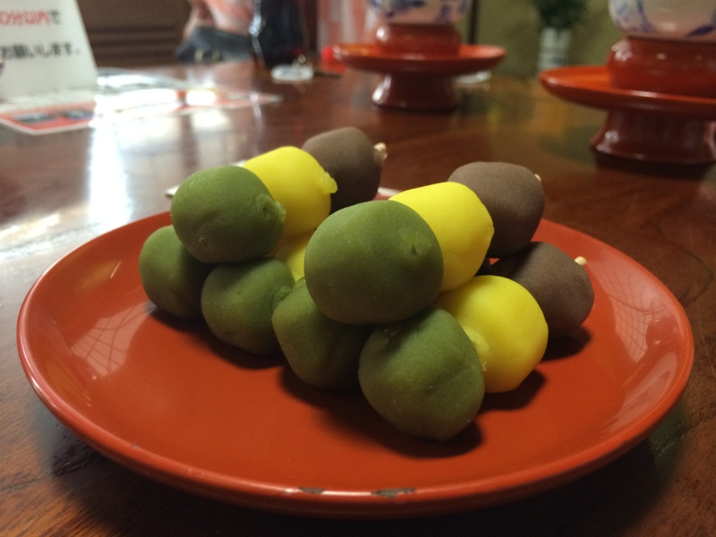
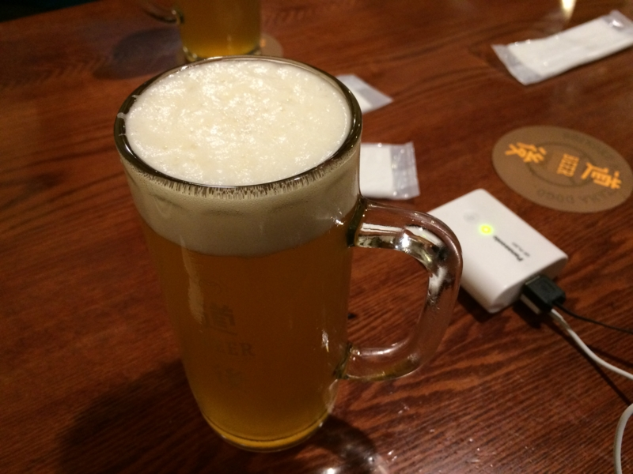
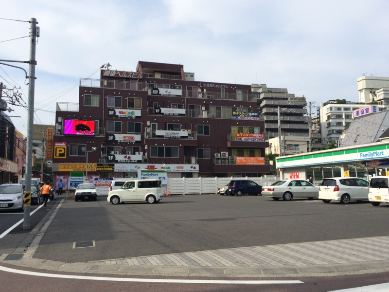
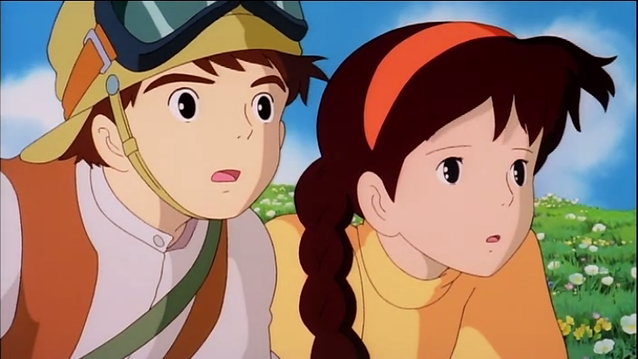
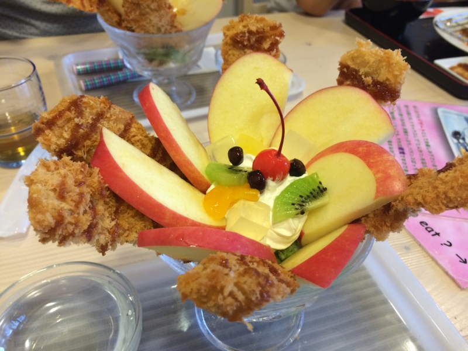
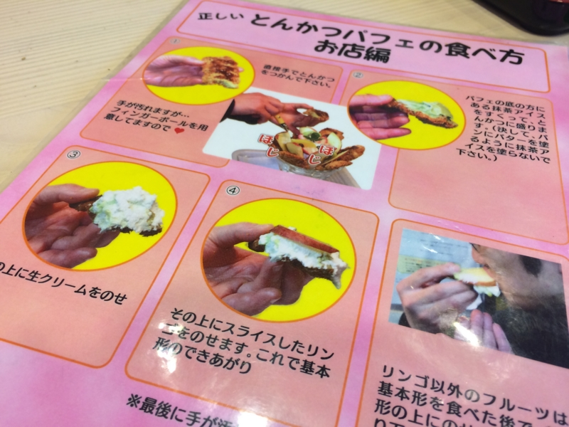

<a href="https://blog.daruyanagi.jp/entry/2014/06/16/163254">&#x30D7;&#x30ED;&#x30B0;&#x30E9;&#x30DF;&#x30F3;&#x30B0;&#x751F;&#x653E;&#x9001;&#x52C9;&#x5F37;&#x4F1A; &#x7B2C;29&#x56DE;&#xFF20;&#x30B5;&#x30A4;&#x30DC;&#x30A6;&#x30BA;&#x682A;&#x5F0F;&#x4F1A;&#x793E; &#x677E;&#x5C71;&#x30AA;&#x30D5;&#x30A3;&#x30B9; #pronama &#x7121;&#x4E8B;&#x7D42;&#x4E86;&hellip;&hellip;&#xFF01; - &#x3060;&#x308B;&#x308D;&#x3050;</a> の次の日。県外からきた人を道後温泉の3階へ案内する。6人の大所帯だったので入れるかどうか心配してたのだけど、一番大きな部屋へ通された。風呂上がりの団子の積まれ方がすごい。酢酸先生がひとり遅れて別室へ通されたのだけど、もし間に合ってたらもっとすごいことになってたかもしれない（<a href="http://blog.ch3cooh.jp/entry/20140618/1403078400">&#x611B;&#x5A9B;&#x30FB;&#x677E;&#x5C71;&#x306B;&#x884C;&#x3063;&#x3066;&#x304D;&#x307E;&#x3057;&#x305F;(5) - &#x6E6F;&#x7BC9;&#x57CE;&#x8DBE;(&#x9053;&#x5F8C;&#x516C;&#x5712;)&#x3068;&#x9053;&#x5F8C;&#x6E29;&#x6CC9;2&#x56DE;&#x76EE; - &#x9162;&#x308D;&#x3050;&#xFF01;</a>）。

次は、道後温泉本館横にある地ビール屋さんで一杯（どころか、3杯ぐらい）。ビールには地元にゆかりのある偉人にちなんだ名前がついているのだけれど、個人的には「のぼさん」（正岡子規だね）が好き。

――と、まぁ、ここまでは普通なのサ。問題はここからだ。

<h3>道後ヘルスビル</h3>

道後ヘルスビルとは、女の子が男の子に優しくしてくれる<a href="#f-dd29c385" name="fn-dd29c385" title="もしかしたら痛めつけてくれるところもあるかもしれない">*1</a>ワンダフルなお店がたくさん詰まった、エロオヤジどもの誘蛾灯である。あちこちに掲げられた派手な看板と、要塞（？）を思わせるちょっと異様な外観が、男の子の冒険心を嫌が応にも掻き立てる。僕はこれまでネットでネタになっているのをみたことしかなかったのだけど――

――「道後ヘルスビルは本当にあったんだ！　ネットは嘘つきなんかじゃなかった！」

外を遠巻きに見ただけなのに、割とテンションが上がってしまった。こんなパラダイスが、道後温泉本館の近所にあるんだなぁ……まったくけしからん。いつか攻略してみたい。

<h3>とんかつパフェ</h3>

とんかつパフェとは、松山の名物料理である。地元民の総意を得たものであるかどうかは知らないが、この料理を出す“<a href="http://www.tonkatsupafe.com/">&#x6E05;&#x307E;&#x308B;</a>”という店はそう主張している。

とんかつパフェは、おおよそ4つのパーツからなる。核となるのが、ひんやり冷たい抹茶アイス。その上に薄くスライスされた・歯ごたえのよいリンゴが花を開かせる。まんなかに添えられたのは甘いクリームとフルーツ。抹茶アイスと絡めれば、さぞかし美しいマリアージュを奏でるだろう。

――と、まぁ、ここでやめとけばよかったのだが。なぜか一番外側に、薄いとんかつが刺さっている。

食べ方もユニーク。とん発に抹茶アイスとクリーム、リンゴをのせ、手でいただく。

これで、お値段は800円。味はと言えば――まずくはないと思う。けれど、とってもおいしいかと問われれば、返答に窮してしまう。ぶっちゃけ、フツーに別々に食った方が旨いのでは？　あと、なぜかご飯が食べたくなったので、帰りにコンビニでいなり寿司を買って、家で食べた。

ここはフツーのメニューを食べにもう一回来たいね。

<ul>
<li><a href="http://nakaji.hatenablog.com/entry/2014/06/20/073000">&#x9053;&#x5F8C;&#x3067;&#x30D3;&#x30FC;&#x30EB;&#x98F2;&#x3093;&#x3067;&#x3068;&#x3093;&#x304B;&#x3064;&#x30D1;&#x30D5;&#x30A7;&#x3092;&#x98DF;&#x3079;&#x305F;&#x8A71; - &#x306A;&#x304B;&#x65E5;&#x8A18;</a></li>
</ul>

<a href="#fn-dd29c385" name="f-dd29c385" class="footnote-number">*1</a>:もしかしたら痛めつけてくれるところもあるかもしれない

