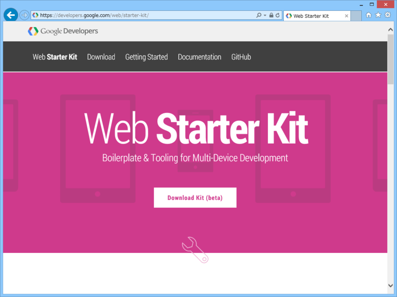
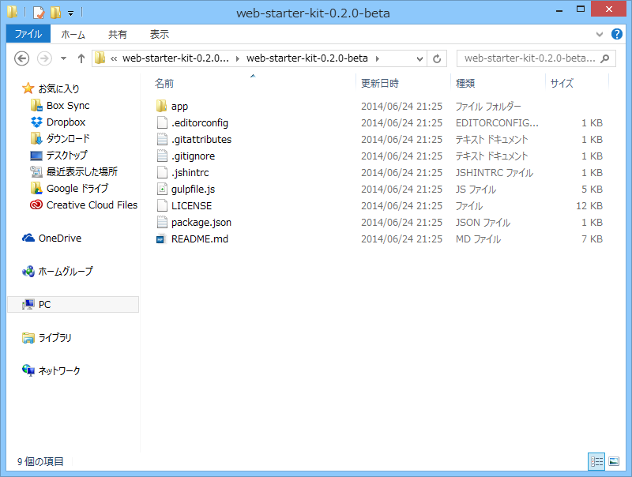
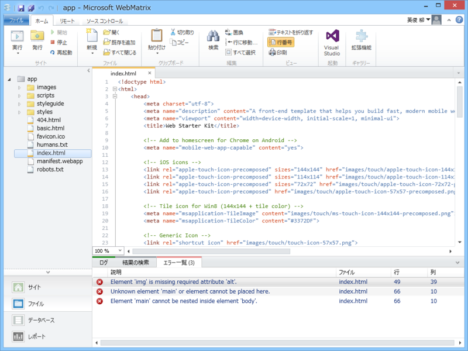
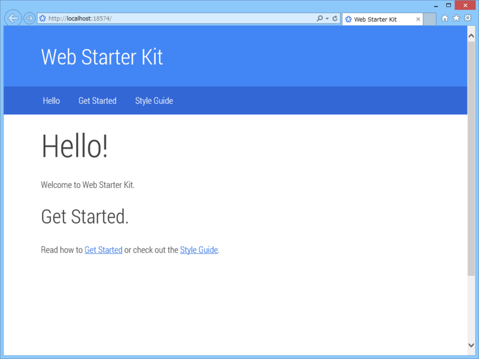
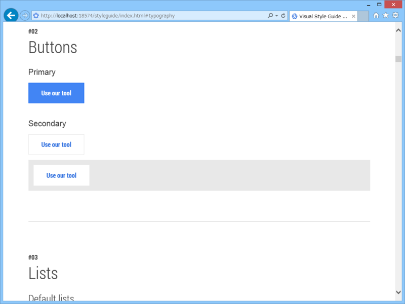
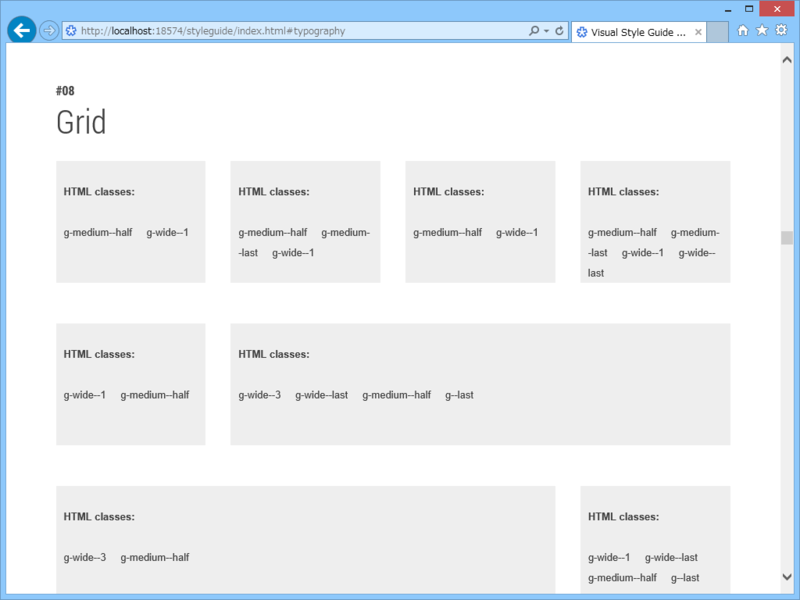
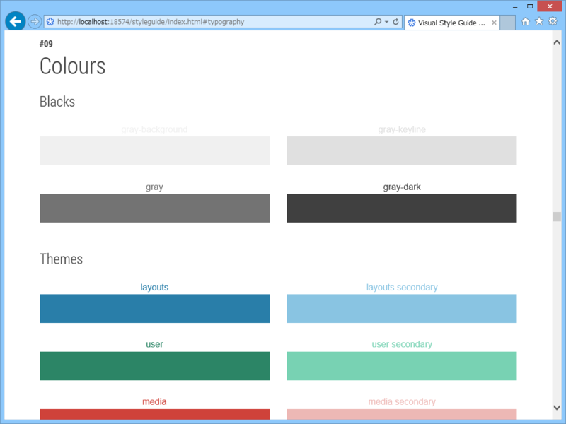
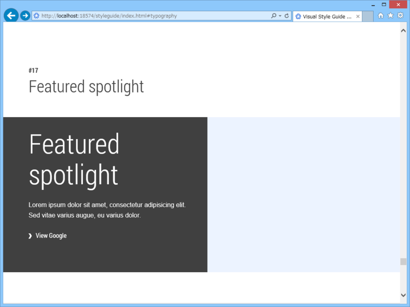
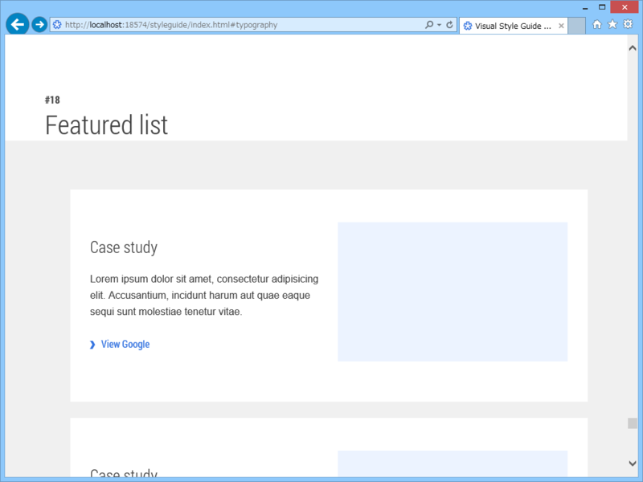

Twitter で小耳にはさんだ「<a href="https://developers.google.com/web/starter-kit/">Web Starter Kit</a>」を少し試してみました（別に WebMatrix で、じゃなくていいんだが）。いわゆるボイラープレート（テンプレみたいなもん）ですね。

<ul>
<li>Mobile-optimized HTML boilerplate</li>
<li>Responsive multi-device layout</li>
<li>Visual component style guide</li>
<li>gulp.js build tooling (optional)</li>
<li>LiveReload</li>
<li>Cross-device synchronization of clicks, scrolls, navigation, and form-filling</li>
<li>Image optimization</li>
<li>JavaScript minification and optimization</li>
<li>CSS optimization</li>
<li>HTML minification</li>
<li>PageSpeed performance reporting</li>
<li>CSS autoprefixing</li>
</ul>
というのが特徴らしい。ブラウザーサポートはこんな感じ。

<ul>
<li>IE10, IE11, IE Mobile 10</li>
<li>FF 30, 31</li>
<li>Chrome 34, 35</li>
<li>Safari 7, 8</li>
<li>Opera 23, 24</li>
<li>iOS Safari 7, 8</li>
<li>Opera Coast</li>
<li>Android / Chrome 4.4, 4.4.3</li>
<li>Blackberry 1.0</li>
</ul>
IE11 で少しずれてるところがあった気もするけどキニシナイ。

さっそくダウンロードし、アーカイブを展開しました。よくわからんのがぐちゃぐちゃ入ってる（<a href="http://gulpjs.com/">gulp.js - the streaming build system</a> のためのファイルなんだろうか？）けど、メインは app フォルダの中身みたい。このフォルダをさっそく［Microsoft WebMatrix で Web サイトとして開く］。

スクリプトはメニュー関連のが最小限度。スタイルシートは SCSS で書かれていて、CSS にコンパイルされています。ほかに Web フォントやらアイコンやらが少し。

basic.html は HTML5 Boilerplate CSS を読み込んだだけのシンプルなスタイル。

<pre class="code lang-html" data-lang="html" data-unlink>&lt;!-- build:css styles/components/main.min.css --&gt;
&lt;link rel=&quot;stylesheet&quot; href=&quot;styles/h5bp.css&quot;&gt;
&lt;!-- endbuild --&gt;
</pre>
inde.html はいろいろ読み込んで Google デザインっぽくしたやつ。

<pre class="code lang-html" data-lang="html" data-unlink>&lt;!-- build:css styles/components/main.min.css --&gt;
&lt;link rel=&quot;stylesheet&quot; href=&quot;styles/h5bp.css&quot;&gt;
&lt;link rel=&quot;stylesheet&quot; href=&quot;styles/components/components.css&quot;&gt;
&lt;link rel=&quot;stylesheet&quot; href=&quot;styles/main.css&quot;&gt;
&lt;!-- endbuild --&gt;
</pre>
とりあえず実行。

Google っぽい。日本語フォントで使うなら、少しいろいろいじった方がバランスがいいかもしれないかなー。そういうセンスないからよくわかんないけど。

スタイルガイドものぞいてみました。

ボタン。とっても……Google っぽいです……。

グリッド。ここらへんは Bootstrap とかでもお馴染み。ざっとしか見てないけど、2段～4段組みまで割りと柔軟にレイアウトできるみたい。

カラー。色のセンスないので、こういうところだけでも真似してみたい。前景と背景だけ色決めて、ほかはアクセントカラーとその薄いバージョンをうまく使う感じで……。

あと、こういう機能紹介っぽい感じのページもいいなぁと思った。まるまる使うと Google 臭がスゴいのであんまり使わない気がするけれど、エッセンスだけでも取り込みたい。

