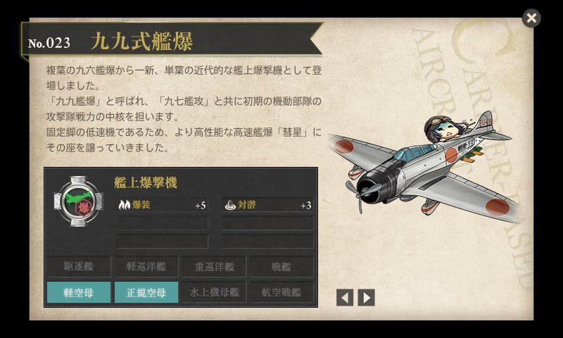
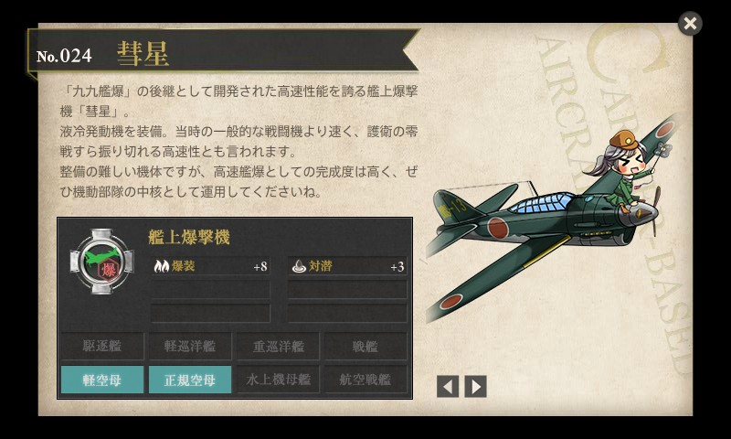

<a href="http://www.amazon.co.jp/exec/obidos/ASIN/4769820534/bestylesnet-22/">空母艦爆隊―艦爆搭乗員死闘の記録 (光人社NF文庫)</a>
<ul><li>作者: 山川新作</li><li>出版社/メーカー: 光人社</li><li>発売日: 2004/06/01</li><li>メディア: 文庫</li><li> クリック: 4回</li><li><a href="http://d.hatena.ne.jp/asin/4769820534/bestylesnet-22" target="_blank">この商品を含むブログ (2件) を見る</a></li></ul>

前に艦攻の話を読んだ（<a href="https://blog.daruyanagi.jp/entry/2014/05/22/025753">&#x300E;&#x7A7A;&#x6BCD;&#x96F7;&#x6483;&#x968A;&#x2015;&#x8266;&#x653B;&#x642D;&#x4E57;&#x54E1;&#x306E;&#x592A;&#x5E73;&#x6D0B;&#x6D77;&#x7A7A;&#x6226;&#x8A18;&#x300F; - &#x3060;&#x308B;&#x308D;&#x3050;</a>）ので、次は艦爆の話を読まねばなるまい、と思ってチョイス。

復習すると、

<ul>
<li>艦上攻撃機（艦攻）
<ul>
<li>雷撃と水平爆撃を行う</li>
<li>強力な魚雷・重爆弾が搭載できる大型機。比較的低速</li>
<li>三座式（操縦、偵察、電信）</li>
</ul></li>
<li>艦上爆撃機（艦爆）
<ul>
<li>急降下爆撃を行う</li>
<li>急降下に耐える強度の高い機体。比較的小型で狭いのが難点</li>
<li>二座（複座）式（操縦、偵察）</li>
</ul></li>
<li>艦上戦闘機（艦戦）
<ul>
<li>ほかの戦闘機と空中格闘戦を行う。護衛・攻撃用途。</li>
<li>機動力重視の機体。小型・高速。</li>
<li>単座式（操縦）。航法担当がいないので、艦攻・艦爆がいないと母艦に帰るのが困難</li>
</ul></li>
</ul>
みたいな感じ。太平洋戦争期の有名な航空機というとやっぱり零戦（零式艦上戦闘機）かなと思うけれど、相手の艦船や施設へ与えたダメージという点では、九九式艦上爆撃機（九九艦爆）のほうが活躍したのかもしれない。

「脚がカワイイのよ、脚が！」

緒戦は大活躍したけれど、中盤以降は陳腐化<a href="#f-60e23e22" name="fn-60e23e22" title="「彗星」が500kg爆弾を積めるのに、「九九艦爆」は250kg爆弾しか積めない、など">*1</a>。それでも後継機の「彗星」の開発が遅れたため使い続けられ、苦杯をなめることになった。最後は特攻機としても利用される。

本書の序盤では、“可憐な乙女たちが小遣を節約して醵金し、献納した”「全日本女学生号」<a href="#f-e0c2f7fb" name="fn-e0c2f7fb" title="飛行機に“報国”って書いてあるのは国民の寄付で作られたものなのだそうな">*2</a>に搭乗した筆者が航空母艦「加賀」に乗り組み、真珠湾攻撃・ポートダーウィン攻撃に参加する。その後、商船改造空母「隼鷹」に乗り込み、ダッチハーバー攻撃（ミッドウェー海戦の裏で行われた北方陽動作戦）・南太平洋海戦などに参加。第三次ソロモン海戦では被弾した「比叡」の直衛に駆けつけるも、衆寡敵せず、撤退している。

「悪くないんだけれど、整備大変なのよー、整備が。」

後半は「彗星」が登場するが、すでに航空母艦なく、陸上基地での勤務がメイン。これでは「艦上」爆撃機ではないよなぁ。最後のほうは登場する航空機すらなく、内地へピックアップしてもらうために1ヶ月歩いて隣の航空基地まで移動するとか、割とさんざんな目に遭ってる。

<blockquote>

敵のルソン島上陸作戦が、いよいよ開始されたとのうわさが飛びはじめた。一方、敵機の空襲は日一日と激しくなったが、年末をひかえたわが基地には、一機の飛行機もない。名は神風特攻隊旭日隊でも、乗るべき飛行機がない、翼のない特攻隊である。みな一様に飛行機がほしかった。ただ一機でもよい、飛べる飛行機が欲しかった。赤トンボ（練習機）でもよい、とにかく翼が欲しかった。

</blockquote>

その翼がなかったおかげで、特攻できず、命拾いをしたのだから、運命というのはわからないもんだな。

こういう系の本を読むといつもそうなのだけど、敗色が濃厚になるにつれて部隊内で盗難がひどくなる話とか、周辺住民の対日感情が最悪で基地から出られない話なんかを読むと、なんともどうしようもないもんだという気にさせられてしまう。

<a href="#fn-60e23e22" name="f-60e23e22" class="footnote-number">*1</a>:「彗星」が500kg爆弾を積めるのに、「九九艦爆」は250kg爆弾しか積めない、など

<a href="#fn-e0c2f7fb" name="f-e0c2f7fb" class="footnote-number">*2</a>:飛行機に“報国”って書いてあるのは国民の寄付で作られたものなのだそうな

