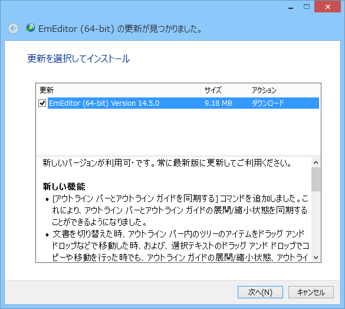
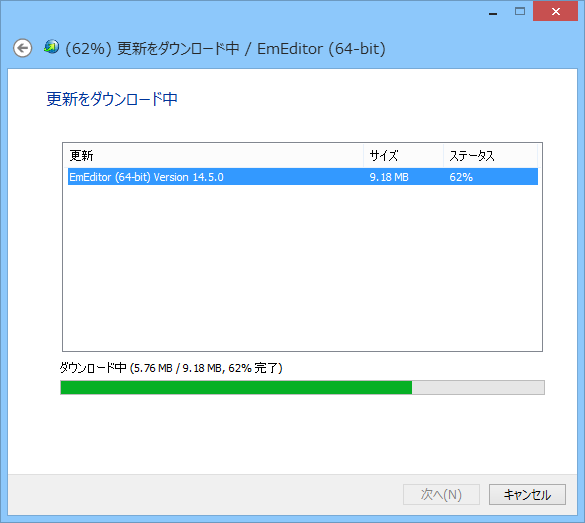
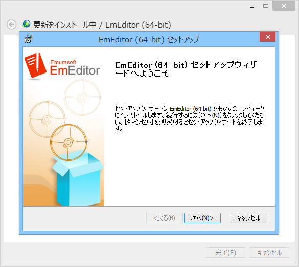
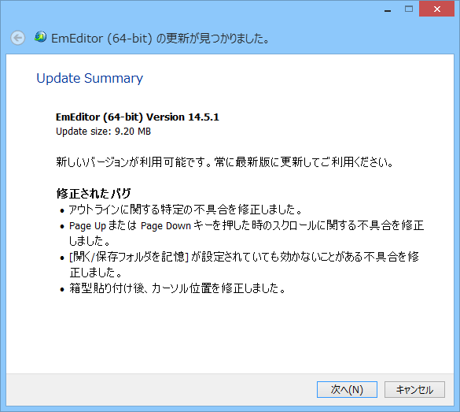
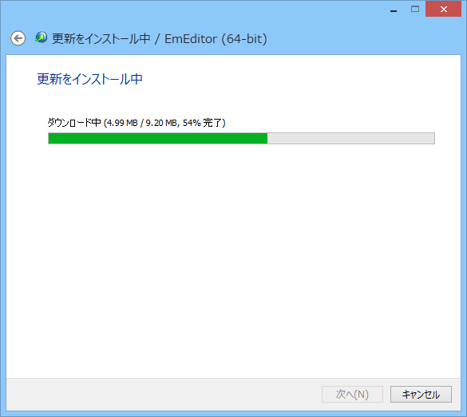
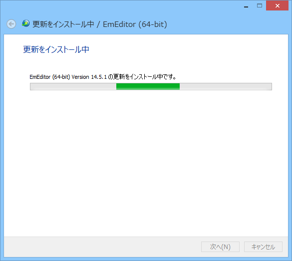

<blockquote cite="http://www.forest.impress.co.jp/docs/news/20140626_655316.html">

そのほかにも、コードのさらなる最適化を進めた結果、機能が増加したにもかかわらず実行ファイルのサイズは縮小。更新チェッカーも改良されており、将来のバージョンではこれまでより少ないクリック数で更新が可能となるという。

<cite><a href="http://www.forest.impress.co.jp/docs/news/20140626_655316.html">&#x30A8;&#x30E0;&#x30BD;&#x30D5;&#x30C8;&#x3001;&#x30A2;&#x30A6;&#x30C8;&#x30E9;&#x30A4;&#x30F3;&#x6A5F;&#x80FD;&#x306E;&#x5B8C;&#x6210;&#x5EA6;&#x3092;&#x9AD8;&#x3081;&#x305F;&#x300C;EmEditor&#x300D;v14.5.0&#x3092;&#x516C;&#x958B; - &#x7A93;&#x306E;&#x675C;</a></cite>
</blockquote>

<h3>v14.5.0 までのアップデートプロセス</h3>

アップデートの案内。

インストーラーのダウンロード。

インストーラーの実行（うぜっ

<h3>v14.5.1 からのアップデートプロセス</h3>

アップデートの案内。

アップデートのダウンロードと……

インストール（終わりっ

いくらデリバリー間隔を短縮しても、セットアップが面倒だったらアップデートは無視されるだけ――そういう意味では今回のアップデートはうれしいと思った。あとは Microsoft ID でサインインしたらプロダクトキーの入力が不要で、設定が複数環境で同期される……とかそんな仕組みを期待したいなー（無茶ぶり

