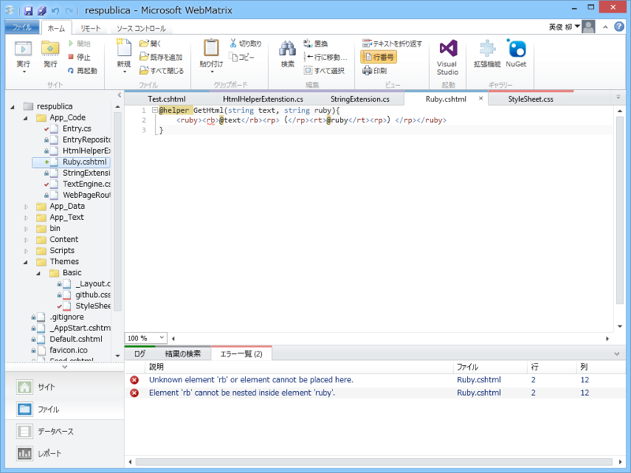
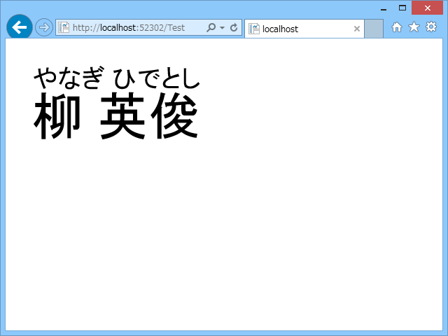

とりあえずオーソドックスに App_Code フォルダ以下に Ruby.cshtml を作ってこんな感じに記述。

<pre class="code lang-cs" data-lang="cs" data-unlink># ~/Ruby.cshtml

@helper GetHtml(string text, string ruby){
&lt;ruby&gt;&lt;rb&gt;@text&lt;/rb&gt;&lt;rp&gt;（&lt;/rp&gt;&lt;rt&gt;@ruby&lt;/rt&gt;&lt;rp&gt;）&lt;/rp&gt;&lt;/ruby&gt;
}
</pre>
使い方はこんな感じ .cshtml の名前がそのまま静的クラスの名前になっていて、定義したヘルパー関数が呼べる。

<pre class="code lang-cs" data-lang="cs" data-unlink># ~/Test.cshtml

@{

}

&lt;!DOCTYPE html&gt;

&lt;html lang=&quot;en&quot;&gt;
&lt;head&gt;
&lt;meta charset=&quot;utf-8&quot; /&gt;
&lt;title&gt;&lt;/title&gt;
&lt;/head&gt;
&lt;body&gt;
@Ruby.GetHtml(&quot;柳 英俊&quot;, &quot;やなぎ ひでとし&quot;)
&lt;/body&gt;
&lt;/html&gt;
</pre>

（※見やすいように拡大してある）

自分はルビのタグなんか覚えるの面倒だし、ましてやルビタグが解釈できない Firefox のことまで考えてコーディングするのは面倒なので、こういうヘルパーを作るのが好み。

<h3>ちょっとハッテン</h3>
<pre class="code lang-cs" data-lang="cs" data-unlink># ~/App_Code/HtmlHelperExtensions.cs

using System;
using System.Collections.Generic;
using System.Linq;
using System.Web;
using System.Web.WebPages.Html;

public static class HtmlHelperExtenstion
{
public static IHtmlString Ruby(this HtmlHelper helper, string text, string ruby)
{
return new HtmlString(string.Format(
&quot;&lt;ruby&gt;&lt;rb&gt;{0}&lt;/rb&gt;&lt;rp&gt;（&lt;/rp&gt;&lt;rt&gt;{1}&lt;/rt&gt;&lt;rp&gt;）&lt;/rp&gt;&lt;/ruby&gt;&quot;,
text, ruby
));
}
}
</pre>
こうやって HtmlHelper の拡張メソッドとして定義しておけば

<pre class="code lang-cs" data-lang="cs" data-unlink>@Html.Ruby(&quot;柳 英俊&quot;, &quot;やなぎ ひでとし&quot;)
</pre>
で同様のことができるようになる。

