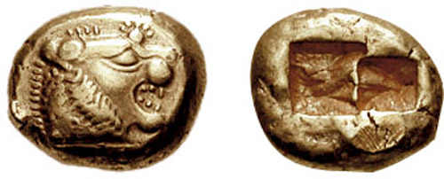

<a href="http://ja.wikipedia.org/wiki/%E3%82%A8%E3%83%AC%E3%82%AF%E3%83%88%E3%83%AD%E3%83%B3%E8%B2%A8">&#x30A8;&#x30EC;&#x30AF;&#x30C8;&#x30ED;&#x30F3;&#x8CA8; - Wikipedia</a> 

<blockquote>

リュディア（リディア）人はわれわれの知る限りでは、金銀の貨幣を鋳造して使用した最初の民族であり、また小売制度を創めたのも彼らであった。またリュディア人自らの言うところでは、今日リュディアとギリシアに普及している遊戯は、自分たちが発明したものだという。リュディアではこれらの遊戯が発明されたのは、彼らがテュルセニアに植民した時のことだという。

――<a href="http://d.hatena.ne.jp/asin/4003340515/bestylesnet-22">歴史 上 (岩波文庫 青 405-1)</a>

</blockquote>

リュディアは小アジアにあった国で、ヘロドトスの言うところによれば「トモロス山から流れ落ちてくる砂金を除いては、記述するに足るような珍しいことは、ほかの国ほどには見当たらない」国だった。

リュディアの風俗は、「女の子どもに婬をひさがせること（要は売春させること）以外は、ギリシア人の風習とよく似てい」たという。リュディアでは娘たちがみな身を売り、嫁入りするまで自分の持参金を稼いでいたというが、これは貧しいゆえか、道徳が腐敗するほど文化が発達したせいか、自分にはよくわからない。

ちなみに、貨幣と並んでリュディア人が開発した“遊戯”というのは、サイコロ（要は博打）や蹴鞠などの“あらゆる種類の遊戯”であったという。ただし、チェスだけは別で、リュディア人も自分たちの発明だとは言っていない。

これらの“遊戯”の発明には、ちょっとしたエピソードがある。

マネスの子アテュスが王のとき、リュディア全土が飢饉に襲われた。リュディアの人々はしばらくこれに耐えていたが、飢饉は一向にやまない。そこで気を紛らわす手段として、これらの“遊戯”が開発された。リュディア人たちは食事を二日に一日に切り詰め、食事のない日はは朝から晩まで“遊戯”を楽しんで空腹を紛らわしたという。この生活は18年間にも及んだ。

しかし、それでもなお飢饉はやまず、むしろいよいよひどくなってきた。そこで王はリュディアの国民を籤で二組に分け（よっぽどそういう賭け事が好きなようだ）、一方を残留組、もう一方を移住組とした。移住組を率いるのは、王子テュルセノス。彼らはスミュルナに下って船を建造し、必要な家財一切を積み込み、食と土地を求めて地中海を西へと向かった。

長い航海を経てウンブリア（中伊の内陸部）にたどり着いた彼らは、その地に都市を建設し、引率者の名にちなんでテュルセニア人と名乗る。これがエトルリア人で、リベラルな思想（男女平等だったららしい）と洗練された文化、高い技術力をもっていた。リュディアはキュロス二世のペルシアに滅ぼされるので、小アジアを脱出したのは長い目で見れば正解だったのかもしれない。

そんな彼らも、のちに共和制ローマに併呑され、次第に同化してしまう。しかし、その名前は今でもトスカーナ州（「エトルリア人の土地」の意）やティレニア海（「エトルリア人の海」の意）といった言葉に残っている。

――と、こんなリュディア人たちの話を読むと、貨幣の起源は（砂金と）博打と売春にあるんじゃねーか、などとなんとなく思った。世界で一番最初に貨幣と仲良くなった彼らが、わりとリベラルなものの考え方をしていたというのも興味を引く。

