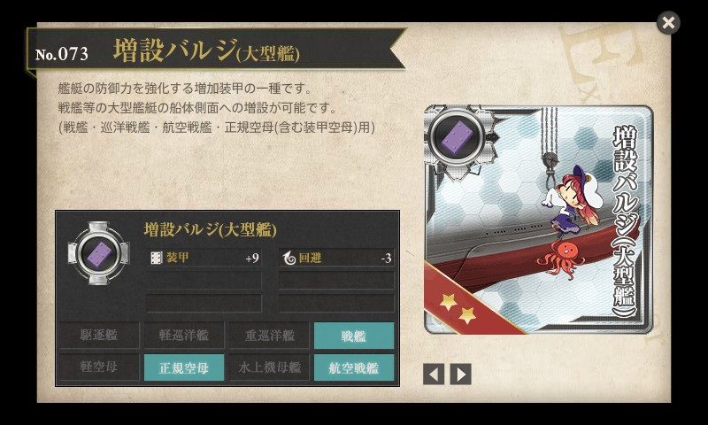
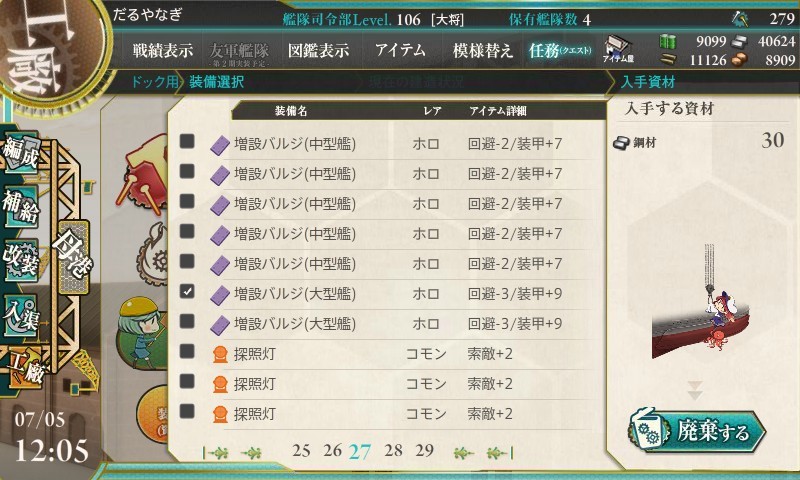
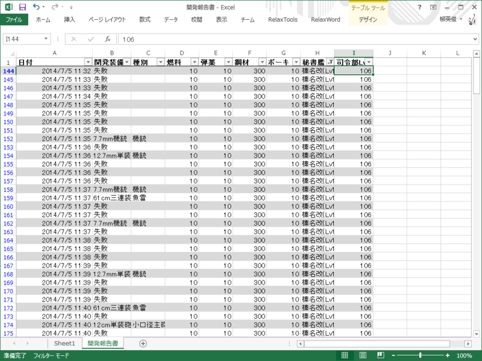
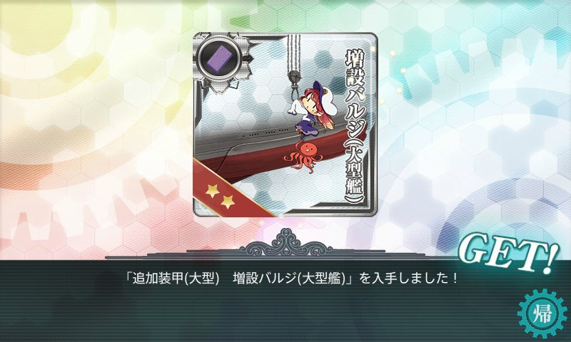
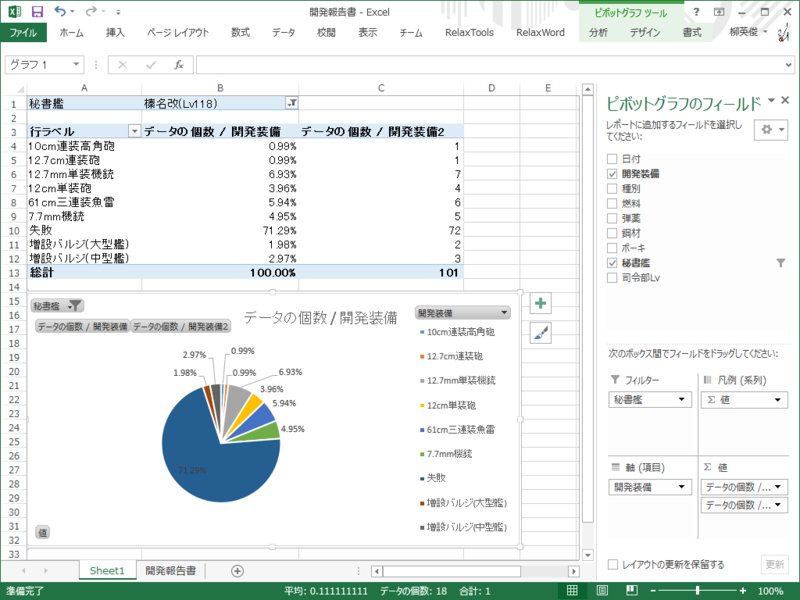
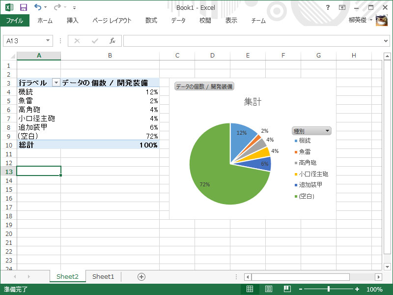

<blockquote class="twitter-tweet" lang="ja">
06▼装備の【開発】拡張&#10;「開発」において【増設バルジ(大型艦)】が開発可能となります。&#10;<a href="https://twitter.com/hashtag/%E8%89%A6%E3%81%93%E3%82%8C?src=hash">#艦これ</a>
&mdash; 「艦これ」開発/運営 (@KanColle_STAFF) <a href="https://twitter.com/KanColle_STAFF/statuses/484961137343991808">2014, 7月 4</a></blockquote>

廃棄して得られる資材は鋼材30なので、10/10/300/10 のレシピを100回試してみる（実際は勢い余って101回やった）。秘書艦は榛名。

36回目にしてやっと大型バルジをゲット。

もちろんこれだけの試行回数で確たることは言えないのだけれど、だいたい

<ul>
<li>中型バルジ：3%</li>
<li>大型バルジ：2%</li>
<li>10cm連装高角砲：1%</li>
</ul>
って感じみたい。失敗率は70%で、建造資材はあまり消化せずに済むが、鋼材の消費は激しい。とはいえ、わが司令部は鋼材が余りまくりなのであまりいたくはない。

ちなみに中型バルジのレシピ 10/10/120/10 を50回試した時（秘書艦は青葉）は

 

<ul>
<li>中型バルジ：6%</li>
<li>10cm連装高角砲：4%</li>
</ul>
だった。こちらの失敗率も70%ほど。

鋼材 120 → 300 によって魚雷の割合が増え、その分10㎝連装高角砲の割合が減った感じ（秘書艦娘を榛名 → 青葉にしたからか？　わからぬ）で、バルジが出る確率はおおむね5%と変わらない。この5%を中型と大型で分ける形になった。

<h4>追記</h4>

Excel のピボットテーブルの使い方がだいぶわかってきた（ぁ

