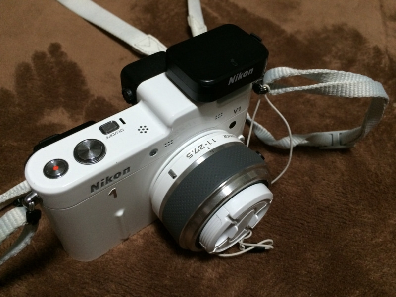
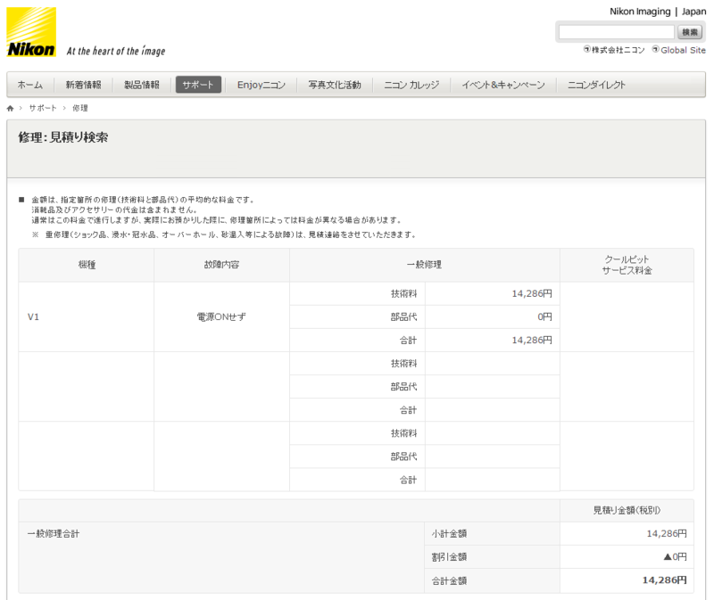
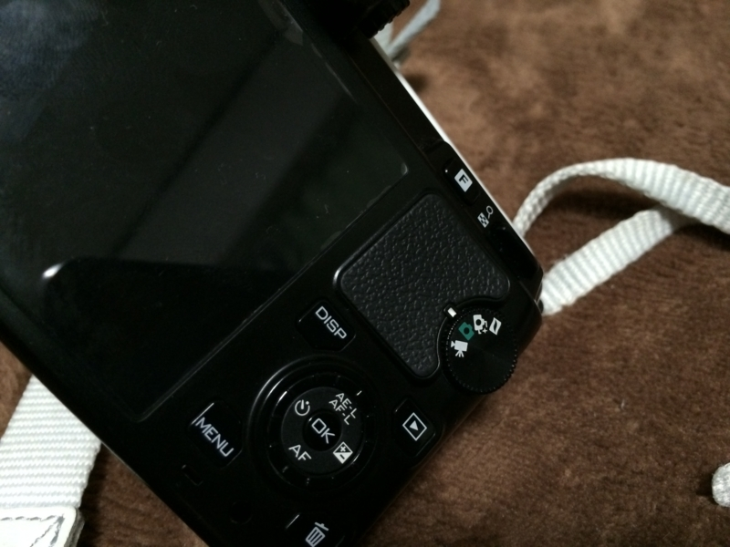

また電源が入らなくなった。困った……。これで三回目だ（前回は <a href="https://blog.daruyanagi.jp/entry/2012/10/24/213636">Nikon 1 V2 &hellip;&hellip;&#x304B;&#x3002; - &#x3060;&#x308B;&#x308D;&#x3050;</a>）。買ったのは2年前（<a href="https://blog.daruyanagi.jp/entry/2012/06/06/052011">Nikon 1 V1 &#x3092;&#x3052;&#x3063;&#x3068;&#x306A;&#x3046; - &#x3060;&#x308B;&#x308D;&#x3050;</a>）なのだけど、ちょっとトラブルが多すぎる気がする。

心当たりがあるとすれば、FlashAir が過熱していたことぐらいか。

購入後2年も経てばさすがに保証期間が切れてると思うのだけど、修理代は 14,286 円との由。うーん……そろそろ売り払って V3 に買い替えようと思ってた矢先だったので、ちょっと辛いなぁ。

あと、文句ついでに。Nikon 1 V1 の撮影モードダイアルは、カバンに入れてるだけですぐに動いてしまう。自分の場合、勝手に動画モードになっているときが多い。後継機では改善されているみたいなのだけど、さっと取り出して写真を撮りたいときにこれはだいぶ不満。

<h5>追記（2014/07/08）</h5>

ダメもとでいろいろやってたら電源が入った感じ。ついでに大掃除しておいた。

