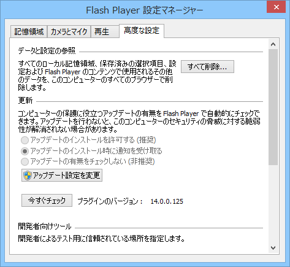
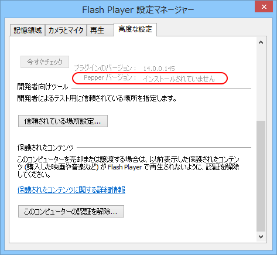
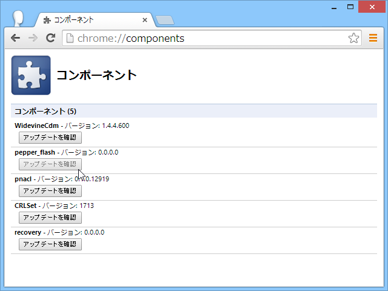
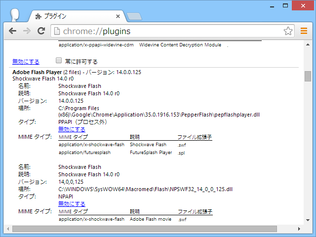

脆弱性の話は <a href="http://helpx.adobe.com/security/products/flash-player/apsb14-17.html">Adobe Security Bulletin</a> にて。

<h3>Adobe Flash Player 14.0.0.125 以前</h3>

 

<h3>Adobe Flash Player 14.0.0.145</h3>

Pepper 版のバージョンも併記されるようになった。

あと、「Google Chrome」のコンポーネントアップデーターでバージョンとれなくなっちゃった。ちゃんとアップデートされるのかなぁ。

今のところアップデートは来てない。

