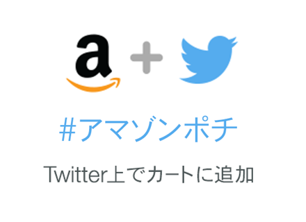
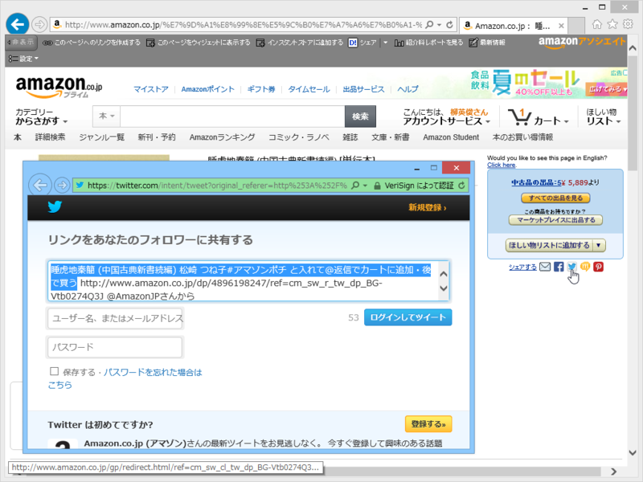
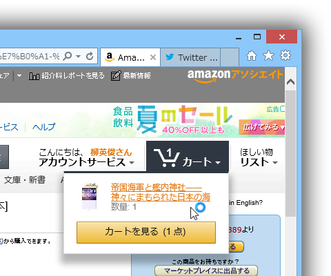

 

<blockquote cite="http://www.amazon.co.jp/gp/press/pr/20140711/">

Amazon.co.jp（以下Amazon）は、本日2014年7月11日（金）より、Twitterと連動した新機能「Amazonソーシャルカート」を開始いたしました。これにより、お客様はTwitter上から欲しい商品や気になる商品を、直接Amazonのショッピングカートに簡単に追加することができます。本機能は、日本国内ではAmazonでの提供が初となります。

「Amazonソーシャルカート」の機能では、Twitter上でお客様がAmazonの商品リンクを含むツイートに対して、「#アマゾンポチ」のハッシュタグを付けてリプライ（返信）することで、Amazonアカウントのショッピングカートに自動的にその商品を追加することができます。この機能を使うことで、お客様はTwitterのタイムラインを楽しみながら、気になる商品や欲しい商品をAmazonのショッピングカートに追加し、後でまとめてAmazon上で商品を確認・購入することができます。「Amazonソーシャルカート」はAmazonアソシエイト・プログラムに対応しており、Twitter経由での紹介料獲得にもご利用頂けます。

<cite><a href="http://www.amazon.co.jp/gp/press/pr/20140711/">http://www.amazon.co.jp/gp/press/pr/20140711/</a></cite>
</blockquote>

おれの頭が悪いせいか、どういう仕組かあまりよくわからんかったので試してみた。

<h3>下準備</h3>

<a href="http://www.amazon.co.jp/gp/socialmedia/amazoncart/">http://www.amazon.co.jp/gp/socialmedia/amazoncart/</a> で Twitter と Amazon を連携させておく。

<h3>#アマゾンポチ する</h3>

まず、Twitter で Amazon の商品リンクをたまたま目にする。今回は自分でリンクを投げた。

<blockquote class="twitter-tweet" lang="ja">
帝国海軍と艦内神社――神々にまもられた日本の海 久野 潤#アマゾンポチ と入れて@返信でカートに追加・後で買う <a href="http://t.co/6AijEIddZX">http://t.co/6AijEIddZX</a> <a href="https://twitter.com/AmazonJP">@AmazonJP</a>さんから
&mdash; ご注文はだるやなぎですか？ (@daruyanagi) <a href="https://twitter.com/daruyanagi/statuses/487588215491014656">2014, 7月 11</a></blockquote>

これに #アマゾンポチ とハッシュタグをつけて返信する

<blockquote class="twitter-tweet" lang="ja">
<a href="https://twitter.com/daruyanagi">@daruyanagi</a> <a href="https://twitter.com/hashtag/%E3%82%A2%E3%83%9E%E3%82%BE%E3%83%B3%E3%83%9D%E3%83%81?src=hash">#アマゾンポチ</a>
&mdash; ご注文はだるやなぎですか？ (@daruyanagi) <a href="https://twitter.com/daruyanagi/statuses/487588413491511296">2014, 7月 11</a></blockquote>

ちょっと間が空いて、Amazon のアカウントから返事が来る。

<blockquote class="twitter-tweet" lang="ja">
<a href="https://twitter.com/daruyanagi">@daruyanagi</a> ありがとうございます！商品があなたの<a href="http://t.co/3LyHuryZCe">http://t.co/3LyHuryZCe</a>カートに追加されました。カートを確認し、購入を完了してください⇒ <a href="http://t.co/fxsROe9m43">http://t.co/fxsROe9m43</a>
&mdash; Amazonソーシャルカート (@MyAmazonJP) <a href="https://twitter.com/MyAmazonJP/statuses/487588556097867777">2014, 7月 11</a></blockquote>

カートに商品がぶち込まれている。

これのなにが便利なのかイマイチ分からんけど、「Amazonアソシエイト・プログラムに対応しており、Twitter経由での紹介料獲得にもご利用頂けます」とのことなのでチャリンチャリンビジネスに使えるのかもしれない。

