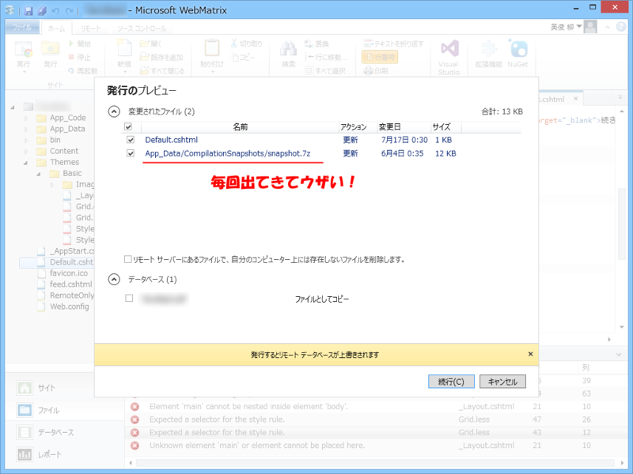
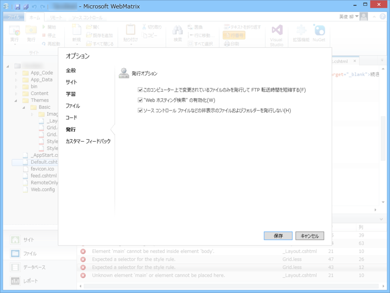
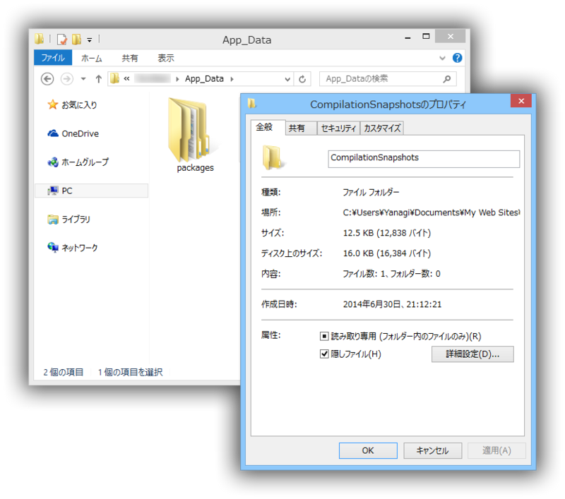
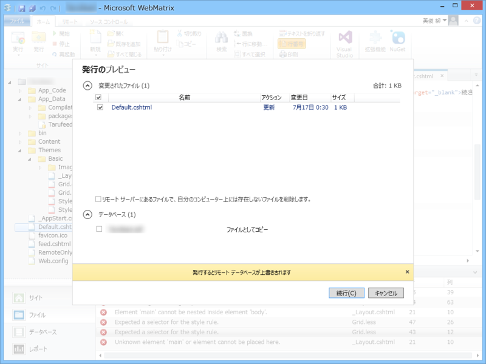

これな。

リモートへ発行したくないローカルファイルがある場合の対処方法。

<h3>隠しファイルを発行しない</h3>

［設定］－［発行オプション］で“ソース コントロール ファイルなどの非表示のファイルおよびフォルダーを発行しない”を有効化。

たぶん初期状態で有効になっているはず。

<h3>発行したくないフォルダーやファイルを隠しファイルに</h3>

フォルダーを隠すときは、子ファイルまで隠しフォルダにしなくていい。

――これで設定は完了。もう一度［発行］すると……

デキました。

