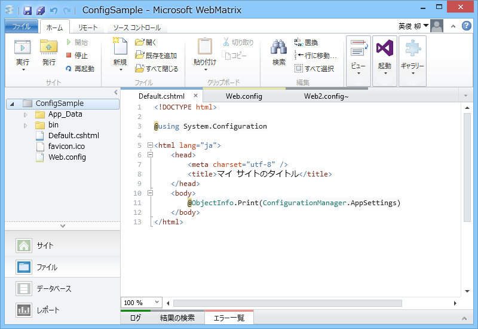
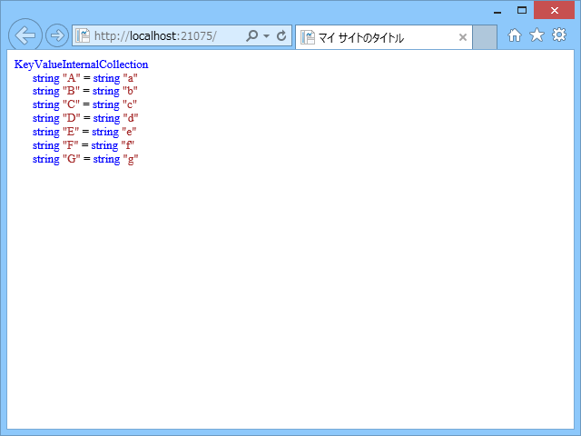
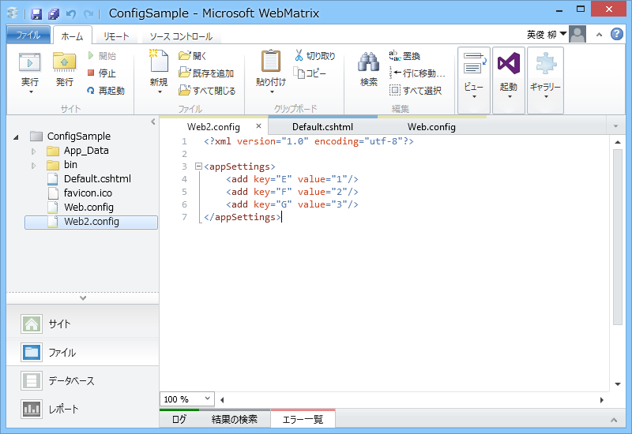
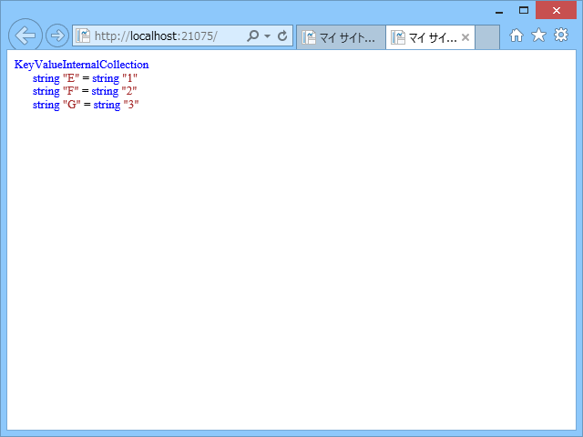

<a href="https://blog.daruyanagi.jp/entry/2014/07/15/224549">WebMatrix&#xFF1A;&#x30ED;&#x30FC;&#x30AB;&#x30EB;&#x3068;&#x30EA;&#x30E2;&#x30FC;&#x30C8;&#x3067;&#x7570;&#x306A;&#x308B;&#x8A2D;&#x5B9A;&#x3092;&#x5229;&#x7528;&#x3059;&#x308B;&#x65B9;&#x6CD5;&#x3092;&#x8003;&#x3048;&#x3066;&#x307F;&#x305F; - &#x3060;&#x308B;&#x308D;&#x3050;</a> でちょっと興味がわいたので、Web.config について少しいろいろ試してみた。

<h3>基本</h3>

 

<h4>Default.cshtml</h4>
<pre class="code lang-html" data-lang="html" data-unlink>&lt;!DOCTYPE html&gt;

@using System.Configuration

&lt;html lang=&quot;ja&quot;&gt;
&lt;head&gt;
        &lt;meta charset=&quot;utf-8&quot; /&gt;
        &lt;title&gt;マイ サイトのタイトル&lt;/title&gt;
    &lt;/head&gt;
&lt;body&gt;
@ObjectInfo.Print(ConfigurationManager.AppSettings)
&lt;/body&gt;
&lt;/html&gt;
</pre>
Web.config の appSettings セクションに記述したアプリケーション設定を読み込む。

@ObjectInfo.Print は WebMatrix でちょっとしたデバッグをするときに便利なのでぜひ覚えておこう。

<h4>Web.config</h4>
<pre class="code lang-xml" data-lang="xml" data-unlink>&lt;?xml version=&quot;1.0&quot; encoding=&quot;utf-8&quot;?&gt;

&lt;configuration&gt;
&lt;system.web&gt;
&lt;compilation debug=&quot;true&quot; targetFramework=&quot;4.0&quot; /&gt;
&lt;/system.web&gt;

&lt;appSettings file=&quot;Web2.config&quot;&gt;
&lt;add key=&quot;A&quot; value=&quot;a&quot;/&gt;
&lt;add key=&quot;B&quot; value=&quot;b&quot;/&gt;
&lt;add key=&quot;C&quot; value=&quot;c&quot;/&gt;
&lt;add key=&quot;D&quot; value=&quot;d&quot;/&gt;
&lt;add key=&quot;E&quot; value=&quot;e&quot;/&gt;
&lt;add key=&quot;F&quot; value=&quot;f&quot;/&gt;
&lt;add key=&quot;G&quot; value=&quot;g&quot;/&gt;
&lt;/appSettings&gt;
&lt;/configuration&gt;
</pre>
appSettings セクションにアプリケーション設定を記述。<code>file="Web2.config"</code> は後述。

<h4>結果</h4>

たとえば、

<pre class="code lang-cs" data-lang="cs" data-unlink>var a = System.Configuration.ConfigurationManager.AppSettings[&quot;A&quot;];
</pre>
などとすることで、Web.config の appSettings セクションに記述したアプリケーション設定が得られる。

ちょっとめんどくさいけれど、API キーなどの静的値はなるべくハードコードせず、appSettings に書いておくべき。

<h3>外部 .config ファイルを利用したアプリケーション設定のオーバーライド</h3>

以下のような Web2.config ファイルを追加。

<h4>Web2.config</h4>
<pre class="code lang-xml" data-lang="xml" data-unlink>&lt;?xml version=&quot;1.0&quot; encoding=&quot;utf-8&quot;?&gt;

&lt;appSettings&gt;
&lt;add key=&quot;E&quot; value=&quot;1&quot;/&gt;
&lt;add key=&quot;F&quot; value=&quot;2&quot;/&gt;
&lt;add key=&quot;G&quot; value=&quot;3&quot;/&gt;
&lt;/appSettings&gt;
</pre>

<h4>結果</h4>

ConfigurationManager.AppSettings["E"] 以降の値が Web2.config の内容によって書き換えられる。

Web.config の file 属性で指定した外部 .config ファイルが存在しない場合は、読み込み処理がスキップされる。

<h3>外部 .config ファイルを利用したアプリケーション設定の強制削除</h3>

ちょっと Web2.config をイジってみる。

<h4>Web2.config</h4>
<pre class="code lang-xml" data-lang="xml" data-unlink>&lt;?xml version=&quot;1.0&quot; encoding=&quot;utf-8&quot;?&gt;

&lt;appSettings&gt;
&lt;clear /&gt; // &lt;- 追加
    &lt;add key=&quot;E&quot; value=&quot;1&quot;/&gt;
&lt;add key=&quot;F&quot; value=&quot;2&quot;/&gt;
&lt;add key=&quot;G&quot; value=&quot;3&quot;/&gt;
&lt;/appSettings&gt;
</pre>

<h4>結果</h4>

Web.config で記述したアプリケーション設定がクリアされる。

要するに、ASP.NET は .config を読んで、appSettings セクションに書かれた add や clear といったコマンドを AppSettings（Dictionary 型）に対して行っているだけ。

なので、

<pre class="code lang-xml" data-lang="xml" data-unlink>&lt;?xml version=&quot;1.0&quot; encoding=&quot;utf-8&quot;?&gt;

&lt;appSettings&gt;
&lt;remove key=&quot;A&quot; /&gt;
&lt;/appSettings&gt;
</pre>
とすれば、特定のキーだけを消すことも可能。これを使えば、Web.config で行ったアプリケーション設定を Web2.config から自由にイジれる。使い方間違うとハマるかもだけど。

<h3>外部 .config ファイルを隠しファイルにする</h3>

結論を先に言うと、Web2.config を隠しファイルにしても、appSettings はちゃんと読み込まれる。

なので <a href="https://blog.daruyanagi.jp/entry/2014/07/17/004650">WebMatrix&#xFF1A;&#x7279;&#x5B9A;&#x306E;&#x30D5;&#x30A1;&#x30A4;&#x30EB;&#x3092;&#x767A;&#x884C;&#x5BFE;&#x8C61;&#x306B;&#x542B;&#x307E;&#x306A;&#x3044; - &#x3060;&#x308B;&#x308D;&#x3050;</a> と組み合わせることで、

<ul>
<li>Web.config</li>
<li>Web2.config（隠しファイル、リモートに発行されない）</li>
</ul>
という構成にすれば、

<ul>
<li>ローカル：Web.config ＋ Web2.config のアプリケーション設定で動作</li>
<li>リモート：Web.config のアプリケーション設定で動作</li>
</ul>
という風に運用できる（<a href="https://blog.daruyanagi.jp/entry/2014/07/15/224549">WebMatrix&#xFF1A;&#x30ED;&#x30FC;&#x30AB;&#x30EB;&#x3068;&#x30EA;&#x30E2;&#x30FC;&#x30C8;&#x3067;&#x7570;&#x306A;&#x308B;&#x8A2D;&#x5B9A;&#x3092;&#x5229;&#x7528;&#x3059;&#x308B;&#x65B9;&#x6CD5;&#x3092;&#x8003;&#x3048;&#x3066;&#x307F;&#x305F; - &#x3060;&#x308B;&#x308D;&#x3050;</a> は発想を逆にすればよかった！）。

