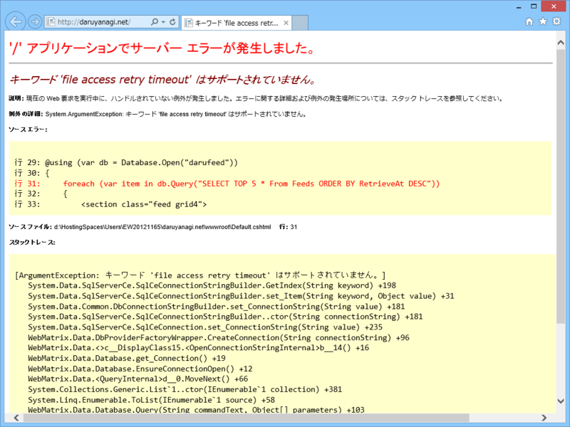

 

<pre class="code lang-cs" data-lang="cs" data-unlink>WebMatrix.Data.Database.Open(&quot;MYDB&quot;);
</pre>
ローカルと Azure ではイケるのに、ExpressWeb では WebMatrix.Data.DatabaseOpen() が失敗する件について。

<h3>解決策その一</h3>

<blockquote cite="http://erikej.blogspot.jp/2012/03/sql-server-compact-40-sp1-ctp1.html">

New connection string keyword: “File Access Retry Timeout” – will reattempt connection open from 0 – 30 seconds, with a default value of 0.

<cite><a href="http://erikej.blogspot.jp/2012/03/sql-server-compact-40-sp1-ctp1.html">Everything SQL Server Compact: SQL Server Compact 4.0 SP1 CTP1 available</a></cite>
</blockquote>

SQL Server Compact 4.0 SP1 CTP1 で追加された要素らしいので、それ以前のバージョンを利用する。

<h3>解決策その二</h3>
<pre class="code lang-cs" data-lang="cs" data-unlink>WebMatrix.Data.Database.OpenConnectionString(
&quot;Data Source=|DataDirectory|\\MYDB.sdf&quot;,
&quot;System.Data.SqlServerCe.4.0&quot;
);
</pre>
.NET Framework データ プロバイダーを指定して、接続文字列で開く。

<ul>
<li><a href="http://stackoverflow.com/questions/11299263/file-access-retry-timeout-asp-net-webpages-razor-c">File access retry timeout (ASP.NET WebPages/Razor/C#) - Stack Overflow</a></li>
</ul>

