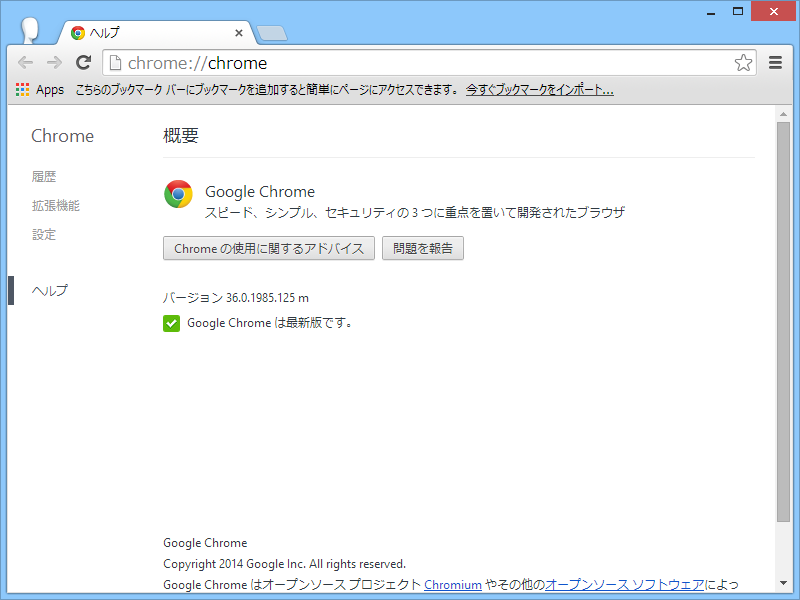
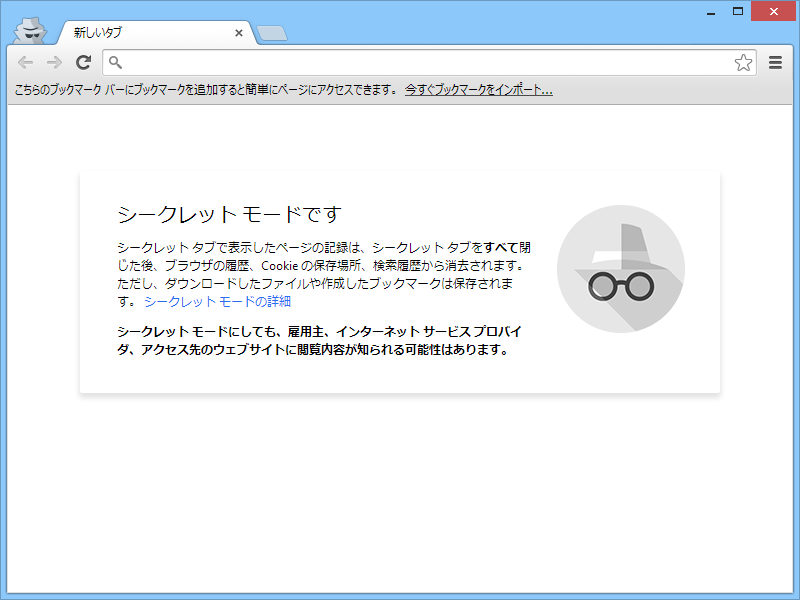
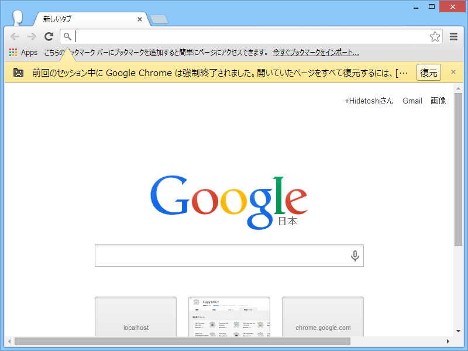
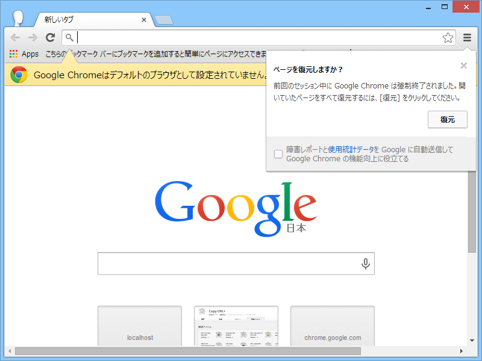

 

<blockquote cite="http://googlechromereleases.blogspot.jp/2014/07/stable-channel-update.html">

The Chrome Team is excited to announce the promotion of Chrome 36 to the Stable channel for Windows, Mac and Linux. Chrome 36.0.1985.125 contains a number of fixes and improvements, including:

<ul>
<li>Rich Notifications Improvements </li>
<li>An Updated Incognito / Guest NTP design</li>
<li>The addition of a Browser crash recovery bubble</li>
<li>Chrome App Launcher for Linux</li>
<li>Lots of under the hood changes for stability and performance</li>
</ul>
<cite><a href="http://googlechromereleases.blogspot.jp/2014/07/stable-channel-update.html">Chrome Releases: Stable Channel Update</a></cite>
</blockquote>

NTP っていうのはどうやら新規タブページ（New Tab Page）のことらしい。Incognito（シークレットモード）は、Chrome OS では<a href="https://support.google.com/chromebook/answer/1057090?hl=ja">&#x30B2;&#x30B9;&#x30C8; &#x30D6;&#x30E9;&#x30A6;&#x30B8;&#x30F3;&#x30B0;</a>機能と呼ばれているのだそうな。

“Browser crash recovery bubble”ってのもよくわかんなかったが、どうやらこれは初期状態で無効のようだ。 chrome://flags/#enable-session-crashed-bubble を有効にするとこんな感じになった。

 

<ul>
<li><a href="https://code.google.com/p/chromium/issues/detail?id=372713">Issue 372713 - chromium - Browser Crash Recovery bubble is not fit inside the browser window - An open-source project to help move the web forward. - Google Project Hosting</a></li>
</ul>
“Rich Notifications Improvements”はイマイチ違いがよくわからんかった。

