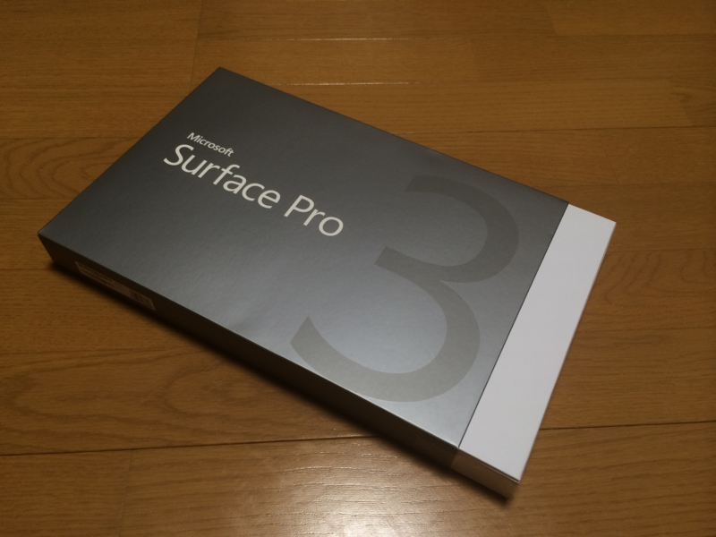
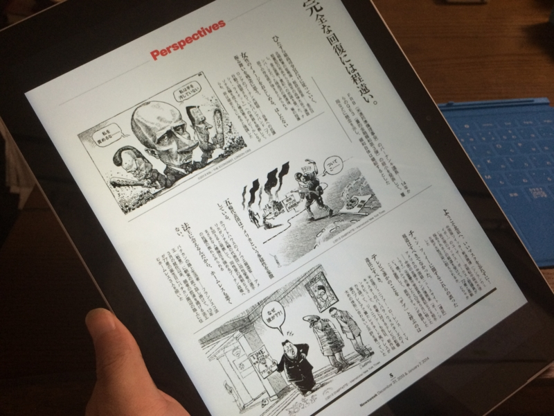

川崎からはるか海を越えて、我が家に Surface Pro 3 さんがやってきました！

日本では今のところ最下位モデルを除く4モデルがラインナップされているけれど、今回は<i> Core i5/メモリ8GB/SSD 256GB </i>のモデルをチョイス。CPU はともかく（内蔵グラフィックスも考えれば Core i7 に越したことないのだが）、メモリはめいいっぱい積んでおきたかったのと、開発環境とかいろいろインストールすると 128BG の SSD では少し足りないので。メインのデスクトップも Core i5 マシンでとくに不便は感じておらず、システムドライブも 300GB 足らずの SSD でフツーに足りていることもあり、自分的にはこのあたりが身の丈にあってる感じ。

ヨドバシの箱は大きかったけど、パッケージはコンパクト。

Surface Pen と電池が1本ついてた。

激怒したのは、電源アダプターの接続部分が旧 Surface と非互換であること。買い足した Surface 2 のアダプターが無駄になってしまった。

けれど、実際に刺してみると、旧モデルよりもしっかり刺さる感じで抜けにくく、接触もよい。まぁ、これだったらアリかなって思った。

ビンボーなので新しい Type Cover を買うお金がなく、今回は旧 Surface の Touch Cover で代用。

とりあえず刺さるし、フツーに使えるのだけど、もちろんサイズは合わない。横幅はだいたい一緒だけど、縦が足りない。Type Cover は来月の予算で買うつもりなのだけど、何色にするべきか、割りと悩んでいる。

購入の最大の動機であるアスペクト 3:2、12 型のディスプレイは、雑誌サイズのコンテンツを読むには最適。ニューズウィークも拡大せずにペラペラ読める。

<ul>
<li><a href="https://blog.daruyanagi.jp/entry/2014/05/21/120634">Microsoft Surface Pro 3 &#x2015;&#x2015; &#x305F;&#x3076;&#x3093;&#x8CB7;&#x3046;&#x3088;&#x3046;&#x306A;&#x6C17;&#x304C;&#x3059;&#x308B;&#x3002; - &#x3060;&#x308B;&#x308D;&#x3050;</a></li>
</ul>
これでマンガ・小説は iPad mini（いずれは Surface mini が埋めてくれると期待してる）、雑誌は Surface で役割分担ができて俺の中では陸・海・空どこでも戦える気分になっておる。

OneNote で少し絵も描いてみた。いい感じかも。なんかいいお絵かきアプリないかな？

それにしても、Surface Pen のボタンをポチッと押すと OneNote が起動するのは便利すぎる。「プリインストールアプリとか余計なことするな、プレーンな状態で提供しろ」派のわし（Note Anytime とか別に要らんし）も、これにはちょっと唸った。

とりあえず今日はここまで。今のところ大きなトラブルもなく使えている。

<a href="http://www.amazon.co.jp/exec/obidos/ASIN/B00KQ5A9KA/bestylesnet-22/">マイクロソフト Surface Pro 3(Core i5/256GB/Office付き) 単体モデル [Windowsタブレット] PS2-00015</a>
<ul><li>出版社/メーカー: マイクロソフト</li><li>メディア: Personal Computers</li><li><a href="http://d.hatena.ne.jp/asin/B00KQ5A9KA/bestylesnet-22" target="_blank">この商品を含むブログを見る</a></li></ul>

