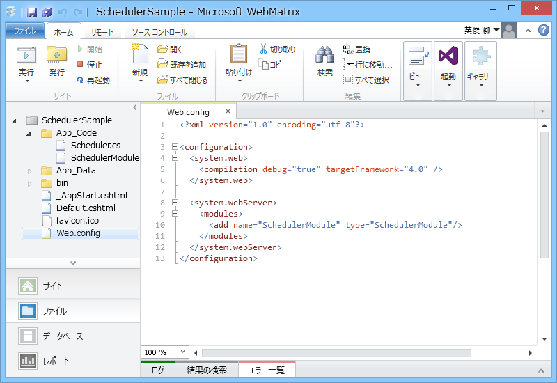

<a href="https://blog.daruyanagi.jp/entry/2013/10/14/141550">WebMatrix 3: Twitter Bot &#xFF08;&#xFF0B;&#x30EA;&#x30A2;&#x30EB;&#x30BF;&#x30A4;&#x30E0;&#x30ED;&#x30B0;&#x8868;&#x793A;&#x4ED8;&#x304D;&#xFF09;&#x3067;&#x3082;&#x4F5C;&#x3063;&#x3066;&#x307F;&#x308B;&#x3002; - &#x3060;&#x308B;&#x308D;&#x3050;</a> で System.Timers.Timer を使って ASP.NET の定期処理を実装したのだけど、のいえ先生の <a href="http://neue.cc/2013/07/20_416.html">neue cc - ASP.NET&#x3067;&#x306E;&#x5B9A;&#x671F;&#x7684;&#x306A;&#x30E2;&#x30CB;&#x30BF;&#x30EA;&#x30F3;&#x30B0;&#x624B;&#x6CD5;</a> でもう一度実装しなおしてみた。

 

<h3>Web.config</h3>
<pre class="code lang-xml" data-lang="xml" data-unlink>&lt;?xml version=&quot;1.0&quot; encoding=&quot;utf-8&quot;?&gt;

&lt;configuration&gt;
&lt;system.web&gt;
&lt;compilation debug=&quot;true&quot; targetFramework=&quot;4.0&quot; /&gt;
&lt;/system.web&gt;

&lt;system.webServer&gt;
&lt;modules&gt;
&lt;add name=&quot;SchedulerModule&quot; type=&quot;SchedulerModule&quot;/&gt;
&lt;/modules&gt;
&lt;/system.webServer&gt;
&lt;/configuration&gt;
</pre>
Web.config でモジュールを登録する。

<h3>~/App_Code/ScheduleModule.cs</h3>
<pre class="code lang-cs" data-lang="cs" data-unlink>using System;
using System.Threading;
using System.Web;

public class SchedulerModule : IHttpModule
{
static int initializedModuleCount = 0;
static Timer timer;

public void Init(HttpApplication context)
{
var count = Interlocked.Increment(ref initializedModuleCount);

if (count != 1) return;

timer = new Timer(_ =&gt;
{
try
{
System.Diagnostics.Debug.WriteLine(&quot;だん！&quot;);
}
catch (Exception e)
{
System.Diagnostics.Debug.WriteLine(e.Message);
}
}, null, TimeSpan.FromMinutes(1), TimeSpan.FromMinutes(1));
}

public void Dispose()
{
var count = Interlocked.Decrement(ref initializedModuleCount);

if (count != 0) return;

var target = Interlocked.Exchange(ref timer, null);

if (target != null) target.Dispose();
}
}
</pre>
SchedulerModule はこんな感じ。IHttpModule インターフェイス（Init、Dispose）を実装する。

（ExpressWeb で動かして initializedModuleCount をインクリメント・デクリメントをメールで通知するようにしてみたらこんな感じ）

SchedulerModule はいくつも作成（＆いくつも殺される）ので、ちゃんと数をカウントして、タイマーが大量生産されないように管理する必要があるそうな（← ASP.NET のライフサイクルをちゃんとわかってない。確かライフサイクルを書いたポスターがあったはずなので、今度確認しておこう）。

