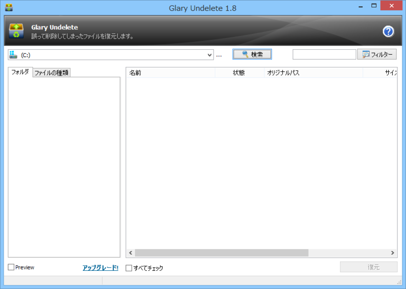
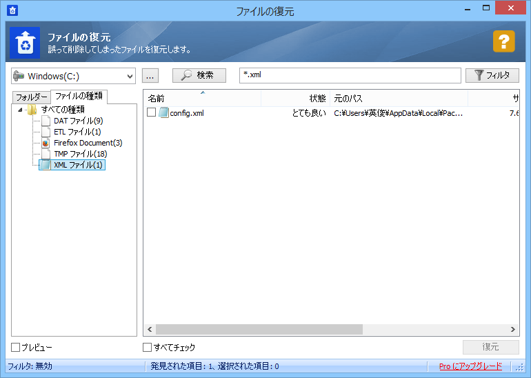
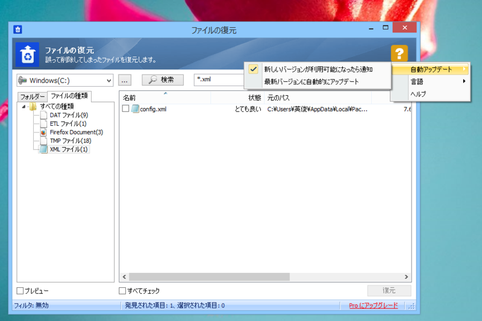

<h3>Glary Undelete 1.8</h3>

 

<h3>Glary Undelete 5.0.1.13</h3>

 

<ul>
<li>アイコンの変更</li>
<li>ユーザーインターフェイスの調整（フィルターボックスが広くなったなど）</li>
<li>ヘルプボタンのクリックの挙動。ヘルプファイルを開くのではなく、メニューを表示するようになった</li>
</ul>
 

<ul>
<li>デフォルトはユーザーインターフェイスが英語に。日本語に切り替え可能</li>
<li>自動更新機能が追加（されたかもしれない）</li>
</ul>
ほかにも、セットアップ時に検索エンジンの変更がサジェストされなくなった。ただし、セットアップ完了時にチェックボックスを外さないと「Glary Utilities」がインストールされる。

<ul>
<li><a href="http://www.forest.impress.co.jp/library/software/glaryundel/">Glary Undelete - &#x7A93;&#x306E;&#x675C;&#x30E9;&#x30A4;&#x30D6;&#x30E9;&#x30EA;</a></li>
</ul>

