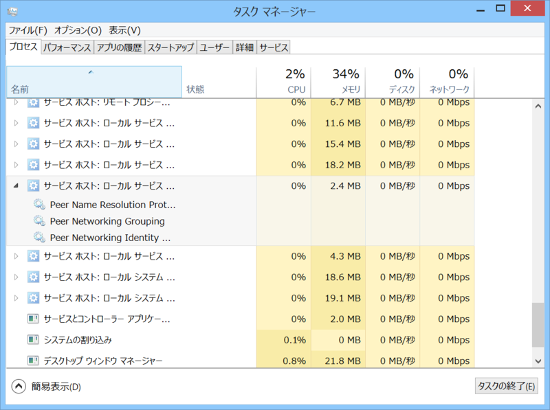
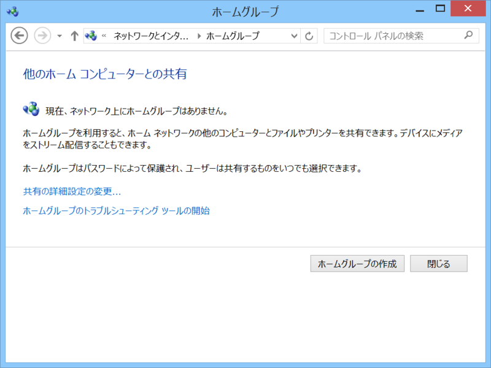
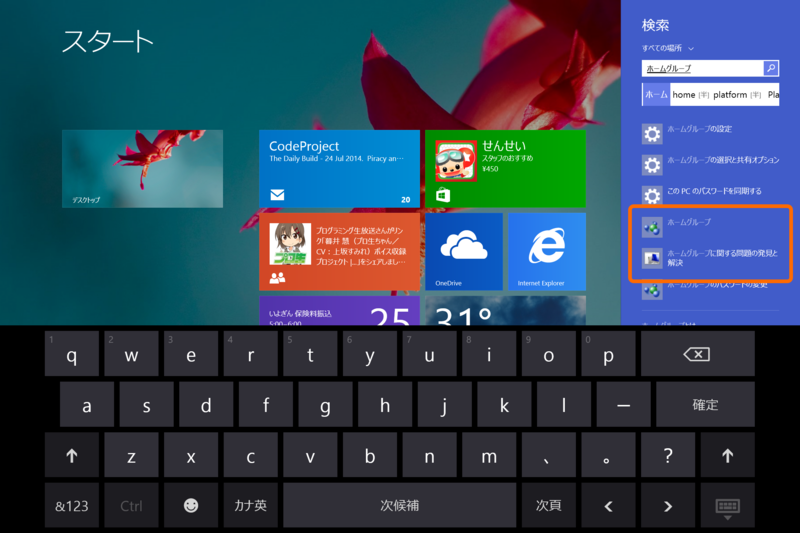

これは Surface Pro 3 に限らないかもしれないが、

<ul>
<li>COM Surrogate</li>
</ul>
や

<ul>
<li>サービスホスト：ローカルサービス（ピア ネットワーク）
<ul>
<li>Peer Name Resolution Protcol</li>
<li>Perr Networking Grouping</li>
<li>Peer Natworking Identity Manager</li>
</ul></li>
</ul>
あたりのプロセスが常に数％の CPU リソースを食っていて、全体で25％程度の負荷がずっと継続するという症状が見られた。鈍感なのでとくにパフォーマンスの低下は感じなかったが、Surface Pro 3 がやたら熱いので気付いた。

<ul>
<li>セットアップ直後（Windows Search が一生懸命インデックスを作ってたりする）</li>
<li>Windows Update の直後（バックグラウンドで .NET のコンパイラが走ってたりする）</li>
<li>オンラインストレージサービスの同期中</li>
</ul>
などは Surface Pro 3 が一時的に熱くなる場合があると思うけれど、そうでないのに熱い場合はこうしたプロセスが暴走してる可能性がある。

<h3>解決策</h3>

今回はホームグループへの参加をやめたら症状が収まった。

［Windows］ボタンを押して“ホームグループ”と入力すると、ホームグループ関連の設定画面にアクセスできるので、適当にごにょごにょすればいいと思う。

むかし VAIO を使っていて似たようなトラブルにあったのだけど、そのときもホームグループが原因だったのかな？

<ul>
<li><a href="https://blog.daruyanagi.jp/entry/2013/08/12/223136">VAIO Fit 15 &#x3067;&#x30C7;&#x30A3;&#x30B9;&#x30AF;&#x30A2;&#x30AF;&#x30BB;&#x30B9;&#x304C;&#x304A;&#x3055;&#x307E;&#x3089;&#x306A;&#x3044; - &#x3060;&#x308B;&#x308D;&#x3050;</a></li>
</ul>
その時はぶち切れながら Peer *** サービスの停止と IPv6 の無効化で解決していたようだ。

