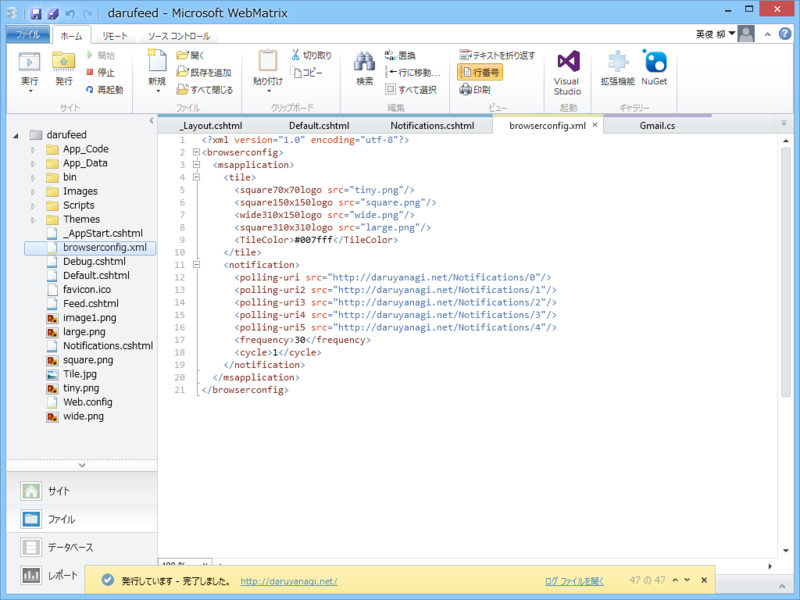

Windows 8.1 で（Windows 8 は切り捨てた）<a href="http://daruyanagi.net/">http://daruyanagi.net/</a> をスタート画面へピン留めすると、こんな感じになるハズ。前々からやってみたかったのだけど、なかなか腰が上がらなかった。

<h3>用意するもの</h3>

 

<ul>
<li>browserconfig.xml
<ul>
<li>この名前でなくてもいいが、その場合はメタタグに名前を記述</li>
</ul></li>
<li>通知タイルを定義した XML ファイル
<ul>
<li>browserconfig.xml の notifications 属性に記述。必須ではないが、用意しておくとタイルがくるくる切り替わるようになる</li>
<li>今回はデータベースをもとに Notifications.cshtml で動的に生成</li>
<li>最大5つまで</li>
</ul></li>
<li><code>&lt;meta name="application-name" content="アプリ名"/&gt;</code>
<ul>
<li>レイアウトファイルに一行挿入</li>
<li>browserconfig.xml の内容をメタタグとして埋め込むスタイルもあるが、今回は分離しておく。はてなブログをタイルに対応させる場合は、ヘッダーへメタタグを記述する方式がよさそう</li>
</ul></li>
<li>tiny、square、wide、large の各サイズ向けタイル画像
<ul>
<li>今回は青色に塗りつぶしただけのシンプルなものを用意</li>
<li>タイルの背景に使う tile.jpg も準備しておいた（「画像は .JPG、.GIF、.PNG 形式のファイルであり、容量を 200 KB 未満、サイズを 1024 x 1024 ピクセル未満にする必要があります。」とのこと）</li>
</ul></li>
</ul>
<table>
<tr>
<td>タイルのサイズ	</td>
<td>標準のタイルのサイズ	</td>
<td>最小画像サイズ	</td>
<td>推奨される画像のサイズ</td>
</tr>
<tr>
<td>小サイズ	</td>
<td>70 x 70	</td>
<td>56 x 56	</td>
<td>128 x 128</td>
</tr>
<tr>
<td>普通サイズ	</td>
<td>150 x 150	</td>
<td>120 x 120	</td>
<td>270 x 270</td>
</tr>
<tr>
<td>ワイド サイズ	</td>
<td>310 x 150	</td>
<td>248 x 120	</td>
<td>558 x 270</td>
</tr>
<tr>
<td>大サイズ	</td>
<td>310 x 310	</td>
<td>248 x 248	</td>
<td>558 x 558</td>
</tr>
</table>

<h3>browserconfig.xml</h3>

こんな感じで記述

<pre class="code lang-xml" data-lang="xml" data-unlink>&lt;?xml version=&quot;1.0&quot; encoding=&quot;utf-8&quot;?&gt;
&lt;browserconfig&gt;
&lt;msapplication&gt;
&lt;tile&gt;
&lt;square70x70logo src=&quot;tiny.png&quot;/&gt;
&lt;square150x150logo src=&quot;square.png&quot;/&gt;
&lt;wide310x150logo src=&quot;wide.png&quot;/&gt;
&lt;square310x310logo src=&quot;large.png&quot;/&gt;
&lt;TileColor&gt;#007fff&lt;/TileColor&gt; // “aliceblue”なんかは使えない鴨
&lt;/tile&gt;
&lt;notification&gt; // 必須ではない。まずはこれなしで動くかテストすることをお勧め
&lt;polling-uri src=&quot;http://daruyanagi.net/Notifications/0&quot;/&gt;
&lt;polling-uri2 src=&quot;http://daruyanagi.net/Notifications/1&quot;/&gt;
&lt;polling-uri3 src=&quot;http://daruyanagi.net/Notifications/2&quot;/&gt;
&lt;polling-uri4 src=&quot;http://daruyanagi.net/Notifications/3&quot;/&gt;
&lt;polling-uri5 src=&quot;http://daruyanagi.net/Notifications/4&quot;/&gt;
&lt;frequency&gt;30&lt;/frequency&gt; // 30、60、360、720、1440 のいずれか
&lt;cycle&gt;1&lt;/cycle&gt; // 0 ～ 7 のいずれか
&lt;/notification&gt;
&lt;/msapplication&gt;
&lt;/browserconfig&gt;
</pre>
cycle 属性の値はこんな感じ。

<ul>
<li>0: (通知が 1 つだけの場合の既定値) 循環しません。</li>
<li>1: (通知が複数ある場合の既定値) すべてのタイルのサイズで通知を循環します。</li>
<li>2: 普通サイズのタイルに対する通知のみを循環します。</li>
<li>3: ワイド タイルに対する通知のみを循環します。</li>
<li>4: 大きいタイルに対する通知のみを循環します。</li>
<li>5: 普通サイズのタイルやワイド タイルに対する通知のみを循環します。</li>
<li>6: 普通サイズのタイルや大きいタイルに対する通知のみを循環します。</li>
<li>7: ワイド タイルや大きいタイルに対する通知のみを循環します。</li>
</ul>
ちゃんと規定値があるので、めんどくさいなら省いてもいいぐらい。

<ul>
<li><a href="http://msdn.microsoft.com/ja-jp/library/dn455106(v=vs.85).aspx">IE11 &#x3067;&#x306E; Web &#x30B5;&#x30A4;&#x30C8;&#x7528;&#x30AB;&#x30B9;&#x30BF;&#x30E0; &#x30BF;&#x30A4;&#x30EB;&#x306E;&#x4F5C;&#x6210; (Windows)</a></li>
</ul>

<h3>Notifications.cshtml</h3>

小・ワイド・大の3つに対応したタイルスキーマを返しておく。テンプレートについては

<ul>
<li><a href="http://msdn.microsoft.com/ja-jp/library/dn456348(v=vs.85).aspx">Internet Explorer 11 &#x3067;&#x306E;&#x30E9;&#x30A4;&#x30D6; &#x30BF;&#x30A4;&#x30EB; &#x30C6;&#x30F3;&#x30D7;&#x30EC;&#x30FC;&#x30C8;&#x306E;&#x9078;&#x629E; (Windows)</a></li>
</ul>
を参照のこと。

<pre class="code lang-xml" data-lang="xml" data-unlink>@{
Response.ContentType = &quot;application/xml&quot;;

dynamic item;

using (var db = Database.Open(“***”))
{
item = db.Query(&quot;SELECT * From ***&quot;)
.ElementAt(UrlData[0].AsInt(0));
}
}
&lt;tile&gt;
&lt;visual lang=&quot;en-US&quot; version=&quot;2&quot;&gt;
&lt;binding template=&quot;TileSquare150x150PeekImageAndText04&quot; branding=&quot;name&quot;&gt;
&lt;image id=&quot;1&quot; src=&quot;http://daruyanagi.net/Tile.jpg&quot;/&gt;
&lt;text id=&quot;1&quot;&gt;@App.Title&lt;/text&gt;
&lt;text id=&quot;2&quot;&gt;@item.Title&lt;/text&gt;
&lt;/binding&gt;

&lt;binding template=&quot;TileWide310x150SmallImageAndText04&quot; branding=&quot;logo&quot;&gt;
&lt;image id=&quot;1&quot; src=&quot;http://daruyanagi.net/Tile.jpg&quot;/&gt;
&lt;text id=&quot;1&quot;&gt;@App.Title&lt;/text&gt;
&lt;text id=&quot;2&quot;&gt;@item.Title&lt;/text&gt;
&lt;/binding&gt;

&lt;binding template=&quot;TileSquare310x310ImageAndTextOverlay02&quot; branding=&quot;logo&quot;&gt;
&lt;image id=&quot;1&quot; src=&quot;http://daruyanagi.net/Tile.jpg&quot;/&gt;
&lt;text id=&quot;1&quot;&gt;@App.Title&lt;/text&gt;
&lt;text id=&quot;2&quot;&gt;@item.Title&lt;/text&gt;
&lt;/binding&gt;
&lt;/visual&gt;
&lt;/tile&gt;
</pre>
<a href="http://daruyanagi.net/Notifications/0">http://daruyanagi.net/Notifications/0</a> を叩くと

<pre class="code lang-xml" data-lang="xml" data-unlink>&lt;tile&gt;
&lt;visual lang=&quot;en-US&quot; version=&quot;2&quot;&gt;
&lt;binding template=&quot;TileSquare150x150PeekImageAndText04&quot; branding=&quot;name&quot;&gt;
&lt;image id=&quot;1&quot; src=&quot;http://daruyanagi.net/Tile.jpg&quot;/&gt;
&lt;text id=&quot;1&quot;&gt;@daruyanagi&lt;/text&gt;
&lt;text id=&quot;2&quot;&gt;Surface Pro 3：COM Surrogate や Peer Name Resolution Protcol が妙にリソースを食っている&lt;/text&gt;
&lt;/binding&gt;

&lt;binding template=&quot;TileWide310x150SmallImageAndText04&quot; branding=&quot;logo&quot;&gt;
&lt;image id=&quot;1&quot; src=&quot;http://daruyanagi.net/Tile.jpg&quot;/&gt;
&lt;text id=&quot;1&quot;&gt;@daruyanagi&lt;/text&gt;
&lt;text id=&quot;2&quot;&gt;Surface Pro 3：COM Surrogate や Peer Name Resolution Protcol が妙にリソースを食っている&lt;/text&gt;
&lt;/binding&gt;

&lt;binding template=&quot;TileSquare310x310ImageAndTextOverlay02&quot; branding=&quot;logo&quot;&gt;
&lt;image id=&quot;1&quot; src=&quot;http://daruyanagi.net/Tile.jpg&quot;/&gt;
&lt;text id=&quot;1&quot;&gt;@daruyanagi&lt;/text&gt;
&lt;text id=&quot;2&quot;&gt;Surface Pro 3：COM Surrogate や Peer Name Resolution Protcol が妙にリソースを食っている&lt;/text&gt;
&lt;/binding&gt;
&lt;/visual&gt;
&lt;/tile&gt;
</pre>
が返る。branding 属性はタイル左下に表示される項目を指定するもので、規定は name のようだ。logo にしておくと favicon が表示される。

これで準備は完了のはず。

<h3>注意する点。</h3>

<ul>
<li>画像へのパスが間違ってるとライブタイルは更新されない</li>
<li>パスの指定はドメインを含めたすべてを指定しなければならないようだ</li>
<li>タイルの version 1 は要らない</li>
<li>フォールバック（fallback）属性を書くと、ライブタイルは動作しない</li>
</ul>
とくに最後の項目は <a href="http://msdn.microsoft.com/ja-jp/library/hh761491.aspx">&#x30BF;&#x30A4;&#x30EB; &#x30C6;&#x30F3;&#x30D7;&#x30EC;&#x30FC;&#x30C8; &#x30AB;&#x30BF;&#x30ED;&#x30B0; (Windows &#x30E9;&#x30F3;&#x30BF;&#x30A4;&#x30E0; &#x30A2;&#x30D7;&#x30EA;) - Windows app development</a> からコードをコピペした場合に注意。

<pre class="code lang-xml" data-lang="xml" data-unlink>&lt;tile&gt;
&lt;visual&gt;
&lt;binding template=&quot;TileSquarePeekImageAndText02&quot;&gt;
&lt;image id=&quot;1&quot; src=&quot;image1&quot; alt=&quot;alt text&quot;/&gt;
&lt;text id=&quot;1&quot;&gt;Text Field 1 (larger text)&lt;/text&gt;
&lt;text id=&quot;2&quot;&gt;Text Field 2&lt;/text&gt;
&lt;/binding&gt;
&lt;/visual&gt;
&lt;/tile&gt;

&lt;tile&gt;
&lt;visual version=&quot;2&quot;&gt;
&lt;binding template=&quot;TileSquare150x150PeekImageAndText02&quot; fallback=&quot;TileSquarePeekImageAndText02&quot;&gt;
&lt;image id=&quot;1&quot; src=&quot;image1&quot; alt=&quot;alt text&quot;/&gt;
&lt;text id=&quot;1&quot;&gt;Text Field 1 (larger text)&lt;/text&gt;
&lt;text id=&quot;2&quot;&gt;Text Field 2&lt;/text&gt;
&lt;/binding&gt;
&lt;/visual&gt;
&lt;/tile&gt;
</pre>
これをコピペしても動かない。正しくはこんな感じ。

<pre class="code lang-xml" data-lang="xml" data-unlink>&lt;tile&gt;
&lt;visual version=&quot;2&quot;&gt;
&lt;binding template=&quot;TileSquare150x150PeekImageAndText02&quot;&gt;
&lt;image id=&quot;1&quot; src=&quot;image1&quot; alt=&quot;alt text&quot;/&gt;
&lt;text id=&quot;1&quot;&gt;Text Field 1 (larger text)&lt;/text&gt;
&lt;text id=&quot;2&quot;&gt;Text Field 2&lt;/text&gt;
&lt;/binding&gt;
&lt;/visual&gt;
&lt;/tile&gt;
</pre>

