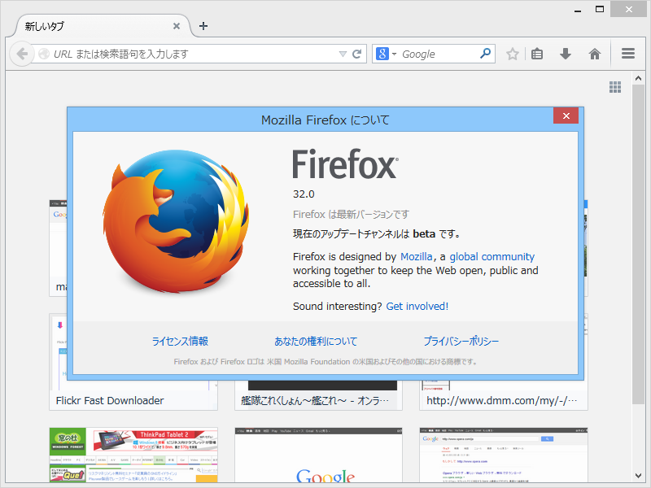
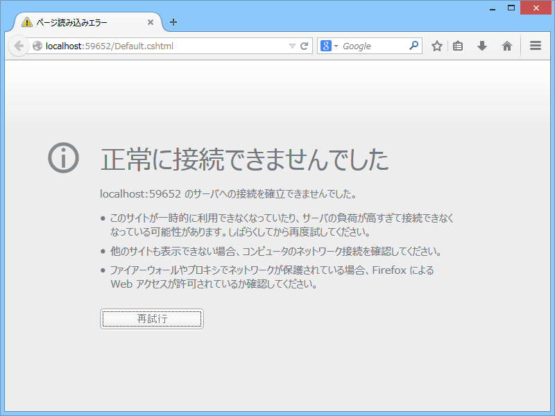
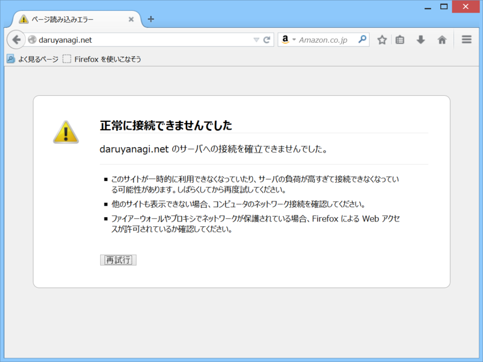

 

<h3>ページのコンテキストメニュー</h3>

テキストが選択されていない場合は、戻る・進む・リロード・ブックマークに追加といったコマンドが追加される。

<h3>接続エラー</h3>

メッセージは変わっていないので純粋にデザインの変更だけみたい。注意アイコンが三角から丸になったのはなぜなんだろう。個人的には道路標識のイメージで三角のほうが注意を促すという意味ではいいと思うのだけど、ユニバーサルデザインとしてはこちらが適切なのかな。

ちなみにこれまではこんな感じだった。

<ul>
<li><a href="http://www.mozilla.jp/firefox/32.0beta/releasenotes/">Firefox 32 &#x30D9;&#x30FC;&#x30BF;&#x7248;&#x30EA;&#x30EA;&#x30FC;&#x30B9;&#x30CE;&#x30FC;&#x30C8;</a></li>
</ul>

