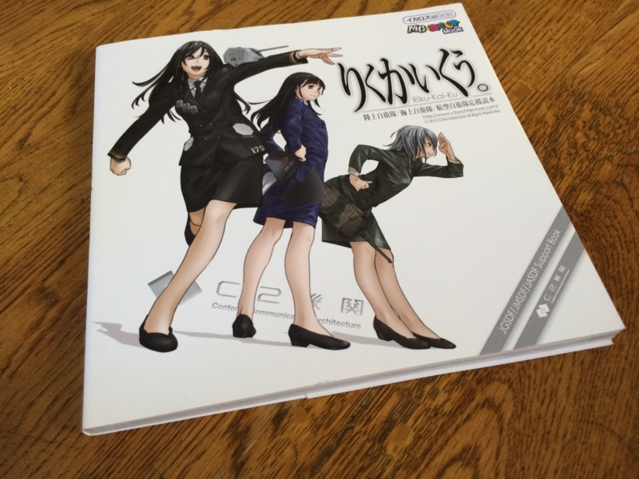
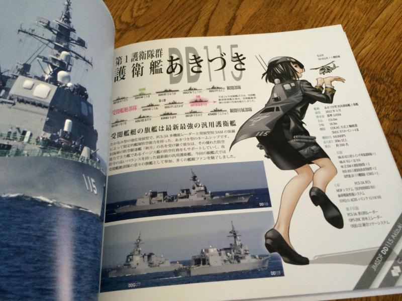

アキバを徘徊していたら見つけたので購入。“艦これ”にも携わっているご飯とミリタリー系の同人サークル“C2機関”が発行した自衛隊をテーマとした同人誌

<ul>
<li>「そうかえん。」（富士<b>総</b>合<b>火</b>力<b>演</b>習 2011 のガイド本。C81）</li>
<li>「かんかんしき。」（平成24年度 自衛隊<b>観艦式</b>のガイド本。C83）</li>
<li>「くうじき。」（航<b>空自</b>衛隊<b>機</b>の解説本。C82）</li>
</ul>
をまとめたものだそうだ。わりと内容が充実していてすごいなーって感じ。

たとえば、これは「あきづき」さん。うほっ、いいお尻♡　……じゃなくて、ビジュアル資料としても役に立ちますな。

まぁ、弟に見せたらめっちゃバカにされたけど、個人的には満足している。アキバの書泉で1,800円なり。

<a href="http://www.amazon.co.jp/exec/obidos/ASIN/486320759X/bestylesnet-22/">りくかいくう。 (イカロス・ムック MC☆あくしずMOOK)</a>
<ul><li>作者: C2機関</li><li>出版社/メーカー: イカロス出版</li><li>発売日: 2013/08/09</li><li>メディア: ムック</li><li><a href="http://d.hatena.ne.jp/asin/486320759X/bestylesnet-22" target="_blank">この商品を含むブログを見る</a></li></ul>

『ちんじゅふ。』も読みたいのだけど、取り寄せはできるんだろうか（vol.2 のヨコチン版とかを出してからまたまとめて出版してくれるのだろうか）。同人誌関係はほとんど知らないので、買い方もよくわからん。普通の本屋に並んでると買いやすくてとてもうれしい。

