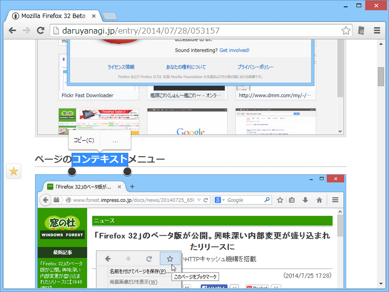
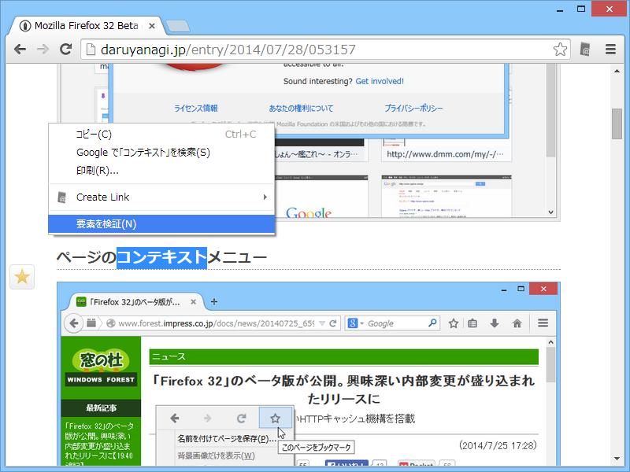
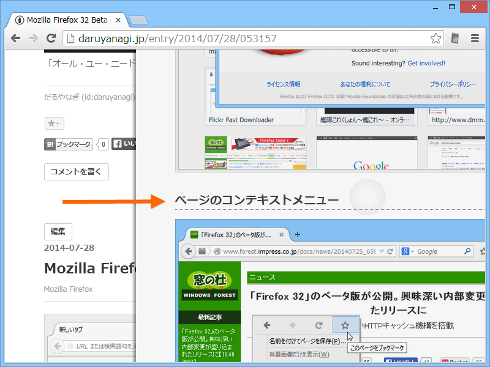
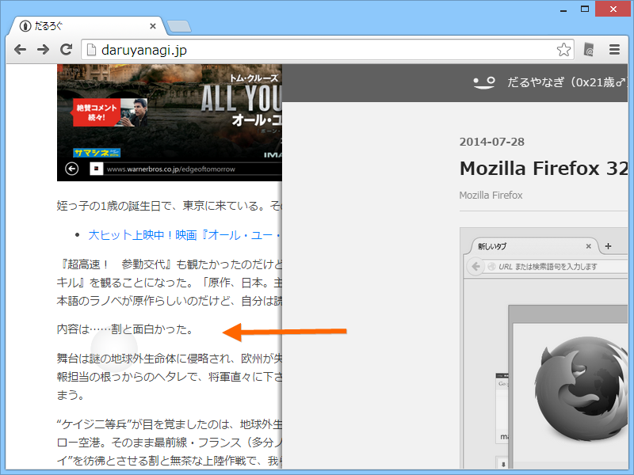
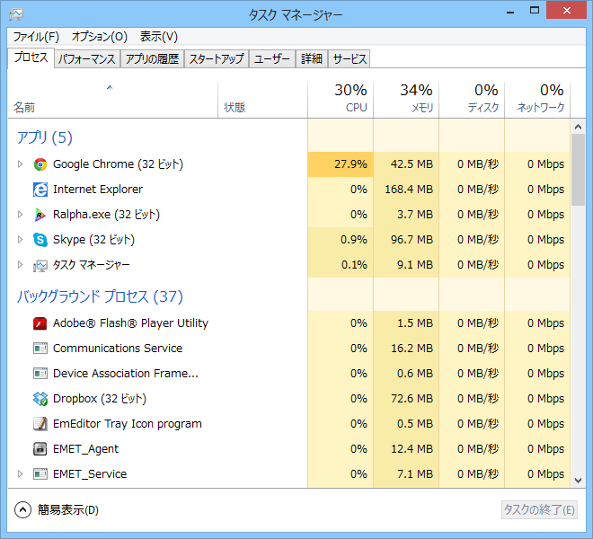

Surface Pro 3 で使うブラウザーを何にしようかなーと思ってたんだけど、デスクトップならば Google Chrome がいい感じなのかな。故あって Google Chrome 37 Beta を入れてるのだけど、割と痒い所に手が届く感じがした（Google Chrome 36 以前からの機能かもしれないけど、37 で確認してるということでご容赦）。

<h3>テキスト選択</h3>

テキストを選択。

選択テキストをタップ。吹き出しでコマンドが現れる。［コピー］しか出てこないけど、まぁ、十中八九コピーするんだからそれでいい。

他のことをしたい場合は、さらに［…］をさらにタップ。通常のコンテキストメニューが現れる。

Mozilla Firefox はタッチ操作にこうした特別な配慮はないみたい。デスクトップの Internet Explorer 11 は、そもそもタッチでどうやってテキストを選択するんだ。わからん。まぁ、TypeCover のマウスパッドやペンが使えるからそれほど困るわけでもないが……。

<h3>フリックナビゲーション</h3>

左から右へのフリックで［戻る］。

右から左へのフリックで［進む］。

Immersive な Internet Explorer では同様の機能が利用できる。Mozilla Firefox にはなさげ。

<h3>最大の弱点</h3>

HiDPI 対応じゃないこと。

あと、タッチでウィンドウのサイズを変えたりドラッグしてると CPU 負荷が高まるときがあるような気がする。タッチで何回かスクロール操作すると、スクロールが止まるのも使っていてしんどい。

