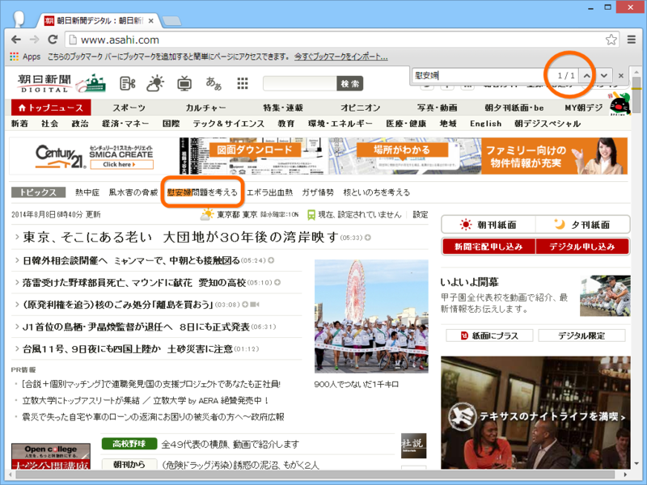

一通り読んでみたけれど、全体的に「苦しい言い訳だなぁ」と感じた。

<ul>
<li><a href="http://www.asahi.com/topics/ianfumondaiwokangaeru/">&#x671D;&#x65E5;&#x65B0;&#x805E;&#x30C7;&#x30B8;&#x30BF;&#x30EB;&#xFF1A;&#x6170;&#x5B89;&#x5A66;&#x554F;&#x984C;&#x3092;&#x8003;&#x3048;&#x308B;&#x306B;&#x95A2;&#x3059;&#x308B;&#x30C8;&#x30D4;&#x30C3;&#x30AF;&#x30B9;</a></li>
</ul>
どうせやるなら開き直ってとことんやればいいのに、「謝りたくない」「誤報であることもできれば認めたくない」「そもそもこの話題には触れたくない」という後ろ向きな気持ちがぷんぷん伝わってくる。

――たとえば、「朝日新聞デジタル」のトップページをみてみよう。

ページを“慰安婦”で検索してみたが、ヒットするのは1カ所だけ。その1カ所も“トピックス”欄のキーワードに過ぎない。この“トピックス”欄に掲載されるキーワードは「※最近の記事に登場したキーワードを自動的に並べています」（<a href="http://www.asahi.com/topics/">&#x671D;&#x65E5;&#x65B0;&#x805E;&#x30C7;&#x30B8;&#x30BF;&#x30EB;&#xFF1A;&#x30C8;&#x30D4;&#x30C3;&#x30AF;&#x30B9;</a>）とのことで、朝日新聞が自発的に・能動的に掲載したものではない。つまり、トップページから検証記事へのリンクは、<b>意図したものとしては一つも存在しない</b>（8月8日7時現在）。東アジアの外交に大きな影響を与えた誤報記事の検証であるのに、この扱いの小ささはなんなのだろう。

けれど、曲がりなりにもこうした検証記事が出るようになったのはいい傾向のように思える。

最初の誤報記事からすでに三十年近くが立っているが、三十年といえば「一世」<a href="#f-a0008d7d" name="fn-a0008d7d" title="「世」は「十十十」、つまり三十年というのがもともとの意味。転じて世代を表す">*1</a>、つまり丸々一世代に当たる。今回の編集担当を務める杉浦信之氏も生まれは1958年だそうで、当時は駆け出しの記者だったろう。今回の誤報記事について、直接的な責任はない<a href="#f-b55f22ed" name="fn-b55f22ed" title="誤報記事を書いた当のご本人は今年退職との由（笑">*2</a>。会社としての立場や主張の一貫性を保ちながら、先達の誤りは正さなければならない（平たく言えば、辻褄を合わせなければならない）という立場に置かれたことについては同情を禁じ得ないところもある。

そういう視点で見ると、戦後処理、財政・社会保障問題、原発問題は一つの糸で結ばれているように個人的には感じられる。

“どれもこれも先の世代の負の遺産だが、かといって投げ出すわけにはいかない問題でもある”という点で。

誰でも自己否定というのはしんどい。年齢と経験を重ねた人たちならばなおさらだろう。今まで積み上げたものが無になるのだから。かといって、時が経つのに任せ、生物学的な解決（要は、当事者が全員死ぬの待つということ）を図っては手遅れになりかねない。しかも、それはリアルと帳尻を合わせながらゆっくり着実に行わなければならない。血気逸った・所詮外野の・無責任な・<ruby>革命主義<rp>(</rp><rt>ちゃぶ台返し</rt><rp>)</rp></ruby>的な輩（かくいう私も、時にその一員だ）から心無い罵声を浴びたとしても、責任者たるものをれを途中で放り出すことはできないはずだ。

なので、表面上はディスりながら（だって言い訳がましいし、結局謝んないし、政治的主張が気にくわないし）、ちょっと同情し、応援しているというのが今のところの正直な気持ち……なのかもしれない。

――最後に、慰安婦問題に対する個人的な意見について。

正直、個別的な事案（ダレがカレにナニされた）に関してはどうでもいいと思ってるし、さっさと解決がつかないものか、と思っている。

そもそも慰安婦問題などというのは、戦争をするから起こる。慰安婦問題では被害者面している当の韓国人も、ベトナム戦争ではベトナム人女性に対してかなりヒドいことをしたと聞き及んでいる。ホロコーストなどもそうだと思うけれど、どうやら戦時では平時の常識がまったく通用しなくなるようだ、戦争に参加したことないから知らんけど。

まぁ、とにかく、戦争しなけりゃ慰安婦問題も虐殺問題も起こりえないのだから<a href="#f-12513e5d" name="fn-12513e5d" title="平時にも東南アジアへ幼児・素人を買春しに行くバカがいるらしいが、留置場で頭を冷やした方がいいと思う。朝日新聞流にいえば、通貨の強さの違い・貧富の差も女性の尊厳を奪う一種の“強制力”だ">*3</a>、<b>これからも不戦を守っていくのが日本国として最大の反省であり、償いであろうと思う</b><a href="#f-5dbdeafa" name="fn-5dbdeafa" title="個人的にはこれを一歩進めて、世界中から戦争をなくすために“非攻”の精神をもってもいいように感じているが、それは自然な――扇動的なことは一切しないで、の意――国民のコンセンサスを得てからの話だ">*4</a>。まぁ、赦す、赦さないは相手次第なのだけど……。

一方、慰安婦問題は個別的な問題でもある。つまり、国としての償いと反省以外にも、たまたまその時代に生きて、被害に遭った女性の尊厳の問題でもある。集団としての強制があったか否かに関わらず、戦争があった以上、個人としてレイプの被害に遭った女性はいるはずで、それに対する個別的な保証は“不戦の誓い”とはまた別のレベルの話として受け止めなければならない。

ただし、これも法的な話としてはほとんどの国との間で解決が済んでいるはず。けれど、もしかして韓国政府が資金を使い込んでしまって被害者個人にまで行きわたらないというのことが万が一あるならば（まぁ、あるらしいんだが。知らんけど）、それを正式に批難する声明を出した上で、全面的な解決を図るために政府が追加の資金を出すことに自分は反対しない。私的基金があれば、個人的に拠出してもかまわないと思っているけれど、お小遣いの範囲内で許してほしいところではある。

とにかく、本音としては、祖父さんや曽祖父さんのやったことの責任を子どもや孫の世代にまで負わせるのは止めたい、ここらあたりで全面的に解決して荷を軽くしてあげたい（それでなくても問題山積なんだから！！）。――できれば生物学的解決に頼らずに。過去のできごとが歴史にならず、いつまでもリアルであるのが妙に生々しく、故に不当に避けられてしまっているのもよくないことだと感じる。

<a href="#fn-a0008d7d" name="f-a0008d7d" class="footnote-number">*1</a>:「世」は「十十十」、つまり三十年というのがもともとの意味。転じて世代を表す

<a href="#fn-b55f22ed" name="f-b55f22ed" class="footnote-number">*2</a>:誤報記事を書いた当のご本人は今年退職との由（笑

<a href="#fn-12513e5d" name="f-12513e5d" class="footnote-number">*3</a>:平時にも東南アジアへ幼児・素人を買春しに行くバカがいるらしいが、留置場で頭を冷やした方がいいと思う。朝日新聞流にいえば、通貨の強さの違い・貧富の差も女性の尊厳を奪う一種の“強制力”だ

<a href="#fn-5dbdeafa" name="f-5dbdeafa" class="footnote-number">*4</a>:個人的にはこれを一歩進めて、世界中から戦争をなくすために“非攻”の精神をもってもいいように感じているが、それは自然な――扇動的なことは一切しないで、の意――国民のコンセンサスを得てからの話だ

