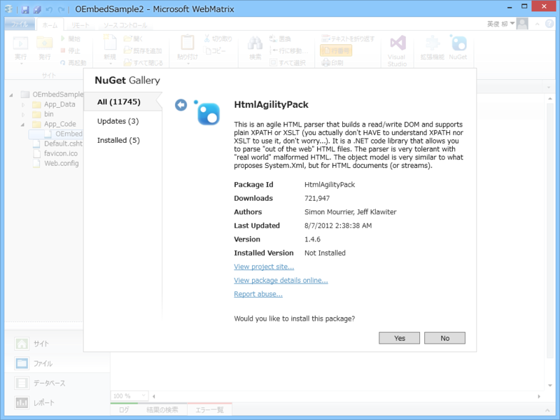

<blockquote cite="http://oembed.com/">

oEmbed is a format for allowing an embedded representation of a URL on third party sites. The simple API allows a website to display embedded content (such as photos or videos) when a user posts a link to that resource, without having to parse the resource directly.

<cite><a href="http://oembed.com/">oEmbed</a></cite>
</blockquote>

要はこういうのです。

<pre class="code" data-lang="" data-unlink># はてな記法の場合
https://twitter.com/daruyanagi/status/497645195769298944:embed</pre>
<blockquote class="twitter-tweet" data-lang="ja">
乱暴するんでしょう？　エロ同人誌みたいに！
&mdash; だるやなぎ に天使が舞い降りた！ (@daruyanagi) <a href="https://twitter.com/daruyanagi/status/497645195769298944?ref_src=twsrc%5Etfw">2014年8月8日</a></blockquote>

URL → 埋め込み HTML を得るための API って感じですかね。

oEmbed API の提供方法は二種類あります。

<ul>
<li>API Endpoint があらかじめ公開されており、それを叩く</li>
<li>link タグに埋め込み oEmbed のURLが埋め込まれいるので、それを叩く</li>
</ul>
両方とも提供してくれている場合もありますが（たとえば YouTube）、前者だけだったり（Flickr）、後者だけだったり（Twitter、<a href="https://dev.twitter.com/docs/api/1/get/statuses/oembed">&#x4E00;&#x5FDC;&#x516C;&#x958B;&#x3055;&#x308C;&#x3066;&#x3044;&#x307E;&#x3059;</a>が一般的な API に比べてちょっとめんどいので link タグ探した方がいい）もします。

今回は後者だけ実装してみました。前者については、

<ul>
<li><a href="https://blog.daruyanagi.jp/entry/2013/07/18/033539">WebMatrix 3: Windows Store oEmbed API &#x3092;&#x5229;&#x7528;&#x3059;&#x308B; - &#x3060;&#x308B;&#x308D;&#x3050;</a></li>
</ul>
で一度やったことがあります。URL パターンとエンドポイントのディクショナリでももっておいて、URL がパターンにマッチした時はエンドポイントを叩く……みたいに実装すれば汎用的になるかと。

<h3>準備</h3>

HTML から 

<pre class="code lang-html" data-lang="html" data-unlink>&lt;link rel=&quot;alternate&quot; type=&quot;application/json+oembed&quot; href=&quot;***&quot; title=&quot;***&quot;&gt;
</pre>
みたいなのを探してとってくる必要があるので、スクレイパー御用達の <a href="http://htmlagilitypack.codeplex.com/">CodePlex Archive</a> を NuGet で追加しておきます。

<h3>コード</h3>

んじゃ、ガリガリ書いていきます。

<h4>~/App_Code/OEmbed.cshtml</h4>

まずは、ヘルパー部分を書き書き。

<pre class="code lang-cs" data-lang="cs" data-unlink>@using HtmlAgilityPack

@helper GetHtml(string url){
try
{
using (var downloader = new WebClient())
{
var html = downloader.DownloadString(url);

var document = new HtmlDocument();
document.LoadHtml(html);

url = document.DocumentNode.Descendants(&quot;link&quot;)
.Where(_ =&gt; _.GetAttributeValue(&quot;type&quot;, string.Empty) == &quot;application/json+oembed&quot;)
.Select(_ =&gt; _.GetAttributeValue(&quot;href&quot;, string.Empty))
.First();

var oembed_data = downloader.DownloadString(url);
var oembed_json = Json.Decode(oembed_data);

@Html.Raw(oembed_json.html)
}
}
catch (Exception e)
{
&lt;p class='error'&gt;@url: @e.Message&lt;/p&gt;
}
}
</pre>
oEmbed は XML 形式か JSON 形式でレスポンスを返すのですが、Twitter は JSON のみをサポートします。どのサービスも JSON には対応していることが多いので、JSON だけ処理すればたいていは十分です。

あと、oembed_json.html を直接使うのは怖い。サニタイズしておいた方がいいかも。ほんとはキャッシュの仕組みとかも入れておきたいですね。

<h4>~/Default.cshtml</h4>

次にテスト用のページを書きかき。

<pre class="code lang-html" data-lang="html" data-unlink>&lt;!DOCTYPE html&gt;

&lt;html lang=&quot;ja&quot;&gt;
&lt;head&gt;
&lt;meta http-equiv=&quot;Content-Type&quot; content=&quot;text/html; charset=utf-8&quot;/&gt;
        &lt;meta charset=&quot;utf-8&quot; /&gt;
        &lt;title&gt;マイ サイトのタイトル&lt;/title&gt;
        &lt;link href=&quot;~/favicon.ico&quot; rel=&quot;shortcut icon&quot; type=&quot;image/x-icon&quot; /&gt;
    &lt;/head&gt;
&lt;body&gt;
@OEmbed.GetHtml(&quot;https://twitter.com/daruyanagi/status/497645195769298944&quot;)
@OEmbed.GetHtml(&quot;https://twitter.com/daruyanagi/status/49764519576929894&quot;)
@OEmbed.GetHtml(&quot;https://www.flickr.com/photos/daruyanagi/6219334657/&quot;)
&lt;/body&gt;
&lt;/html&gt;
</pre>

<h4>結果</h4>

2番目は URL を間違ってみた。3番目は oEmbed 対応だけど link タグ形式ではないサービス（Flickr）で試してみた。Flickr については、API Endpoint を叩いてーという処理が必要になりますね。

